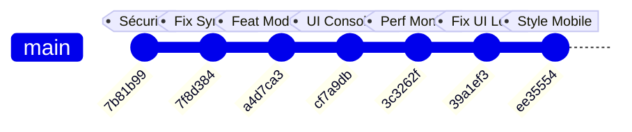

# Rapport d'Audit Technique — Modifications de l'Administration & Performance

Rapport préparé par le Développeur Principal (**Senior Developer Audit**).  
Ce document contient l'analyse structurelle des changements appliqués aujourd'hui sur le projet **Dr.CAT** d'après l'historique Git récent, évaluant leur robustesse, leurs performances et leur impact sur l'expérience utilisateur.

---

## 📋 Table des Matières
1. [Synthèse Globale des Commits](#1-synthèse-globale-des-commits)
2. [Analyse Détaillée par Axe de Modification](#2-analyse-détaillée-par-axe-de-modification)
   - [Axe A : Correction de la Synchronisation des Propositions (CORS / Ngrok)](#axe-a--correction-de-la-synchronisation-des-propositions-cors--ngrok)
   - [Axe B : Module de Révision & d'Édition Directe (Moderation Flow)](#axe-b--module-de-révision--dédition-directe-moderation-flow)
   - [Axe C : Refactoring de l'Interface en Centre de Contrôle Onglet](#axe-c--refactoring-de-linterface-en-centre-de-contrôle-onglet)
   - [Axe D : Profilage en Arrière-plan Continu (Continuous Performance Monitor)](#axe-d--profilage-en-arrière-plan-continu-continuous-performance-monitor)
3. [Audit de Sécurité & Gestion des Fuites d'UI](#3-audit-de-sécurité--gestion-des-fuites-dui)
4. [Recommandations pour la Prochaine Phase](#4-recommandations-pour-la-prochaine-phase)

---

## 1. Synthèse Globale des Commits

Aujourd'hui, nous avons effectué **6 commits stratégiques** visant à stabiliser la synchronisation des données invité/serveur, à enrichir le tableau de bord d'administration et à consolider le moteur d'évaluation de la performance.



| Commit ID | Type | Description Technique | Impact Client |
| :--- | :--- | :--- | :--- |
| **`7f8d384`** | `fix` | Routage des appels API de synchronisation des modifications vers les URL relatives pour les clients web. | Rétablissement de la synchronisation des suggestions des testeurs externes (invités via Ngrok). |
| **`a4d7ca3`** | `feat` | Création de la modale de révision dynamique et de l'endpoint d'édition des suggestions en attente. | Capacité pour l'administrateur de relire, éditer et peaufiner les propositions avant de les valider en base. |
| **`cf7a9db`** | `refactor` | Consolidation des panels admin (Modération, Diagnostics, Performances) en un Centre de Contrôle unique à onglets. | Interface épurée, suppression du scroll encombrant sur le tableau de bord. |
| **`3c3262f`** | `perf` | Persistance en arrière-plan du collecteur de frames (`FrameMonitor`) dès le chargement du site. | Mesure continue des FPS et des saccades (Janks) lors de la navigation complète de l'application. |
| **`39a1ef3`** | `fix` | Fermeture correcte des balises HTML `</div>` dans `index.html` pour encapsuler les outils d'administration. | Résolution d'une fuite d'interface (les blocs diagnostics/performance s'affichaient chez les non-admins). |
| **`ee35554`** | `style` | Intégration de requêtes médias CSS pour redimensionner les onglets d'administration sur mobile. | Résolution du problème de troncature du texte des boutons d'onglets (bouton "Performance"). |

---

## 2. Analyse Détaillée par Axe de Modification

### 🛠️ Axe A : Correction de la Synchronisation des Propositions (CORS / Ngrok)
- **Problématique d'origine** : Les utilisateurs invités accédant au site web par le tunnel public Ngrok (`https://*.ngrok-free.dev`) ne voyaient pas leurs suggestions remonter vers l'administrateur. Le code client vérifiait `hasRemoteServer()`. N'ayant pas de variable `localStorage` configurée pour l'URL distante, la fonction renvoyait `false`. L'application considérait à tort le navigateur comme une application mobile hors-ligne et stockait les suggestions localement dans le `localStorage` de l'invité.
- **Solution Senior** : Refactoring des méthodes de requêtes serveur (`api.js`) en ajoutant la condition `!isOfflineApp || hasRemoteServer()`.
  > [!NOTE]
  > Dans un navigateur web traditionnel, `isOfflineApp` est `false`. L'application interroge désormais directement le serveur via son chemin d'origine relatif (ex: `/api/suggestions`), assurant que toutes les actions des invités sont bien inscrites en base serveur.

```javascript
// Avant (api.js) :
if (hasRemoteServer()) { ... } // Rejeté pour les invités web

// Après (api.js) :
if (!isOfflineApp || hasRemoteServer()) { ... } // Valide pour les invités web et les app connectées
```

---

### 📝 Axe B : Module de Révision & d'Édition Directe (Moderation Flow)
- **Problématique d'origine** : L'administrateur ne pouvait pas relire confortablement les longues modifications de fiches (les textes longs étaient tronqués). De plus, il était impossible d'ajuster le texte ou de corriger les fautes d'une suggestion avant son intégration en base.
- **Solution Senior** :
  1. **Nouveau point de terminaison backend** : `POST /api/suggestions/:id/edit` dans `server.js`. Il permet de modifier en mémoire (et sur le disque dans `suggestions.json` via un verrou de base de données `dbLock`) les propriétés de la proposition sans l'approuver immédiatement.
  2. **Modale de révision interactive** : Créée dynamiquement en JS (dans `dashboard.js`) pour afficher le titre, la spécialité, les red flags, la synthèse clinique et les ordonnances dans des zones de texte (`<textarea>`) modifiables.
  3. **Confirmation d'action** : Ajout de boîtes de dialogue de validation (`confirm()`) pour empêcher l'approbation ou le rejet d'une suggestion par erreur.

---

### 🎨 Axe C : Refactoring de l'Interface en Centre de Contrôle Onglet
- **Problématique d'origine** : L'accumulation d'outils d'administration (liste des propositions, auto-tests système, graphes de performance) générait une surcharge d'informations verticales et perturbait la lecture du tableau de bord.
- **Solution Senior** : 
  - Restructuration des blocs HTML au sein d'un seul bloc parent `#admin-moderation-panel`.
  - Intégration d'un sélecteur d'onglets ergonomique en CSS/JS (Propositions, Diagnostic, Performance).
  - **Correction post-restructure** : Le commit `39a1ef3` a réaligné l'arbre DOM en corrigeant la fermeture prématurée de la division `#admin-panes-container`. Cela a corrigé un bug critique où les cartes de diagnostics et de performances étaient visibles en dehors du conteneur d'administration et s'affichaient chez les utilisateurs invités.
  - **Optimisation Mobile (Commit `ee35554`)** : L'application des règles `@media (max-width: 480px)` réduit dynamiquement la taille du texte à `11px`, adapte les paddings et désactive la mise en majuscule (`text-transform: none`) des en-têtes d'onglets pour empêcher la troncature du bouton "Performance" sur les écrans étroits de smartphones.

---

### ⚡ Axe D : Profilage en Arrière-plan Continu (Continuous Performance Monitor)
- **Problématique d'origine** : Auparavant, les modules de profilage (tels que la capture des FPS par `FrameMonitor`) s'activaient uniquement lorsque le panel de performance était déplié. En conséquence, l'administrateur ne pouvait pas mesurer l'impact de sa navigation dans le reste de l'application.
- **Solution Senior** :
  - Lancement persistant du `FrameMonitor` dans `initPerformance()`.
  - Le changement d'onglet gère uniquement le cycle d'actualisation de l'interface graphique (l'intervalle de rendu `renderPerformanceUI` de 1s est coupé lorsque l'onglet Performance est inactif pour préserver les ressources CPU).
  - Les données de performance continuent de s'accumuler en tâche de fond, permettant un audit précis de la réactivité de l'application après une séance de tests.

---

## 3. Audit de Sécurité & Gestion des Fuites d'UI

> [!IMPORTANT]
> **Validation du cloisonnement de l'administration :**
> - L'intégralité du code HTML du **Centre de Contrôle Admin** (y compris les diagnostics de connexion et le journal de la console serveur) est maintenant structurée à l'intérieur de la balise parent `<div id="admin-moderation-panel" style="display: none;">`.
> - Au chargement de la page et lors du rendu du tableau de bord (`renderDashboard()`), l'élément `#admin-moderation-panel` est expressément configuré sur `display: none` si `state.isAdmin` est évalué à `false`.
> - **Absence de fuite** : Après la correction des divisions HTML, aucun composant d'administration n'est visible pour un invité non connecté.

---

## 4. Recommandations pour la Prochaine Phase

1. **Reconstruction de l'APK Android (Capacitor)** :
   - Les modifications apportées aux en-têtes CORS (notamment l'autorisation de `ngrok-skip-browser-warning`) et l'ajustement du routage hors-ligne/en-ligne doivent être intégrés au build Android local.
   - Recommandation : Lancer un build de production Android pour valider la fluidité du WebView.
2. **Nettoyage périodique des suggestions** :
   - L'accumulation de suggestions révisées ou rejetées peut faire grossir le fichier `suggestions.json`. Nous recommandons l'ajout d'une limite automatique (ex: archivage après 30 jours).
