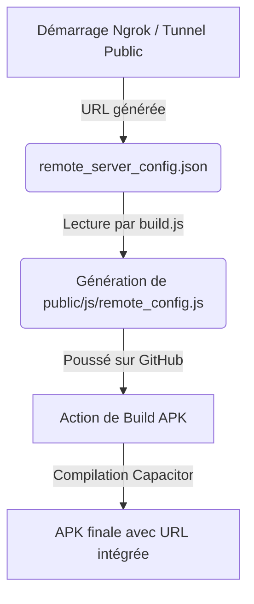
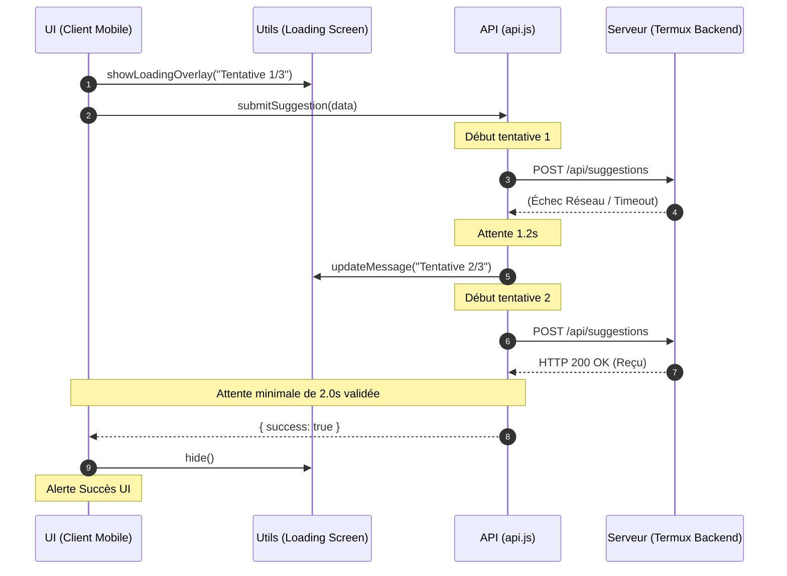

# 📑 Audit de Code & Rapport de Stabilité (v2)

Ce document fournit un audit technique détaillé des dernières modifications apportées au projet **Dr.CAT** (Axe Client/Serveur, Stratégie Réseau & Expérience Utilisateur). 

---

## 📋 Table des Matières
1. [Axe 1 : Stabilisation du Cache Navigateur (PWA & HTTP)](#axe-1--stabilisation-du-cache-navigateur-pwa--http)
2. [Axe 2 : Compilation Dynamique de l'URL Serveur (Zero-Setup APK)](#axe-2--compilation-dynamique-de-lurl-serveur-zero-setup-apk)
3. [Axe 3 : Correction de la Logique de Hors-ligne (Gating Invité/Admin)](#axe-3--correction-de-la-logique-de-hors-ligne-gating-invitéadmin)
4. [Axe 4 : Tunnel de Soumission des Suggestions (UX Premium & Retry Loop)](#axe-4--tunnel-de-soumission-des-suggestions-ux-premium--retry-loop)
5. [Diagrammes d'Architecture & Flux](#diagrammes-darchitecture--flux)
6. [Conclusion & Recommandations Handoff](#conclusion--recommandations-handoff)

---

## Axe 1 : Stabilisation du Cache Navigateur (PWA & HTTP)
* **Problématique** : Les modifications appliquées sur le serveur ne s'actualisaient pas chez les utilisateurs sans devoir supprimer manuellement les cookies/données de site ou naviguer en mode privé.
* **Audit & Solution** :
  1. **Network-First (PWA)** : Migration du fichier `public/service-worker.js` d'une stratégie *Cache-First* à **Network-First** pour tous les fichiers statiques principaux. Version du cache incrémentée à `dr-cat-v2`.
  2. **Interdiction de Cache HTML** : Modification de `server.js` pour configurer le middleware de fichiers statiques d'Express. Les fichiers `.html` reçoivent désormais des en-têtes HTTP de non-mise en cache strictes :
     ```http
     Cache-Control: no-store, no-cache, must-revalidate, proxy-revalidate
     Pragma: no-cache
     Expires: 0
     ```
* **Impact** : Mise à jour instantanée du site en production dès la reconnexion au réseau.

---

## Axe 2 : Compilation Dynamique de l'URL Serveur (Zero-Setup APK)
* **Problématique** : L'adresse de tunnel dynamique (Ngrok) change à chaque démarrage du backend. Les APK installées sur tablette ou mobile ne pouvaient pas deviner cette URL sans configuration manuelle (ce qui était bloqué sur mobile car le bouton Admin est masqué).
* **Audit & Solution** :
  - **Compilation Automatisée** : Écriture d'un script d'assemblage dans `build.js` et d'une routine de démarrage dans `server.js`. Ils lisent le fichier local `remote_server_config.json` et génèrent dynamiquement un fichier de configuration JavaScript : `public/js/remote_config.js` (gitignored).
  - **Intégration API** : `public/js/api.js` importe la constante `REMOTE_SERVER_URL` directement depuis ce fichier auto-généré.
  - **Tracking Git** : Retrait de `remote_server_config.json` de `.gitignore` afin que le compilateur GitHub Actions (Ubuntu runner) puisse lire la configuration et injecter le bon tunnel actif lors de la génération de l'APK.
  - **Anti-pollution Caches (`localStorage`)** : Ajout d'une détection dans `public/js/api.js` (`getRemoteServerUrl()`) : si la valeur compilée de `REMOTE_SERVER_URL` change (nouvelle version de l'APK installée avec un nouveau tunnel), l'application invalide et supprime automatiquement toute ancienne URL Ngrok périmée stockée dans le `localStorage` de l'appareil.

---

## Axe 3 : Correction de la Logique de Hors-ligne (Gating Invité/Admin)
* **Problématique (Bug Logique)** : Si la connexion réseau échouait ou si le serveur était injoignable, la méthode `submitSuggestion()` retombait sur les méthodes d'écriture locales de l'administrateur (`createCatOnServer`/`saveCatDataToServer`).
* **Conséquences** : 
  1. Les invités généraient des fiches et des modifications directement dans leur `localStorage` local (créant des données "fantômes" invalides).
  2. L'interface affichait une alerte de "Proposition envoyée avec succès" alors qu'aucune donnée n'avait atteint le serveur.
* **Audit & Solution** :
  - Restructuration logique complète de `submitSuggestion()`. Les propositions de fiches ou modifications initiées par des invités **n'ont pas le droit** de polluer le stockage local et d'agir comme des administrateurs.
  - Si le serveur est injoignable, l'envoi s'interrompt proprement et renvoie `{ success: false, error: '...' }`, forçant la modale UI à afficher une notification d'échec explicite à l'utilisateur.

---

## Axe 4 : Tunnel de Soumission des Suggestions (UX Premium & Retry Loop)
* **Problématique** : Les réseaux mobiles et tablettes étant instables, un envoi de suggestion pouvait échouer instantanément en cas de micro-coupure, sans possibilité de récupération. De plus, aucun indicateur visuel de chargement n'était présenté à l'utilisateur.
* **Audit & Solution** :
  1. **Boucle de Tentatives (Retry Loop)** : Implémentation d'un algorithme de retry à 3 essais maximum dans `public/js/api.js`. L'application attend **1.2 secondes** entre chaque tentative en cas d'erreur de connexion réseau.
  2. **Modale d'Attente Glassmorphism** : Création dans `public/js/utils.js` d'un overlay d'attente stylisé avec floutage d'arrière-plan, un indicateur de rotation (spinner cyan) et un texte dynamique reflétant l'essai en cours (ex : `"Tentative 2/3"`).
  3. **Protection contre le Scintillement (Anti-Flash)** : Le wrapper UI calcule le temps d'exécution et force l'affichage du loader pendant une durée minimale de **2 secondes**, évitant les sursauts graphiques désagréables si le réseau est ultra-rapide.

---

## Diagrammes d'Architecture & Flux

### 1. Workflow de Compilation de l'APK (Injecteur d'URL)


### 2. Flux de Soumission des Suggestions avec Retries


---

## Conclusion & Recommandations Handoff

* **Sécurité & Robuste** : Le cloisonnement admin/invité est entièrement consolidé. Les utilisateurs invités ne peuvent plus contourner les requêtes ou modifier leur cache local par accident.
* **Handoff pour le prochain chat** : Toutes les modifications sont stagees, commitees et poussées sur `master` et `light-android`. Le prochain agent de développement peut reprendre en toute confiance en s'appuyant sur cette base stable et audités.
