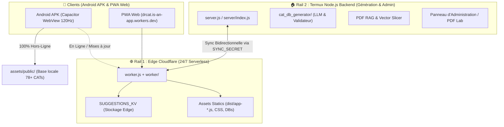

# 🗺️ Carte Complète du Codebase Dr.CAT (Living Codebase Map)

> **Dernière mise à jour** : 2026-09-02 (v1.19.0)  
> **Auteur** : Dr. Kibeche Ali Dia Eddine  
> **Statut** : Document vivant de référence (Single Source of Truth)

---

## 🏛️ 1. Topologie & Architecture Système

Dr.CAT repose sur un modèle **Dual-Rail / Multi-Rail Hybride** garantissant une disponibilité clinique 24h/24 :



---

## 📂 2. Arborescence Détaillée des Répertoires

```
med/
├── .agents/                      # Protocoles d'exécution et règles Antigravity (AGENTS.md)
├── .github/workflows/            # CI/CD GitHub Actions (build-apk.yml)
├── android/                      # Projet natif Android Studio / Capacitor 7
│   ├── app/                      # Code source natif, AndroidManifest.xml, build.gradle
│   └── variables.gradle          # Versions du SDK (targetSdkVersion = 34)
├── cat_db_generator/             # Moteur de génération IA & Validation Médicale
│   ├── lib/                      # llm-engine.js, medical-validator.js, model-selector.js
│   ├── cats_db_staged.json       # Base de staging canonique (JSON Array pur)
│   ├── cats_db_staged.meta.json  # Sidecar de versionnage de schéma (v3.5)
│   ├── golden_set.json           # 5 cas cliniques de référence pour le test golden
│   └── generate_cat_db.js        # CLI principal de génération (npm run generate)
├── data/                         # Stockage des données de référence & PDF masters
│   ├── pdf_masters/              # 78 PDF médicaux originaux haute résolution
│   ├── pdf_cache/                # Extractions OCR et index sémantique
│   └── nomenclature/             # BDPM et Nomenclature Algérienne des médicaments
├── docs/                         # Documentation Diátaxis complète
│   ├── 01-architecture/          # Architecture, Dual-rail, Télémétrie, Codebase Map
│   ├── 02-guides/                # Guides pas-à-pas (Wrangler, APK, Domaine, PDF Lab)
│   ├── 03-reference/             # Spécifications d'API, Schémas, Nomenclature
│   └── 04-decisions-adr/         # Architecture Decision Records (ADR 001 à 007)
├── public/                       # Frontend Web & Assets de Production pour l'APK
│   ├── css/                      # Feuilles de styles modulaires (variables, layout, modals, etc.)
│   ├── js/                       # Code source frontend modulaire ES Modules
│   │   ├── components/           # Composants UI (header, sidebar, workspace, etc.)
│   │   ├── api.js                # Client API & gestion des fallbacks réseau
│   │   ├── main.js               # Point d'entrée de l'application cliente
│   │   ├── state.js              # Store d'état réactif central
│   │   ├── utils.js              # Parsers Markdown, formatteurs médicaux, sanitize
│   │   └── version-checker.js    # Vérificateur de version au démarrage & Lock Gate
│   ├── data/                     # Bases de données minifiées de production (cats_db.json)
│   ├── dist/                     # Bundle de production minifié (app-*.js)
│   ├── index.html                # Page d'accueil unique (Critical CSS + Splash étanche)
│   └── og-banner.png             # Bannière Open Graph HD 1200x630 officielle
├── scripts/                      # Boîte à outils CLI d'automatisation
├── server/                       # Backend Node.js / Express pour Termux
│   ├── routes/                   # Endpoints Express (cats, admin, suggestions, telemetry, pdfs)
│   ├── services/                 # Auth, Cache, Data Store, Sync Worker, Server Providers
│   └── index.js                  # Initialisation du serveur Termux
├── shortcuts/                    # Raccourcis d'environnement Termux (start_med.sh)
├── tests/                        # 11 Suites de tests automatisées Master Test Suite
├── build.js                      # Orchestrateur de build et d'estampillage des versions
├── package.json                  # Dépendances, métadonnées et scripts npm
├── remote_server_config.json     # Registre central des serveurs actifs
├── worker.js                     # Point d'entrée du Cloudflare Worker Edge
└── wrangler.jsonc                # Configuration de déploiement Cloudflare
```

---

## 🎨 3. Architecture Frontend (`public/`)

### 📦 Composants UI (`public/js/components/`)
- [`header.js`](../../public/js/components/header.js) : Barre supérieure, recherche globale, bouton de bascule de vue, statut en ligne.
- [`sidebar.js`](../../public/js/components/sidebar.js) : Tiroir latéral, liste des 78+ CATs avec `content-visibility: auto` (120 FPS), filtres de spécialité et recherche instantanée.
- [`workspace.js`](../../public/js/components/workspace.js) : Zone clinique principale, rendu des 7 étapes rétractables de la synthèse, onglets interactifs, ordonnances par DCI, posologies et calculateurs associés.
- [`dashboard.js`](../../public/js/components/dashboard.js) : Vue d'accueil, cartes de spécialités médicales, accès rapide aux urgences vitales.
- [`leitner.js`](../../public/js/components/leitner.js) : Système de révision médicale par répétition espacée (SM-2 / Leitner 5 boîtes).
- [`calculators.js`](../../public/js/components/calculators.js) : Calculateurs médicaux (Clairance Cockcroft-Gault, Score de Wells, Glasgow, IMC, etc.).
- [`modals.js`](../../public/js/components/modals.js) : Gestionnaire des fenêtres modales avec dimensionnement dynamique `100dvh` (Mode Lecture, Suggérer une CAT, Mentions Légales).
- [`native.js`](../../public/js/components/native.js) : Pont natif Android / Capacitor (Bouton retour matériel, hauteur du clavier, cycle de vie pause/resume).

### 🎨 Design Tokens & CSS (`public/css/`)
- [`variables.css`](../../public/css/variables.css) : Tokens de couleurs (Dark `#090d16` / Light `#f1f5f9`), transition view transitions `::view-transition-new/old(root)`.
- [`modal.css`](../../public/css/modal.css) : Boîtes de dialogue en `100dvh` avec marges de respiration de 24px pour Chrome & Firefox.
- [`utilities.css`](../../public/css/utilities.css) : Réactivité tactile 0ms via `touch-action: manipulation` et retour haptique visuel.
- [`sidebar.css`](../../public/css/sidebar.css) : Confinement de défilement `overscroll-behavior-y: contain`.

---

## 🛠️ 4. Boîte à Outils des Scripts CLI (`scripts/`)

| Commande / Script | Description & Rôle |
| :--- | :--- |
| **`npm run set:domain -- <domain>`** | Met à jour automatiquement le sous-domaine Cloudflare dans les 12 fichiers cibles et recompile l'app. |
| **`npm run build`** | Compile le bundle JS minifié (`build.js`), optimise les CSS critiques et estampilie la version. |
| **`npm run test:suite`** | Exécute les 11 suites de tests automatisées (Audit de sécurité, RAG, Télémétrie, Smoke, etc.). |
| **`npm run generate`** | Lance le générateur IA de CATs (`cat_db_generator/generate_cat_db.js`). |
| **`npm run generate -- --canary`** | Lance le test canary du parseur de posologies avant génération. |
| **`npm run generate -- --golden`** | Régénère les 5 cas cliniques de référence pour mesurer la dérive de qualité clinique. |
| **`npm run compress:pdfs`** | Compresse les PDF masters pour les empaqueter de façon compacte dans l'APK. |
| **`npm run reindex`** | Réindexe les documents PDF et le sommaire vectoriel pour la recherche sémantique. |
| **`npm run cap:sync`** | Synchronise le dossier `public/` vers Android et retire les sources JS de dev brutes (`clean_android_assets.js`). |

---

## 🔒 5. Sécurité & Données

1. **Intégrité Stockage Médecin** :
   - Règle stricte anti-`localStorage.clear()` sur les écrans de verrouillage pour préserver notes cliniques (`dr_cat_notes_*`), statistiques Leitner et streaks d'apprentissage.
2. **Parité Cloudflare Worker** :
   - `SYNC_SECRET` partagé et strictement identique entre Termux `.env` et Cloudflare Worker secret.
3. **Hardening APK Android** :
   - `aaptOptions.ignoreAssetsPattern` élimine tout code source de développement lors du packaging de l'APK release.
