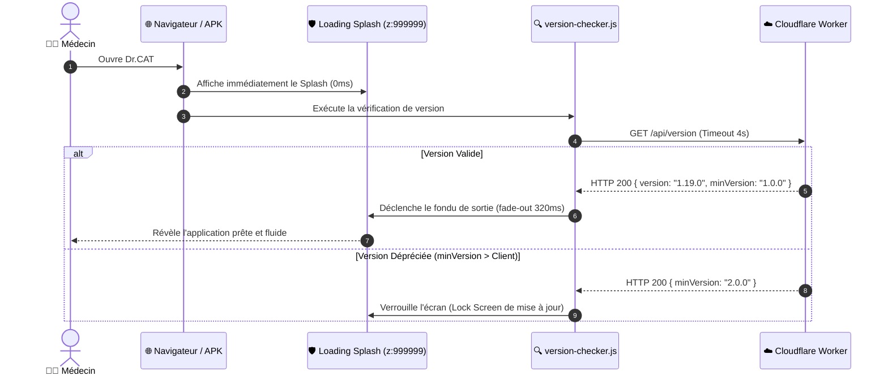

# 🗺️ Carte Complète & Architecture Technique du Codebase Dr.CAT

> **Dernière mise à jour** : 2026-09-02 (v1.19.0)  
> **Auteur & Concepteur** : Dr. Kibeche Ali Dia Eddine  
> **Statut** : Document Maître de Référence Technique (Single Source of Truth)

---

## 🏛️ 1. Topologie Globale & Modèle Hybride Multi-Rail

Dr.CAT est une application médicale conçue pour fonctionner avec une disponibilité de 100%, combinant un client mobile Android hors-ligne, un réseau Edge mondial Cloudflare et un serveur d'administration local sous Termux.

```mermaid
flowchart TD
    subgraph ClientLayer["📱 1. COUCHE CLIENT (PWA & APK ANDROID)"]
        APK["📱 Android APK (Capacitor 7 / WebView 120Hz)"]
        WebPWA["🌐 Client PWA Web (Navigateurs Desktop / Mobile)"]
        LocalFS["💾 Base Locale cats_db.json (100% Hors-Ligne)"]
        APK -->|Lecture Directe Instantanée 0ms| LocalFS
        WebPWA -->|Lecture Assets & API| EdgeRouter
    end

    subgraph Rail1["☁️ 2. RAIL 1 : EDGE CLOUDFLARE 24/7 (Haute Disponibilité)"]
        EdgeRouter["worker.js (Routeur Serverless)"]
        KVStore["SUGGESTIONS_KV (Cloudflare KV Store)"]
        CDNAssets["Assets Statiques (dist/app-*.js, CSS, DBs)"]
        TelemetryIngest["Routeur Télémétrie Edge /api/telemetry"]
        EdgeRouter --> KVStore
        EdgeRouter --> CDNAssets
        EdgeRouter --> TelemetryIngest
    end

    subgraph Rail2["🏠 3. RAIL 2 : BACKEND LOCAL TERMUX / NODE.JS (Admin & IA)"]
        NodeServer["server/index.js & server.js (Port 3000)"]
        LLMEngine["cat_db_generator/ (Moteur IA Gemini & Validateur BDPM)"]
        PDFLab["PDF Lab (Visual Slicer, Sommaire GPS & RAG Vectoriel)"]
        AdminDashboard["Panneau Admin & Gestionnaire de Suggestions"]
        DiskStore["data/ (PDF Masters, Caches OCR, Golden Set)"]
        NodeServer --> LLMEngine
        NodeServer --> PDFLab
        NodeServer --> AdminDashboard
        NodeServer --> DiskStore
    end

    APK -.->|Mises à jour & Télémétrie| EdgeRouter
    NodeServer <==|Sync 2-Voies x-sync-secret| EdgeRouter
```

---

## 📂 2. Arborescence Complète & Rôle Exhaustif des Modules

### 📱 A. Couche Frontend & Assets (`public/`)

```
public/
├── css/                              # Feuilles de styles modulaires
│   ├── animations.css                # Keyframes GPU (pulse-glow, tapRipple, fadeIn)
│   ├── dashboard.css                 # Vue d'accueil, grille des spécialités, cartes cliniques
│   ├── fonts.css                     # Définition @font-face locale Outfit (WOFF2 offline)
│   ├── layout.css                    # Grille responsive, header fixe, zone split-view
│   ├── legal.css                     # Bannière de consentement et modale CGU/Mentions
│   ├── modal.css                     # Modales 100dvh avec marges de respiration Chrome/Firefox
│   ├── sidebar.css                   # Tiroir des CATs, content-visibility: auto (120 FPS)
│   ├── update-modal.css              # Écran de verrouillage de sécurité et force-update
│   ├── utilities.css                 # touch-action: manipulation (0ms tap), badges, pill-buttons
│   ├── variables.css                 # Design tokens CSS, transitions de thème circulaires
│   └── workspace.css                 # Zone de consultation, 7 étapes rétractables, ordonnances
├── data/                             # Données de production minifiées pour le client
│   ├── cats_db.json                  # Base finale des CATs (78+ fiches, métriques IA retirées)
│   ├── pdf_index.json                # Index public des 78 thèses et livres médicaux
│   ├── pdf_list.json                 # Liste épurée des fichiers PDF consultables
│   └── quiz_db.json                  # Questions de révision médicale pour le mode Leitner
├── dist/                             # Bundles de production générés par build.js
│   ├── app-[HASH].js                 # Bundle JavaScript minifié et obfusqué
│   └── chunk-[HASH].js               # Chunks de code scindés pour optimisation LCP
├── fonts/                            # Polices typographiques hébergées localement
│   └── outfit-latin.woff2            # Police sans-serif moderne, zéro requête externe
├── js/                               # Code source JavaScript modulaire (ES Modules)
│   ├── components/                   # Composants autonomes de l'interface
│   │   ├── admin-modal.js            # Panneau de modération des suggestions et injection CAT
│   │   ├── calculators.js            # Calculateurs médicaux (Cockcroft, Wells, IMC, Glasgow)
│   │   ├── dashboard.js              # Rendu de la vue d'accueil et raccourcis d'urgences
│   │   ├── header.js                 # Barre de recherche globale et bascule de thème
│   │   ├── leitner.js                # Moteur de répétition espacée Leitner (5 boîtes SM-2)
│   │   ├── modals.js                 # Gestionnaire universel des fenêtres modales
│   │   ├── native.js                 # Pont natif Capacitor (BackButton, Keyboard, Lifecycle)
│   │   ├── search.js                 # Moteur de recherche instantanée multi-critères
│   │   ├── sidebar.js                # Gestion du tiroir latéral et des filtres de spécialité
│   │   └── workspace.js              # Rendu clinique de la fiche, ordonnances et étapes
│   ├── api.js                        # Client HTTP avec gestion multi-rail et timeouts
│   ├── config.js                     # Clés de configuration de l'application cliente
│   ├── debug-console.js              # Console de débogage flottante pour l'APK Android
│   ├── main.js                       # Point d'entrée de l'application et cycle de démarrage
│   ├── remote_config.js              # URLs des serveurs distants injectées par build.js
│   ├── state.js                      # Store d'état réactif centralisé (Observable pattern)
│   ├── utils.js                      # Formatteurs Markdown, sanitizers et helpers DOM
│   └── version-checker.js            # Vérificateur de version au démarrage et Security Gate
├── drcat_logo.webp                   # Logo officiel optimisé WebP pour le splash screen
├── favicon.png                       # Icône de navigateur haute résolution
├── icon-192.png / icon-512.png       # Icônes PWA et lanceur Android
├── index.html                        # Page HTML unique (Critical CSS inlined + Splash étanche)
├── manifest.json                     # Manifeste PWA pour installation sur écran d'accueil
├── og-banner.png                     # Bannière officielle Open Graph 1200x630 HD
├── robots.txt                        # Directives pour moteurs de recherche et IA
├── sitemap.xml                       # Plan du site XML pour indexation SEO
└── style.css                         # Point d'entrée des styles regroupant les modules CSS
```

---

### 🧠 B. Moteur IA & Générateur Médical (`cat_db_generator/`)

```
cat_db_generator/
├── lib/
│   ├── gemini-schemas.js             # Schémas OpenAPI stricts pour l'API Google Gemini
│   ├── llm-engine.js                 # Orchestrateur Gemini (découverte, blocklist, retry)
│   ├── medical-validator.js          # Validateur en 7 sections (DCI, BDPM, plafonds)
│   ├── model-selector.js             # Sélecteur dynamique de modèles avec scoring
│   ├── prompt-builder.js             # Constructeur de prompts cliniques structurés
│   └── semantic-rag.js               # Moteur RAG dense avec gemini-embedding-2 (3072 dims)
├── cats_db_staged.json               # Base de données de staging (Array JSON pur)
├── cats_db_staged.meta.json          # Métadonnées et schéma version sidecar (v3.5)
├── generate_cat_db.js                # CLI de génération principale (`npm run generate`)
└── golden_set.json                   # 5 cas cliniques de référence pour le test golden
```

---

### 🏠 C. Backend Node.js Termux (`server/`)

```
server/
├── routes/                           # Endpoints Express REST API
│   ├── admin.js                      # Endpoints d'administration, staging, PDF Lab
│   ├── cats.js                       # Endpoints publics de consultation des fiches
│   ├── pdfs.js                       # Endpoints de streaming et de découpe PDF
│   ├── search.js                     # Recherche sémantique locale sur les PDF
│   ├── suggestions.js                # Réception et modération des suggestions
│   └── telemetry.js                  # Collecte et agrégation des crashs mobiles
├── services/                         # Services métier backend
│   ├── auth.js                       # Authentification par token de session sécurisé
│   ├── cache.js                      # Cache mémoire avec invalidation automatique
│   ├── data-store.js                 # Écriture atomique sécurisée via fichiers .tmp
│   ├── server-providers-config.js    # Gestion du registre de serveurs (remote_server_config)
│   └── sync-suggestions.js           # Relais de synchronisation Cloudflare KV (SYNC_SECRET)
└── index.js                          # Point d'entrée du serveur Express
```

---

### ☁️ D. Edge Cloudflare Worker (`worker/` & `worker.js`)

```
worker/
├── routes/
│   ├── static-alias.js               # Alias serveur pour /api/cats, /api/version, etc.
│   ├── suggestions.js                # Routeur KV pour soumission et lecture protégée
│   └── telemetry.js                  # Ingestion des rapports de crashs sur l'Edge
├── cors.js                           # En-têtes CORS universels et preflights OPTIONS
└── worker.js                         # Point d'entrée du Worker Cloudflare
```

---

## 🔄 3. Flux de Données & Protocoles Clés

### 1. Cycle de Démarrage Client (Anti-FOUC & Vérification)


### 2. Protocole de Synchronisation Cloudflare KV (`SYNC_SECRET`)
1. Un médecin propose une CAT via l'APK $\rightarrow$ `POST /api/suggestions` sur Cloudflare Edge.
2. Le Worker valide la clé publique `x-app-key` et écrit dans `SUGGESTIONS_KV`.
3. Lorsque le serveur Termux démarre $\rightarrow$ `GET /api/suggestions` avec `x-sync-secret`.
4. Le Worker compare le secret par HMAC SHA-256 en temps constant et renvoie la file.
5. Termux sauvegarde dans `suggestions.json` et envoie un accusé de réception `POST /api/suggestions/ack` pour purger la file du cloud.

---

## 🛠️ 4. Matrice Complète des Scripts CLI

| Commande | Fichier Script Source | Fonction Principale |
| :--- | :--- | :--- |
| `npm run set:domain -- <url>` | `scripts/update_domain.js` | Met à jour le domaine dans les 12 fichiers cibles, régénère la bannière et compile le build. |
| `npm run build` | `build.js` | Inversion CSS critique, bundling ESbuild, minification et estampillage de version. |
| `npm run test:suite` | `tests/run_all_tests.js` | Exécution des 11 suites de tests unitaires et d'intégration (0 échec toléré). |
| `npm run generate` | `cat_db_generator/generate_cat_db.js` | Moteur de génération IA de conduites à tenir médicales. |
| `npm run generate -- --canary` | `cat_db_generator/generate_cat_db.js` | Test canary du parseur posologique sur 15 formulations complexes. |
| `npm run generate -- --golden` | `cat_db_generator/generate_cat_db.js` | Score de régression clinique sur les 5 cas du Golden Set. |
| `npm run cap:sync` | `scripts/clean_android_assets.js` | Synchronisation Capacitor et dépouillement des sources JS brutes de l'APK. |
| `npm run compress:pdfs` | `scripts/compress_pdfs.js` | Optimisation Ghostscript/Vectorielle des PDF masters pour l'APK. |
| `npm run reindex` | `index_pdfs.js` | Réindexation OCR et vectorisation sémantique des 78 PDF masters. |
| `npm run bump` | `scripts/bump_version.js` | Incrémentation sémantique de version et mise à jour de `package.json`. |
| `npm run set:password` | `set_admin_password.js` | Définition du mot de passe administrateur sécurisé. |
| `npm run set:provider` | `set_server_provider.js` | Configuration manuelle du registre de serveurs `remote_server_config.json`. |
