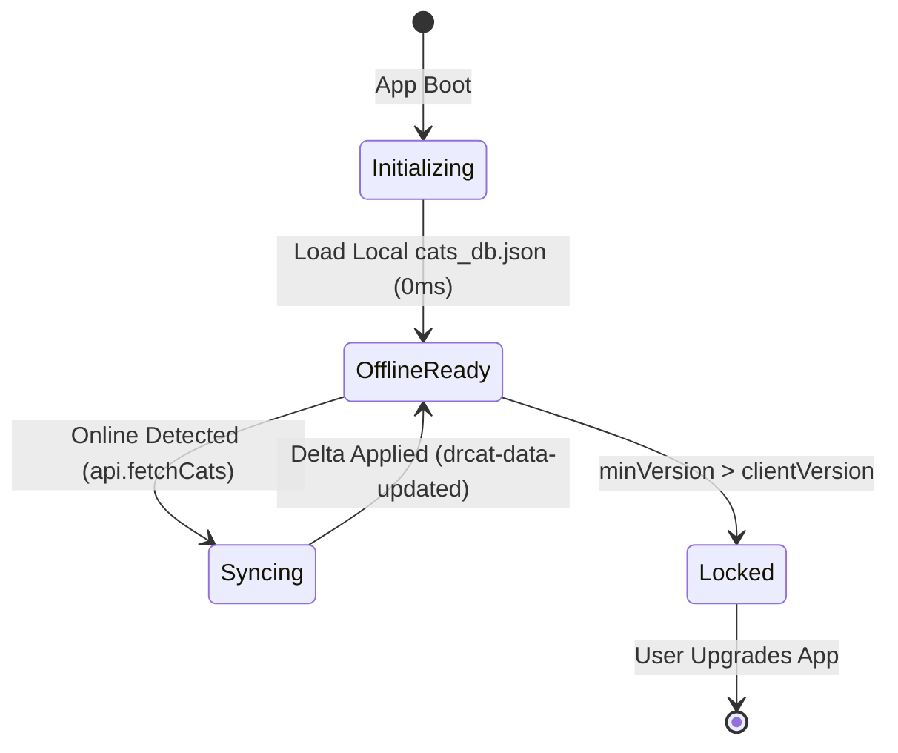

# Dr.CAT Architectural Blueprint & Codebase Map (codebase-map.md)

> **Document Type**: System Architecture Specification & Component Dependency Map  
> **Target Audience**: Senior Software Engineers & Autonomous AI Agents  
> **Status**: Production (v1.19.0+)

---

## 1. System Topology & Infrastructure Layering

Dr.CAT implements a **Dual-Rail Hybrid Architecture** providing zero-latency offline execution on mobile devices combined with an always-on Cloudflare Edge serverless layer and a local Node.js management daemon under Termux.

```mermaid
graph TD
    subgraph Layer1["1. Client Layer (Capacitor Native APK & PWA)"]
        WebView["Chromium WebView / Browser Context"]
        StateStore["Observable State Store (state.js)"]
        RouterEngine["Client Routing & Modal Manager (modals.js)"]
        LocalBundle["Pre-packaged DB (assets/public/data/cats_db.json)"]
        WebView --> StateStore --> RouterEngine
        WebView -->|0ms Instant Read| LocalBundle
    end

    subgraph Layer2["2. Global Edge Layer (Cloudflare Serverless)"]
        WorkerRouter["worker.js (Edge Handler)"]
        KV["SUGGESTIONS_KV (Cloudflare KV Store)"]
        StaticAssets["Edge CDN (dist/app-*.js, CSS, Fonts)"]
        WorkerRouter --> KV
        WorkerRouter --> StaticAssets
    end

    subgraph Layer3["3. Backend Daemon Layer (Termux / Linux Node.js)"]
        ExpressServer["server/index.js (Express 5 Daemon)"]
        LLMOrchestrator["cat_db_generator/ (Gemini AI & Pharmacovigilance)"]
        RAGProcessor["PDF Lab (Vector Slicer & Semantic Embeddings)"]
        LocalDisk["Filesystem (data/pdf_masters/, nomenclature/)"]
        ExpressServer --> LLMOrchestrator
        ExpressServer --> RAGProcessor
        ExpressServer --> LocalDisk
    end

    WebView -.->|HTTP / REST (api.js)| WorkerRouter
    ExpressServer <==|Bidirectional Sync (SYNC_SECRET HMAC)| WorkerRouter
```

---

## 2. Directory Structure & Module Contract Matrix

### 2.1 Client Frontend Core (`public/`)

| Module Path | Exports / Entry Point | Runtime Dependencies | Architectural Role |
| :--- | :--- | :--- | :--- |
| `public/index.html` | Entry HTML Document | Inline Critical CSS | Single Page Application entrypoint; contains Splash veil `#app-loading-overlay`. |
| `public/js/main.js` | `initApp()` | `state.js`, `api.js`, `components/*` | Client bootstrap coordinator; initializes DOM event delegation and loads initial dataset. |
| `public/js/state.js` | `state`, `subscribe()` | None | Reactive centralized store implementing the Observable pattern. |
| `public/js/api.js` | `fetchCats()`, `getApiUrl()` | `remote_config.js` | HTTP transport layer handling multi-rail fallback, retries, and network headers. |
| `public/js/version-checker.js`| `initVersionChecker()`| `api.js` | Boot-time update verification and non-destructive Security Lock Gate. |
| `public/js/utils.js` | `sanitize()`, `parseMd()`| None | Markdown parser, XSS sanitizer, and DOM string manipulation utilities. |
| `public/js/debug-console.js` | `initDebugConsole()` | `api.js` | On-screen diagnostics overlay for inspecting logs directly on Android devices. |

#### UI Component Tree (`public/js/components/`)
* `header.js`: Global search bar, view mode switchers (Dashboard / Workspace / Leitner / Calculators), theme toggle.
* `sidebar.js`: 78+ CAT list renderer utilizing CSS `content-visibility: auto; contain-intrinsic-size: auto 52px;` for 120 FPS list inertia.
* `workspace.js`: Primary clinical reader rendering the 7-step collapsible protocol accordion, interactive DCI prescription tables, and red flags.
  - `workspace/prescription.js`: Dual-View Prescription engine (⚡ Express pharmacy Rx format vs 📖 Detailed clinical guide & RHD) with `localStorage` sticky state persistence.
* `dashboard.js`: Specialty grid navigation, clinical emergency shortcuts, and recent reading stats.
* `leitner.js`: SM-2 Spaced Repetition flashcard system using 5 interval review boxes.
* `calculators.js`: Medical formula engine (Cockcroft-Gault, Wells Score, Glasgow Coma Scale, BMI, Corrected Calcium).
* `modals.js`: Viewport-aware dialog manager (`100dvh`) handling Reading Mode, Suggestion Submission, and Legal disclaimers.
* `douaa-toast.js`: Top-right non-intrusive spiritual reminder & Sadaqa Jariyah toast rotating 5 authentic Douas on a 20-minute real-time cooldown.
* `native.js`: Capacitor native bridge handling Android Hardware Back Button stack, soft keyboard resizing, and lifecycle events.

---

### 2.2 Medical AI Generation Engine (`cat_db_generator/`)

| Module Path | Core Functionality | Input / Output Contract |
| :--- | :--- | :--- |
| `generate_cat_db.js` | CLI Generation Orchestrator | CLI flags (`--canary`, `--golden`, `--rebuild-all`) $\rightarrow$ updates `cats_db_staged.json`. |
| `lib/llm-engine.js` | Google Gemini API Transport | Dynamic model discovery, `GEMINI_BLOCKLIST` filtering, and OpenAPI schema locking. |
| `lib/gemini-schemas.js`| OpenAPI Schema Definitions | Strict JSON schemas enforced on LLM output via `responseSchema`. |
| `lib/medical-validator.js`| 7-Gate Clinical Validator | Verifies drug tokens against BDPM & Algerian nomenclature; enforces dosage ceilings. |
| `lib/semantic-rag.js` | Dense Vector Search | Vector cosine similarity search via `gemini-embedding-2` (3,072 dimensions). |
| `lib/prompt-builder.js`| Clinical Prompt Synthesizer| Constructs structured markdown prompts under a 10,000 character budget. |
| `golden_set.json` | 5 Reference Clinical Cases | Baseline test suite preventing clinical quality regression during prompt refactors. |

---

### 2.3 Backend Daemon Services (`server/`)

| Module Path | Responsibilities | Security Constraints |
| :--- | :--- | :--- |
| `server/index.js` | Express 5 Application Setup | CORS preflights (`OPTIONS 204`), double-slash normalization, and route mounting. |
| `server/routes/cats.js` | Public Data Endpoints (`/api/cats`) | Read-only; supports incremental sync via `?since=` timestamps. |
| `server/routes/suggestions.js` | Suggestions Moderation | Public `POST` with `x-app-key`; Admin curation endpoints require session tokens. |
| `server/routes/telemetry.js` | Crash Report Aggregator | Deduplicates crash reports via SHA-256 fingerprinting into `telemetry_reports.json`. |
| `server/routes/admin.js` | Administrative Operations | Strictly gated behind Localhost Socket Verification + Bearer Token. |
| `server/services/sync-suggestions.js` | Cloudflare KV Sync Relay | Gated behind `x-sync-secret` with constant-time SHA-256 HMAC comparisons. |
| `server/services/data-store.js` | Atomic File System IO | Guarantees atomic file updates using temporary files and POSIX renames. |

---

### 2.4 Cloudflare Edge Infrastructure (`worker/` & `worker.js`)

| File Path | Routing Contract | Persistence & Bindings |
| :--- | :--- | :--- |
| `worker.js` | Root edge request dispatcher. | Routes `/api/*` to worker handlers and falls back to `env.ASSETS` for static assets. |
| `worker/routes/suggestions.js`| `POST /api/suggestions`, `GET /api/suggestions`, `POST /api/suggestions/ack`. | Bound to `env.SUGGESTIONS_KV`. Server reads require valid `x-sync-secret`. |
| `worker/routes/telemetry.js` | `POST /api/telemetry`. | Edge crash ingestion and reporting endpoint. |
| `worker/cors.js` | Universal CORS Headers. | Injects `Access-Control-Allow-Origin: *` and handles preflight `OPTIONS 204`. |

---

### 2.5 Operational & Administration CLI Scripts (`scripts/` & Root)

| CLI Entry / Script | Command Alias | Functional Scope |
| :--- | :--- | :--- |
| `set_admin_password.js` | `npm run set:password` | Sets/resets admin password with PBKDF2-SHA512 salted hashing. |
| `scripts/update_domain.js`| `npm run set:domain -- <domain>` | Single-command domain migration across config, SEO & client. |
| `set_server_provider.js` | `npm run set:provider` | Multi-gateway and fallback remote server priority configurator. |
| `scripts/bump_version.js` | `npm run bump <version>` | Atomic version synchronizer (`package.json`, `gradle`, `version.json`, `worker.js`). |
| `scripts/compress_pdfs.js`| `npm run compress:pdfs` | Ghostscript ultra-compression pipeline (96 DPI / JPEGQ 60). |
| `index_pdfs.js` | `npm run reindex` | Master PDF indexing into `public/data/pdf_index.json`. |
| `cat_db_generator/scripts/generate_quiz_cli.js` | CLI Docimology Generator | Multi-stage clinical quiz and MCQ vignette batch generation. |
| Full Reference | [**CLI Commands Reference**](file:///data/data/com.termux/files/home/med/docs/03-reference/cli-commands-reference.md) | Exhaustive command ledger for all developer & admin operations. |

---

## 3. Client State Machine Architecture (`public/js/state.js`)

The client application manages state via a single observable store:



### Observable Store Schema:
```typescript
interface AppState {
  cats: Array<ClinicalCAT>;
  activeCatId: number | null;
  activeSpecialty: string;
  searchQuery: string;
  viewMode: 'dashboard' | 'workspace' | 'leitner' | 'calculators';
  isOnline: boolean;
  isAdmin: boolean;
  theme: 'dark' | 'light';
  leitner: {
    cards: Array<LeitnerCard>;
    activeBox: number;
    streak: number;
  };
}
```
