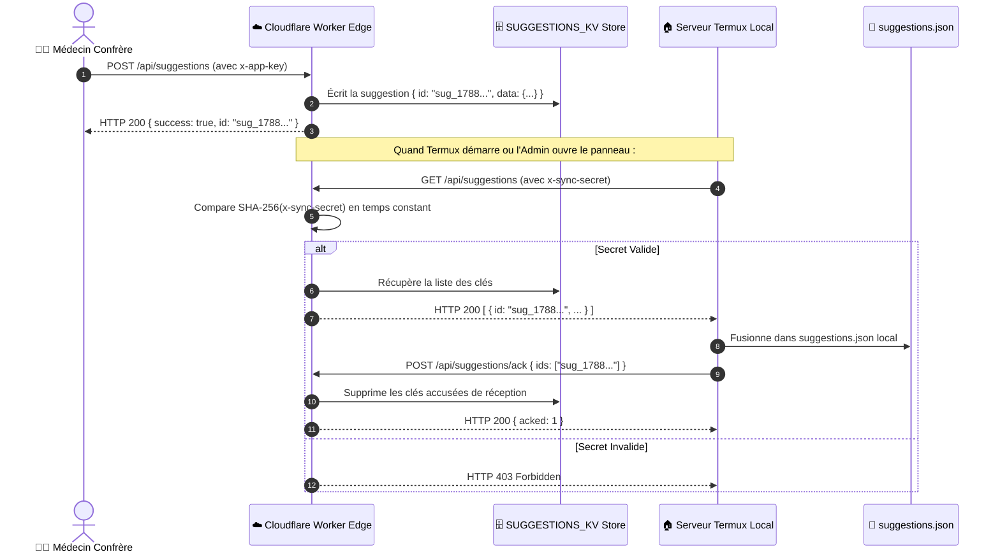

# 🛤️ Architecture Approfondie : Réseau Hybride Multi-Rail & Cloudflare Edge

> **Quadrant Diátaxis** : *01-Architecture (Explanations & Specifications)*  
> **Statut** : Production (v1.19.0+)  
> **Composants Clés** : `worker.js`, `worker/routes/`, `server/services/sync-suggestions.js`, `remote_server_config.json`, `public/js/remote_config.js`, `public/js/api.js`

---

## 🎯 1. Philosophie & Problématique Réseau en Pratique Médicale

Les médecins exercent fréquemment dans des environnements aux contraintes réseau extrêmes :
- **Sous-sols hospitaliers et blocs opératoires** : Zéro réseau cellulaire ou Wi-Fi captif bloquant.
- **Cabinets de consultation** : Connexions ADSL/4G instables avec micro-coupures régulières.
- **Urgences & Gardes de nuit** : Besoin d'une latence d'affichage strictement inférieure à 50 ms.

Pour garantir que l'application ne freeze **jamais**, Dr.CAT implémente une topologie **Multi-Rail Hiérarchisée** :

```mermaid
flowchart TD
    ClientReq["📱 Requête Client (ex: Lecture CAT, Proposition, Crash)"]

    subgraph RailSelection["Mécanisme de Résolution Multi-Rail (api.js)"]
        CheckOffline{"Est-ce une lecture de base ou de document ?"}
        CheckOffline -->|Oui| LocalDB["💾 1. Stockage Local APK (file:///android_asset/ / 0ms)"]
        
        CheckOffline -->|Non (Action Réseau)| Rail1{"Rail 1 : Cloudflare Edge disponible ?"}
        Rail1 -->|HTTP 200 (< 50ms)| EdgeSuccess["☁️ Cloudflare Worker Edge (is-an-app.workers.dev)"]
        
        Rail1 -->|Timeout > 4000ms / Erreur| Rail2{"Rail 2 : Tunnel Ngrok Termux actif ?"}
        Rail2 -->|HTTP 200| TermuxSuccess["🏠 Backend Node.js Termux Direct"]
        
        Rail2 -->|Échec| Rail3{"Rail 3 : Réseau Local Wi-Fi (127.0.0.1:3000) ?"}
        Rail3 -->|HTTP 200| LocalSuccess["📶 Serveur Local Wi-Fi"]
        Rail3 -->|Échec| OfflineFallback["🛡️ Mise en File d'Attente Locale & Retry Différé"]
    end
```

---

## ☁️ 2. Spécification Détaillée des 3 Rails

### ⚡ Rail 1 : Cloudflare Edge Serverless (`drcat.is-an-app.workers.dev`)
- **Disponibilité** : 99.99% mondiale sur plus de 300 centres de données Cloudflare.
- **Rôle Principal** : 
  1. Distribution des assets et des bases statiques (`cats_db.json`, `quiz_db.json`, `pdf_index.json`).
  2. Ingestion 24h/24 des propositions de fiches sans nécessiter que le serveur Termux soit allumé.
  3. Vérificateur de version et barrière de sécurité (`/api/version`).
  4. Collecte et déduplication de la télémétrie mobile (`/api/telemetry`).
- **En-têtes Exigés** :
  - Soumission publique : `x-app-key: drcat-public-v1`
  - Télémétrie publique : `x-client-platform: android | web`

---

### 🏠 Rail 2 : Backend Dynamique Termux (`ngrok-free.dev` / Tunnel)
- **Disponibilité** : Actif lorsque le praticien lance `shortcuts/start_med.sh` sur sa tablette.
- **Rôle Principal** :
  1. Panneau d'administration sécurisé (`/admin`).
  2. Moteur de génération IA Gemini (`cat_db_generator/`).
  3. PDF Lab, OCR unitaire et découpage visuel de pages (`/api/admin/slice-pdf`).
  4. Curateur de staging et injection dans la base de production.
- **Sécurisation** :
  - Vérification de socket locale pour les routes d'écriture (`req.socket.remoteAddress === '127.0.0.1'`).
  - Bypass automatique de la page d'avertissement Ngrok : en-tête `ngrok-skip-browser-warning: true`.

---

### 📶 Rail 3 : Réseau Local Wi-Fi & Base Interne APK
- **Disponibilité** : 100% Permanente, même en mode avion.
- **Rôle Principal** : Rendu instantané de toute l'encyclopédie clinique depuis les assets locaux de l'application sans aucun appel réseau sortant.

---

## 🔄 3. Le Protocole de Synchronisation Cloudflare KV (`SYNC_SECRET`)

Les propositions soumises par des médecins sur le Worker Cloudflare sont récupérées par le serveur local Termux selon un protocole strict d'accusé de réception (Handshake ACK) :



---

## 🔒 4. Matrice de Sécurité & En-têtes HTTP

| Endpoint | Méthode | Rail / Hôte | En-têtes Requis | Réponse Attendue |
| :--- | :---: | :--- | :--- | :--- |
| `/api/cats` | `GET` | Cloudflare / Termux | *Aucun (Public)* | `HTTP 200 JSON (Array)` |
| `/api/version` | `GET` | Cloudflare / Termux | *Aucun (Public)* | `HTTP 200 { version, minVersion }` |
| `/api/suggestions` | `POST` | Cloudflare / Termux | `x-app-key: drcat-public-v1`<br>`Content-Type: application/json` | `HTTP 200 { id, receivedAt }` |
| `/api/suggestions` | `GET` | Cloudflare Edge | `x-sync-secret: <HEX_SECRET>` | `HTTP 200 (Array de suggestions)` |
| `/api/suggestions/ack` | `POST` | Cloudflare Edge | `x-sync-secret: <HEX_SECRET>` | `HTTP 200 { acked: N }` |
| `/api/telemetry` | `POST` | Cloudflare / Termux | `Content-Type: application/json` | `HTTP 200 { reportId, status }` |
| `/api/admin/*` | `ALL` | Termux Uniquement | `Authorization: Bearer <TOKEN>`<br>`Socket Localhost Verified` | `HTTP 200 / 401 / 403` |

---

## 🛠️ 5. Gestion des Pannes & Stratégie de Résilience

1. **Panne de Connexion Totale (Offline)** :
   - Le client n'affiche aucune boîte de dialogue d'erreur intrusive.
   - La consultation des 78 fiches, calculateurs et mode Leitner continue à 100% de ses capacités.
2. **Panne du Serveur Termux (Ngrok déconnecté)** :
   - L'APK bascule silencieusement sur le Rail 1 Cloudflare Edge en 4 secondes.
   - Les soumissions de suggestions et la télémétrie sont redirigées vers Cloudflare KV.
3. **Mise à Jour Forcée du Domaine (`set:domain`)** :
   - L'exécution de `npm run set:domain -- <nouvelle-url>` propage la nouvelle route à travers les 12 fichiers de configuration en moins de 3 secondes.
