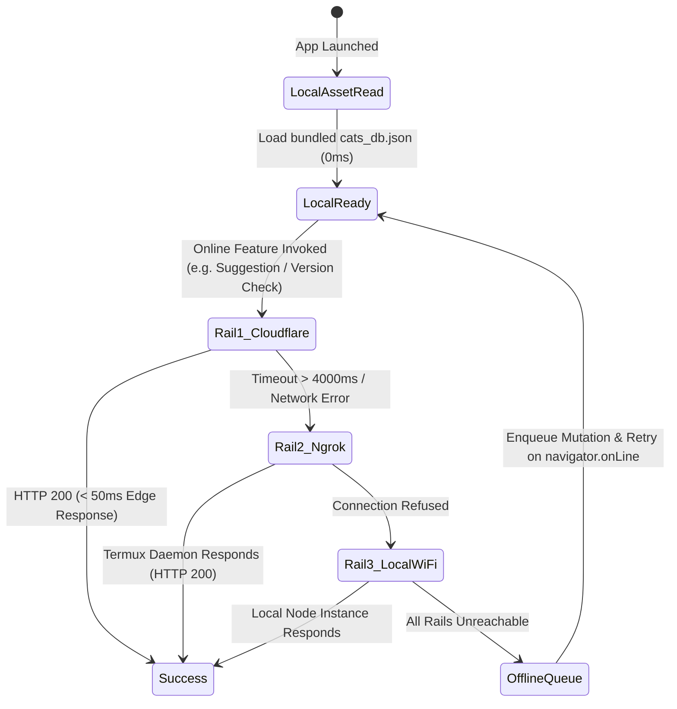
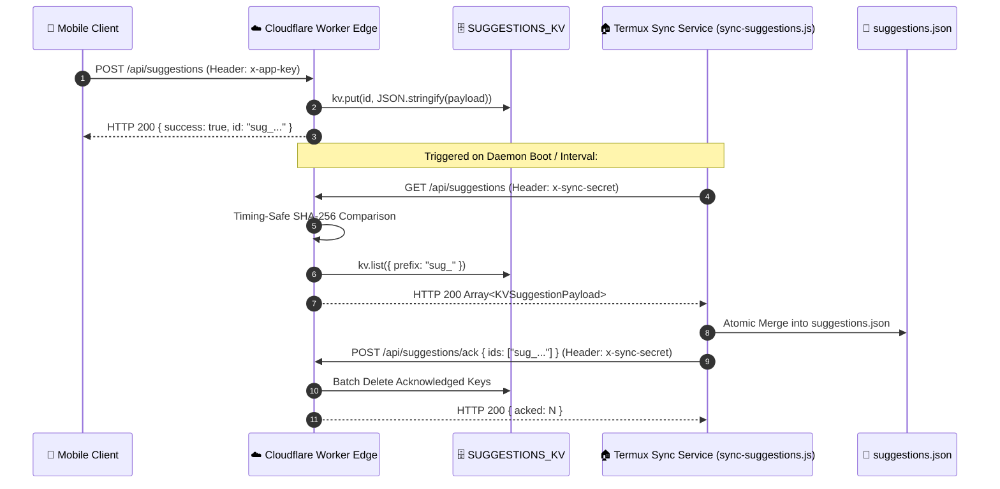

# Dual-Rail Network & Cloudflare Edge Specification (dual-rail-network.md)

> **Document Type**: Network Architecture & Distributed Edge Protocol Specification  
> **Target Audience**: Senior Backend Engineers, Cloud Architects & Autonomous AI Agents  
> **Status**: Production (v1.19.0+)

---

## 1. Network Topology & Fallback State Machine

Dr.CAT utilizes a multi-tier network topology to guarantee high availability across variable clinical connectivity environments (from hospital basements with 0% signal to high-speed broadband).



---

## 2. Distributed Edge Layer Contract (`worker.js`)

The Cloudflare Edge Worker (`drcat.is-an-app.workers.dev`) operates as a serverless gateway bound to KV storage and static CDN assets.

### 2.1 Bindings & Environment Variables
* `env.SUGGESTIONS_KV`: Distributed Key-Value namespace (`d569bf8299a545f182c9e6acedd4d6aa`).
* `env.ASSETS`: Static asset binding serving production bundles from `public/`.
* `env.SYNC_SECRET`: 64-character hexadecimal shared secret for server-to-server KV synchronization.

---

## 3. Suggestions KV Store Schema & Lifecycle

### 3.1 Key Naming Convention
* Format: `sug_<timestamp_ms>_<entropy>` (e.g., `sug_1788309687851_9o6mgex57`).
* KV Expiration: TTL of 30 days (`expirationTtl: 2592000`) to prevent orphaned entries if a sync daemon is offline.

### 3.2 KV Data Payload Schema
```typescript
interface KVSuggestionPayload {
  id: string;                      // Unique suggestion identifier
  title: string;                   // Proposed protocol title
  category: string;                // Clinical category
  summary: string;                 // Markdown clinical protocol
  ordonnance?: Array<Prescription>;// Structured DCI prescription items
  red_flags?: Array<string>;       // Urgent safety warnings
  author_alias?: string;           // Submitting physician's alias
  submitted_at: number;            // Epoch millisecond timestamp
  client_platform: 'android' | 'web';
  app_version: string;
}
```

---

## 4. Two-Way Synchronization & ACK Handshake Protocol

To ensure suggestions submitted to the global edge are safely synchronized to the local Termux database without duplicates, the daemon executes a two-phase handshake:



### 4.1 Constant-Time Secret Validation Algorithm
```javascript
import crypto from 'crypto';

export function timingSafeEqualSecret(providedSecret, expectedSecret) {
  if (!providedSecret || !expectedSecret) return false;
  const bufA = Buffer.from(providedSecret);
  const bufB = Buffer.from(expectedSecret);
  if (bufA.length !== bufB.length) return false;
  return crypto.timingSafeEqual(bufA, bufB);
}
```

---

## 5. HTTP Routing & Security Matrix

| Path | Method | Rail / Target | Required Headers | Response Schema |
| :--- | :---: | :--- | :--- | :--- |
| `/api/cats` | `GET` | Cloudflare Edge / Node | None (Public) | `Array<ClinicalCAT>` |
| `/api/version` | `GET` | Cloudflare Edge / Node | None (Public) | `{"version": string, "minVersion": string}` |
| `/api/suggestions` | `POST` | Cloudflare Edge / Node | `x-app-key: drcat-public-v1`<br>`Content-Type: application/json` | `{"success": true, "id": string}` |
| `/api/suggestions` | `GET` | Cloudflare Edge | `x-sync-secret: <HEX_SECRET>` | `Array<KVSuggestionPayload>` |
| `/api/suggestions/ack`| `POST` | Cloudflare Edge | `x-sync-secret: <HEX_SECRET>`<br>`Content-Type: application/json` | `{"success": true, "acked": number}` |
| `/api/telemetry` | `POST` | Cloudflare Edge / Node | `Content-Type: application/json` | `{"success": true, "reportId": string}` |
| `/api/admin/*` | ALL | Termux Daemon | `Authorization: Bearer <TOKEN>`<br>`Socket Localhost Verified` | Operations dependent |
