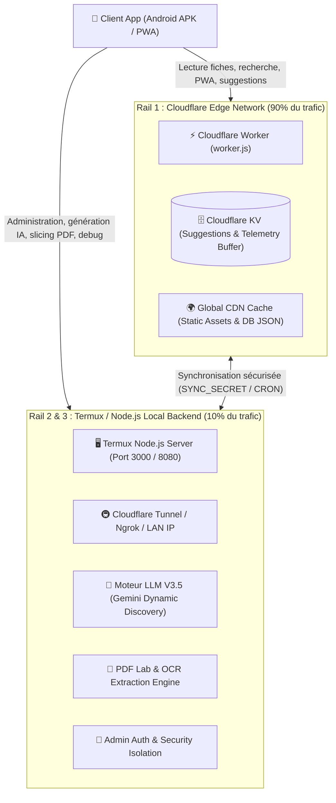
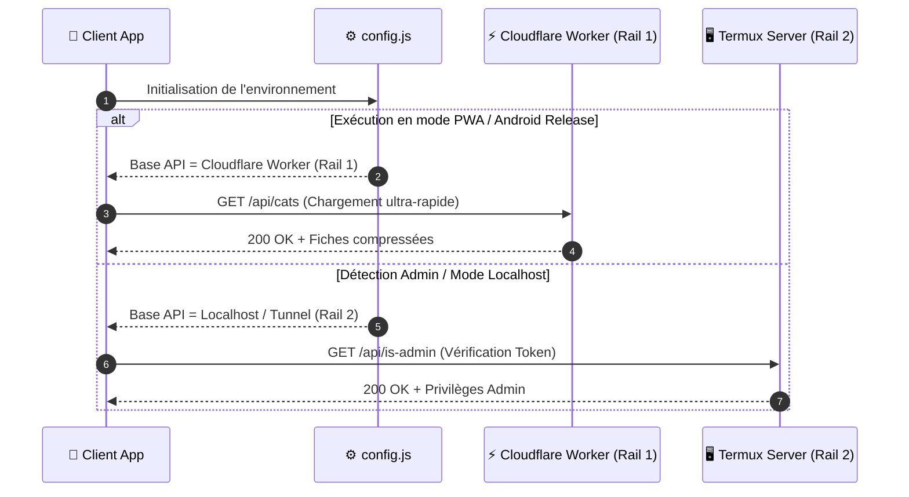

# 🌐 Architecture : Modèle Réseau Hybride Dual-Rail (Dr. CAT)

> **Quadrant Diátaxis** : *01-Architecture (Explanations)*  
> **Statut** : Production (v1.17.0+)  
> **Composants Clés** : `worker.js`, `server.js`, `public/js/api.js`, `public/js/config.js`

---

## 🎯 1. Vue d'Ensemble & Philosophie

L'application **Dr. CAT** est conçue pour fonctionner dans des environnements médicaux à connectivité variable (hôpitaux, cliniques de garde, zones blanches) tout en offrant des fonctionnalités administratives et d'intelligence artificielle avancées.

Pour résoudre le dilemme entre **haute disponibilité publique mondiale** (Edge CDN) et **serveur local d'administration/génération IA hébergé sur tablette Termux**, Dr. CAT implémente une architecture réseau originale dite **Dual-Rail** (Architecture à Double Rail).



---

## 🛤️ 2. Définition des Rails

### ⚡ Rail 1 : Cloudflare Edge Worker (Public / Lecture / Haute Disponibilité)
- **URL Publique** : `https://drcat.dr-cat.workers.dev` (ou domaine personnalisé).
- **Rôle** : Servir 90% des requêtes utilisateurs avec une latence ultra-faible (< 30ms mondialement).
- **Fonctionnalités prises en charge** :
  - Distribution des fiches cliniques (`GET /api/cats` via base statique `cats_db.json`).
  - Téléchargement des PDFs compressés (`GET /pdfs/*`).
  - Distribution des assets Web/PWA (`index.html`, bundles JS, styles CSS, polices WOFF2).
  - Contrôle de version et Kill Switch (`GET /api/version`).
  - Réception publique des suggestions utilisateurs (`POST /api/suggestions` relayées dans Cloudflare KV).
  - Réception publique des rapports de crash télémétrie (`POST /api/telemetry`).
- **Garanties** :
  - Zéro dépendance sur l'état d'allumage de la tablette Termux.
  - Protection Cloudflare DDoS et gestion universelle des preflights CORS (OPTIONS 204).

---

### 🖥️ Rail 2 : Termux Backend & Tunnels d'Administration (Génération & Gestion)
- **Points d'Accès** :
  - **Local Direct** : `http://localhost:3000` (accès sur l'appareil hôte).
  - **Réseau Local (LAN)** : `http://192.168.x.x:3000` (WiFi interne).
  - **Tunnel Cloudflare (Rail 3)** : `https://tunnel.dr-cat.dev` (Tunnel persistant `cloudflared`).
  - **Tunnel Ngrok (Rail 2 Fallback)** : `https://xxxx.ngrok-free.app` (Tunnel temporaire chiffré).
- **Rôle** : Exécution des tâches intensives et sécurisées non réalisables sur le Worker Edge.
- **Fonctionnalités exclusives** :
  - Moteur de génération LLM (`cat_db_generator/generate_cat_db.js`, Gemini API).
  - PDF Lab & Visual Slicer (`admin/pdf_lab.html`, `server/pdf_extractor.js`, PDF-Lib, Ghostscript).
  - Ingestion, OCR et Staging des fiches (`server/routes/admin.js`).
  - Validation médicale automatisée & Canaries de dosage.
  - Dashboard de crash intelligence & consultation des télémétries (`/api/admin/telemetry`).
  - Pull et synchronisation bidirectionnelle des suggestions stockées sur le KV Cloudflare (`server/services/sync-suggestions.js`).

---

## 🔄 3. Mécanisme de Bascule & Résolution d'API Client

Le client Web et Android (`public/js/api.js` et `public/js/config.js`) résout dynamiquement le endpoint cible selon la disponibilité du réseau et le rôle de l'utilisateur :



---

## 🔒 4. Sécurité & Parité des Secrets (`SYNC_SECRET`)

Pour transférer les suggestions et données télémétriques accumulées sur le Cloudflare Worker vers le serveur Termux sans exposer les données au public :

1. Le Cloudflare Worker protège son endpoint d'exportation `GET /api/suggestions` par un header strict :
   ```http
   x-sync-secret: <HEX_SECRET_64_CHARS>
   ```
2. Le service Termux `server/services/sync-suggestions.js` envoie ce secret stocké dans son `.env`.
3. Si le secret ne correspond pas exactement, le Worker retourne immédiatement `403 Forbidden`.
4. Cette parité stricte garantit qu'aucun acteur tiers ne peut siphonner les retours et suggestions des utilisateurs.

---

## 📊 5. Matrice Comparative des Rails

| Caractéristique | Rail 1 (Cloudflare Worker) | Rail 2 & 3 (Termux / Tunnels) |
| :--- | :--- | :--- |
| **Emplacement** | 300+ datacenters Edge mondiaux | Tablette Android locale / Serveur Node |
| **Temps de Réponse** | 10 - 40 ms | 50 - 250 ms (via tunnel) / 2 ms (local) |
| **Consommation Batterie** | Nulle (serveur distant) | Modérée lors des calculs IA / PDF |
| **Disponibilité** | 99.99% (haute résilience) | Dépendante de l'allumage du terminal |
| **Tâches Autorisées** | Lecture, distribution assets, buffer KV | OCR, Découpage PDF, Génération LLM, Admin |
| **Authentification** | Clé publique d'application | Token Admin Bearer + Isolation IP |

---

## 🔗 Liens & Documents Associés
- 🛡️ [Isolation & Sécurité Réseau](file:///data/data/com.termux/files/home/med/docs/01-architecture/security-isolation.md)
- 🚀 [Guide de Déploiement Cloudflare](file:///data/data/com.termux/files/home/med/docs/02-guides/cloudflare-wrangler-deploy.md)
- 📜 [ADR-001 : Choix du Modèle Hybride Dual-Rail](file:///data/data/com.termux/files/home/med/docs/04-decisions-adr/adr-001-dual-rail-hybrid-model.md)
