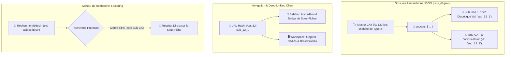

# 🌳 Architecture : Matrice Hiérarchique Master CATs & Sub-CATs

> **Quadrant Diátaxis** : *01-Architecture (Explanations)*  
> **Statut** : Production (v1.17.0+)  
> **Composants Clés** : `data/official_master_subcats_matrix.json`, `public/js/components/sidebar.js`, `public/js/components/workspace.js`, `scripts/master_subcats_scanner.js`

---

## 🎯 1. Vue d'Ensemble & Nécessité Médicale

En pratique clinique quotidienne, une pathologie majeure (Master CAT) regroupe fréquemment des variantes étiologiques, des formes cliniques spécifiques ou des populations particulières (enfant, femme enceinte, sujet âgé) nécessitant une conduite distincte mais rattachée au même tableau clinique.

Exemple :  
- **Master CAT** : *Diabète de type 2* (Prise en charge globale, règles hygiéno-diététiques, cibles HbA1c).
  - ↳ **Sub-CAT 1** : *Décompensation acido-cétosique* (Urgence vitale hospitalière).
  - ↳ **Sub-CAT 2** : *Pied diabétique infecté* (Antibiothérapie, soins locaux et décharge).
  - ↳ **Sub-CAT 3** : *Insulinothérapie d'initiation en ambulatoire*.

La version 1.17.0 de Dr. CAT introduit une **architecture taxonomique à deux niveaux** : **60 Master CATs** officielles chapeautant **63 Sub-CATs** ciblées.



---

## 🗂️ 2. Modèle de Données & Schéma Hiérarchique

Chaque fiche de la base de données peut comporter un tableau optionnel `subcats` imbriqué :

```json
{
  "id": 12,
  "category": "Endocrinologie",
  "title": "Diabète de Type 2",
  "summary": "1. Diagnostic & Cibles...\n2. Conduite...\n3. Traitement...",
  "red_flags": "Glycémie > 3g/L avec acétonurie, coma hyperosmolaire...",
  "ordonnance": "Metformine 1000mg : 1 cp 2x/jour au milieu des repas",
  "pdf_keywords": ["Diabete", "Endocrinologie"],
  "subcats": [
    {
      "id": "sub_12_1",
      "title": "Pied Diabétique Infecté",
      "summary": "1. Évaluation du grade de sévérité (Pédic/Wagner)...\n2. Décharge immédiate...",
      "red_flags": "Phlegmon, nécrose étendue, sepsis, pouls abolis",
      "ordonnance": "Amoxicilline + Ac. Clavulanique 1g : 1 cp 3x/jour pendant 14 jours",
      "pdf_keywords": ["Pied_Diabetique", "Infection_Pied"]
    }
  ]
}
```

---

## 🔗 3. Deep-Linking & Routage dans l'Application

L'état de navigation (`public/js/state.js` et `public/js/main.js`) gère la résolution instantanée des liens directs :
- Navigation vers la fiche maîtresse : `#cat-12`
- Navigation directe vers une sous-fiche : `#cat-12-sub_12_1`
- **Comportement UI** :
  - La sidebar déplie automatiquement la catégorie parent et met en surbrillance la sous-fiche.
  - Le workspace affiche le fil d'Ariane (*Breadcrumb*) : `Endocrinologie > Diabète de Type 2 > Pied Diabétique Infecté`.
  - Des onglets segmentés permettent de basculer instantanément entre la vue d'ensemble et les sous-fiches.

---

## 🔎 4. Moteur de Recherche & Indexation Profonde

Dans `public/js/components/sidebar.js` et `public/js/utils.js` :
- L'index de recherche inversé indexe simultanément les titres, résumés, ordonnances et drapeaux rouges des fiches maîtresses ET de chaque sous-fiche.
- Si le terme recherché matche le contenu d'une sous-fiche, l'élément parent s'affiche avec un badge cliquable menant directement au contenu pertinent.

---

## 📊 5. Matrice Officielle & Outils de Scan de Corpus

La cohérence de l'ensemble du corpus est garantie par trois scripts dédiés :
1. `scripts/corpus_density_scanner.js` : Évalue la présence de contenu source PDF pour chaque sous-fiche potentielle.
2. `scripts/master_subcats_scanner.js` : Valide la matrice de couverture à deux niveaux.
3. `data/official_master_subcats_matrix.json` : Référentiel canonique listant les 60 Master CATs et 63 Sub-CATs officielles.

---

## 🔗 Liens & Documents Associés
- 📐 [Spécification de la Matrice 60-Master / 63-Sub-CAT](file:///data/data/com.termux/files/home/med/docs/03-reference/master-subcats-matrix-spec.md)
- 🛠️ [Guide du Pipeline de Génération Sub-CATs](file:///data/data/com.termux/files/home/med/docs/02-guides/subcats-matrix-pipeline.md)
- 📜 [ADR-006 : Architecture Taxonomique 2-Tiers](file:///data/data/com.termux/files/home/med/docs/04-decisions-adr/adr-006-hierarchical-subcats.md)
