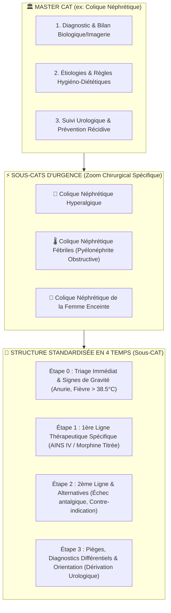

# 🌳 Architecture Approfondie : Moteur Hiérarchique Master CAT & Sous-CATs V3.6

> **Quadrant Diátaxis** : *01-Architecture (Explanations & Specifications)*  
> **Statut** : Production (v1.19.0+)  
> **Composants Clés** : `public/js/components/workspace.js`, `cat_db_generator/generate_cat_db.js`, `cat_db_generator/lib/medical-validator.js`, `docs/04-decisions-adr/adr-006-hierarchical-subcats.md`

---

## 🎯 1. La Problématique Clinique : Le "Bruit Informationnel" aux Urgences

Dans la pratique médicale quotidienne, une fiche clinique généraliste sur une pathologie (ex: *L'Insuffisance Cardiaque*) est trop verbeuse lors d'une décompensation aiguë au lit du malade. Le médecin urgentiste n'a pas le temps de relire la physiopathologie ou les bilans étiologiques quand un patient arrive en Œdème Aigu du Poumon (OAP).

Pour résoudre ce dilemme, Dr.CAT sépare strictement l'encyclopédie en deux niveaux :
1. **Master CAT (Fiche Générale)** : Panorama complet, physiopathologie, diagnostic étiologique, stratégie au long cours.
2. **Sous-CATs (Zoom Chirurgical)** : Fiche réflexe d'action immédiate en **4 étapes standardisées**, sans aucune répétition de généralités.



---

## 📐 2. La Charte Réflexe en 4 Étapes (Standard V3.6)

Chaque sous-fiche clinique obéit scrupuleusement au format chirurgical suivant :

### 🚨 Étape 0 : Triage & Gravité Immédiate
- **Objectif** : Identifier en 5 secondes si le pronostic vital ou fonctionnel est engagé.
- **Contenu** : Signes de choc, défaillance d'organe, critères d'admission directe en Réanimation / Soins Intensifs ou transfert chirurgical.
- **Règle** : Phrases courtes, puces d'alerte avec valeurs seuils chiffrées (ex: *SpO2 < 90%*, *PAS < 90 mmHg*, *Lactates > 2 mmol/L*).

### 💊 Étape 1 : 1ère Ligne Thérapeutique Spécifique
- **Objectif** : Délivrer immédiatement la prescription salvatrice sans ambiguïté.
- **Contenu** : Molécules en DCI stricte, posologies unitaires exactes, voies d'administration (IV, SC, Inhalation, PO), vitesse de perfusion et durée initiale.
- **Règle** : Pas de texte vague. Chaque médicament est présenté avec sa posologie millimétrée.

### 🔄 Étape 2 : 2ème Ligne Thérapeutique & Alternatives
- **Objectif** : Fournir la conduite à tenir en cas d'échec de la 1ère ligne ou de contre-indication absolue.
- **Contenu** : Protocoles d'escalade thérapeutique, alternatives pour terrain allergique (ex: allergie vraie aux Pénicillines), insuffisance rénale ou grossesse.

### 🛡️ Étape 3 : Pièges, Diagnostics Différentiels & Orientation
- **Objectif** : Éviter l'erreur médicale fatale (*The Can't-Miss Diagnoses*).
- **Contenu** : Diagnostics différentiels graves mimant le tableau, pièges d'interprétation biologique/ECG/imagerie, critères de sortie autorisée ou de maintien sous surveillance hospitalière.

---

## 🔗 3. Modèle de Données & Liaison Parent-Enfant

Dans la base de données [`cats_db.json`](../../public/data/cats_db.json), la hiérarchie est garantie par des clés stables :

```json
{
  "id": "colique_nephretique_hyperalgique",
  "parent_id": "colique_nephretique",
  "is_subcat": true,
  "title": "Colique Néphrétique Hyperalgique & Fébriles",
  "category": "Urologie / Urgences",
  "summary": "# 0. Triage & Gravité Immédiate\n- **Fièvre >= 38.5°C** ou frissons : Urgence médico-chirurgicale absolue...\n\n# 1. 1ère Ligne Thérapeutique Spécifique\n- **Kétoprofène** : 100 mg IVL sur 20 min...\n- **Morphine** : 0.05 à 0.1 mg/kg en titration IV...\n\n# 2. 2ème Ligne & Alternatives\n- En cas de contre-indication aux AINS : Paracétamol 1g IV + Néfopam 20 mg...\n\n# 3. Pièges & Orientation\n- **Piège majeur** : L'anévrisme de l'aorte abdominale fissuré simulant une colique néphrétique...",
  "ordonnance": [
    { "dci": "Kétoprofène", "dosage": "100 mg", "form": "Injectable IV", "posology": "100 mg IV sur 20 min, max 300 mg/24h" },
    { "dci": "Morphine", "dosage": "10 mg/1ml", "form": "Injectable", "posology": "Titration IV : bolus de 2 à 3 mg toutes les 5 min jusqu'à EVA < 3" }
  ]
}
```

---

## 🎨 4. Rendu Dynamique dans l'Interface (`workspace.js`)

Lors de la sélection d'une fiche :
1. **Boutons de Navigation Rapide** : Si la fiche possède des sous-CATs, des pilules interactives (*Pills*) apparaissent au sommet du Workspace pour basculer en 1 clic vers le zoom chirurgical.
2. **Accordéons Rétractables d'Étapes** : Le moteur `utils.js` transforme automatiquement chaque étape (`# 0.`, `# 1.`, `# 2.`, `# 3.`) en sections repliables avec code couleur visuel (Rouge pour Étape 0, Cyan pour Étape 1, Vert pour Étape 2, Ambre pour Étape 3).
3. **Mémorisation de Vue** : La vue active (Master ou Sub-CAT) est synchronisée dans le store d'état `state.js` pour une fluidité sans rechargement.
