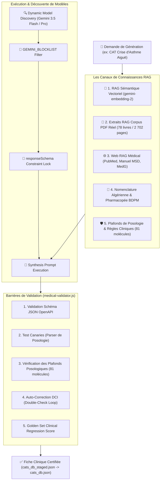

# 🤖 Architecture : Moteur de Génération Médicale LLM V3.6

> **Quadrant Diátaxis** : *01-Architecture (Explanations)*  
> **Statut** : Production (v1.18.0+)  
> **Composants Clés** : `cat_db_generator/generate_cat_db.js`, `cat_db_generator/lib/llm-engine.js`, `cat_db_generator/lib/semantic-rag.js`, `cat_db_generator/lib/medical-validator.js`, `cat_db_generator/lib/gemini-schemas.js`

---

## 🎯 1. Vue d'Ensemble & Défis de l'IA Clinique

La génération automatisée de Conduites à Tenir (CAT) médicales exige un niveau de fiabilité, de rigueur pharmacologique et de sécurité absolue qu'un simple appel LLM non encadré ne peut garantir.

Le moteur **Dr. CAT LLM Engine V3.6** repose sur une architecture multi-flux garantissant :
1. **Garantie Mathématique de Structure (Gemini `responseSchema`)** : Utilisation des schémas OpenAPI stricts pour les Master et Sub-CATs via `lib/gemini-schemas.js`.
2. **Dual RAG Sémantique Vectoriel** : Recherche de passages de cours par similarité cosinus dense (`gemini-embedding-2` / 3 072 dimensions) avec cache disque permanent `data/pdf_embeddings_cache.json`.
3. **Moniteur de Surcharge de Prompt** : Alerte en temps réel lorsque le contexte combiné dépasse 10 000 caractères.
4. **Boucle de Double-Check Pharmacologique Automatique** : Auto-correction immédiate en 2ème tentative si une posologie ou une DCI non répertoriée est détectée.
5. **Zéro Hallucination Pharmacologique** : Validation systématique contre la base BDPM (4 474 DCIs) et la nomenclature algérienne (1 358 DCIs).

---

## 🔍 2. Découverte Dynamique des Modèles & `GEMINI_BLOCKLIST`

Le module `cat_db_generator/lib/llm-engine.js` implémente un système intelligent de sélection de modèles Gemini :

1. **Interrogation Dynamique de l'API Google AI** :
   - Récupération de la liste des modèles actifs associés à la clé API (`gemini-2.5-pro`, `gemini-2.5-flash`, etc.).
   - Tri automatique selon la version sémantique la plus récente et les capacités de raisonnement.
2. **Filtre `GEMINI_BLOCKLIST`** :
   - Variable d'environnement facultative `.env` permettant d'exclure des modèles expérimentaux instables ou sujets aux hallucinations.
   - Exemple : `GEMINI_BLOCKLIST=preview,exp,experimental`
   - Si tous les modèles découverts sont filtrés, le système lève une exception claire et explicite au lieu d'échouer silencieusement.
3. **Mécanisme de Repli (Fallback Chain)** :
   - En cas d'erreur de quota (HTTP 429) ou d'indisponibilité momentanée, le moteur bascule automatiquement sur le modèle de repli configuré.

---

## 🛡️ 3. Les Barrières de Validation Médicale (`medical-validator.js`)

Chaque fiche générée est soumise à un audit rigoureux en 7 sections :

### 1. Structure Formelle & Sections Obligatoires
- Découpage strict : **1. Diagnostic**, **2. Conduite Pratique**, **3. Traitement**, **4. Examens Complémentaires**, **5. Orientation**.
- Présence impérative des drapeaux rouges (`red_flags`) et d'une proposition d'ordonnance type (`ordonnance`).

### 2. Contrôle Pharmacologique & Plafonds Posologiques (Section 7f)
- Analyse lexicale de chaque ligne de l'ordonnance.
- Vérification des doses unitaires et journalières contre les plafonds cliniques définis dans `lib/clinical-ceilings.js` (ex: Paracétamol max 4g/j adulte, Amoxicilline max 3g/j adulte).
- Détection des associations contre-indiquées (ex: AINS + Anticoagulant oral, double macrolide).

### 3. Unknown-Molecule Validator Gate
- Tout médicament prescrit est confronté au registre des molécules connues (DCI BDPM + Dénominations algériennes).
- Si une molécule n'est pas reconnue dans les dictionnaires officiels, le validateur émet un avertissement explicite :
  `[DCI Non Référencée] <NOM_MOLECULE>`
- Cet avertissement permet à l'administrateur médical d'inspecter manuellement la prescription dans le Staging Lab avant validation finale.

---

## 🧪 4. Canaries de Dosage & Régression Golden Set

Pour garantir qu'une modification de prompt ou de regex ne détériore pas silencieusement la qualité des générations :

### 🐤 1. Canaries de Dosage (`--canary`)
- Auto-test exécuté au démarrage de chaque génération (`npm run generate -- --canary`).
- Analyse 15 formulations posologiques complexes (ex: *"1 sachet 3x/j à dissoudre dans un verre d'eau"*, *"50 mg/kg/j en 3 prises orales"*).
- Si le parser de dosage échoue sur un seul cas test, la génération globale est interrompue pour éviter toute corruption de données.

### 🏆 2. Suite Clinique Golden Set (`--golden`)
- Évalue 5 cas cliniques types immuables définis dans `cat_db_generator/golden_set.json` (ex: Colique néphrétique, Crise d'asthme aiguë, Érysipèle).
- Compare la sortie générée aux attentes cliniques formelles (mots-clés thérapeutiques indispensables, contre-indications signalées, score de concision).

---

## 🔗 Liens & Documents Associés
- 📄 [Pipeline RAG & Découpage PDF](file:///data/data/com.termux/files/home/med/docs/01-architecture/pdf-rag-pipeline.md)
- 🛠️ [Guide de Génération des CATs](file:///data/data/com.termux/files/home/med/docs/02-guides/generating-validating-cats.md)
- 📐 [Nomenclature Médicale & Règles BDPM](file:///data/data/com.termux/files/home/med/docs/03-reference/drug-nomenclature-algeria.md)
