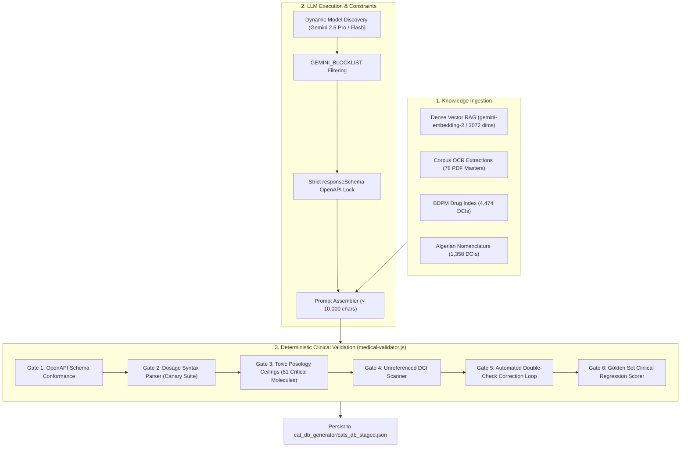

# Medical AI Generation & Validation Engine (llm-generation-engine.md)

> **Document Type**: Technical Specification & Algorithmic Design Document  
> **Target Audience**: Senior Engineers, Clinical Informaticians & AI Agents  
> **Status**: Production (v1.19.0+)

---

## 1. Engine Overview & Safety Invariants

The Dr.CAT Medical Generation Engine (`cat_db_generator/`) synthesizes structured Clinical Decision Protocols (CATs) using Google Gemini LLMs while enforcing deterministic formatting and pharmacological safety constraints.



---

## 2. OpenAPI Output Schema Contract (`gemini-schemas.js`)

The generation engine enforces strict JSON schema conformance at the API layer via Gemini `responseSchema`. Free-form conversational output is structurally prohibited.

```json
{
  "$schema": "https://json-schema.org/draft/2020-12/schema",
  "type": "object",
  "required": ["id", "title", "category", "specialty", "summary", "ordonnance", "red_flags"],
  "properties": {
    "id": { "type": "integer", "description": "Immutable sequential integer identifier" },
    "title": { "type": "string", "description": "Clinical title of the condition" },
    "category": { "type": "string", "description": "Medical specialty classification" },
    "specialty": { "type": "string" },
    "is_subcat": { "type": "boolean", "default": false },
    "parent_id": { "type": "integer" },
    "summary": {
      "type": "string",
      "description": "Structured 7-step clinical markdown string containing triage, diagnostic criteria, and management"
    },
    "ordonnance": {
      "type": "array",
      "items": {
        "type": "object",
        "required": ["dci", "dosage", "form", "posology", "duration"],
        "properties": {
          "dci": { "type": "string", "description": "International Nonproprietary Name" },
          "dosage": { "type": "string", "description": "Unit strength (e.g., 500 mg, 1 g)" },
          "form": { "type": "string", "description": "Pharmaceutical dosage form (e.g., Comprimé, Solution injectable)" },
          "posology": { "type": "string", "description": "Explicit administration instructions" },
          "duration": { "type": "string", "description": "Treatment duration in days/weeks" },
          "instructions": { "type": "string", "description": "Specific administration timing or food constraints" }
        }
      }
    },
    "red_flags": {
      "type": "array",
      "items": { "type": "string" },
      "description": "Critical emergency triggers requiring immediate escalation"
    },
    "sub_cats": {
      "type": "array",
      "items": { "type": "integer" },
      "description": "Child Sub-CAT IDs linked to this Master protocol"
    }
  }
}
```

---

## 3. Dynamic Model Discovery & Blocklist Engine (`lib/llm-engine.js`)

```javascript
/**
 * Discovers and filters Gemini models based on dynamic capability inspection
 * and environment blocklists.
 */
export async function selectOptimalGeminiModel(apiKey) {
  const models = await fetchAvailableGoogleModels(apiKey);
  const eligible = models.filter(m => 
    m.supportedGenerationMethods.includes('generateContent') &&
    !m.name.includes('vision')
  );

  const blocklist = (process.env.GEMINI_BLOCKLIST || '')
    .split(',')
    .map(s => s.trim().toLowerCase())
    .filter(Boolean);

  const filtered = eligible.filter(m => 
    !blocklist.some(blocked => m.name.toLowerCase().includes(blocked))
  );

  if (!filtered.length) {
    throw new Error(`[LLM Engine] No models available after applying GEMINI_BLOCKLIST: "${process.env.GEMINI_BLOCKLIST}"`);
  }

  // Sort by highest version number descending
  return filtered.sort((a, b) => compareSemver(b.version, a.version))[0].name;
}
```

---

## 4. Deterministic 7-Gate Clinical Validation (`lib/medical-validator.js`)

Every synthesized protocol undergoes automated static analysis prior to database inclusion:

### 4.1 Toxic Posology Ceilings Table (Sample Subset of 81 Checked Molecules)
| Molecule (DCI) | Maximum Single Dose | Maximum 24h Daily Ceiling | Route | Action on Violation |
| :--- | :--- | :--- | :--- | :--- |
| **Paracétamol** | 1 000 mg | 4 000 mg (Adulte) / 60 mg/kg/j (Pédiatrique) | PO / IV | **FATAL ERROR**: Immediate generation abort. |
| **Amoxicilline** | 1 000 mg (Standard) / 2 000 mg (Pneumo) | 3 000 mg (Standard) / 6 000 mg (Méningite) | PO / IV | **FATAL ERROR**: Re-prompt double check loop. |
| **Kétoprofène** | 100 mg | 300 mg / 24h | PO / IV | **FATAL ERROR**: Re-prompt double check loop. |
| **Morphine** | 10 mg (PO) / 2-3 mg (IV bolus titration) | Titration selon EVA (Échelle Visuelle Analogique) | IV / SC / PO | **WARNING**: Requires explicit monitoring note. |
| **Métronidazole** | 500 mg | 1 500 mg / 24h | PO / IV | **FATAL ERROR**: Ceilings enforced. |

---

### 4.2 Unreferenced Molecule Cross-Check (Gate 4)
* **Dataset Indexes**:
  - French BDPM (Banque Publique des Médicaments): 4,474 verified DCI tokens.
  - Algerian Official Drug Nomenclature: 1,358 registered commercial and generic names.
* **Algorithm**: Extract prescription lines $\rightarrow$ tokenize words $\rightarrow$ compare against normalized drug dictionary $\rightarrow$ if non-matching and not an administrative vehicle (e.g. *NaCl 0.9%*, *G5%*), issue `[DCI Non Référencée]` warning flag for manual physician review in Staging Lab.

---

## 5. Canary Dosage Suite Contract (`--canary`)

The dosage parser canary suite verifies regular expressions and numerical extraction logic across 15 standard clinical formulations:

```json
[
  { "input": "1 g 3 fois par jour au milieu des repas", "expectedDose": "1 g", "expectedFreq": 3 },
  { "input": "500 mg toutes les 8 heures par voie orale", "expectedDose": "500 mg", "expectedFreq": 3 },
  { "input": "50 mg/kg/jour répartis en 3 prises", "expectedDose": "50 mg/kg/j", "expectedFreq": 3 },
  { "input": "2 bouffées matin et soir avec chambre d'inhalation", "expectedDose": "2 bouffées", "expectedFreq": 2 },
  { "input": "1 nébulisation de 5 mg toutes les 20 minutes pendant 1 heure", "expectedDose": "5 mg", "expectedFreq": "Urgence" },
  { "input": "0.5 mg/kg en dose unique le matin", "expectedDose": "0.5 mg/kg", "expectedFreq": 1 },
  { "input": "100 UI/ml SC selon schéma basal-bolus", "expectedDose": "100 UI/ml", "expectedFreq": "Variable" }
]
```
* **Execution Constraint**: If any test in the canary table fails during `npm run generate -- --canary`, the build pipeline exits immediately with code `1`.
