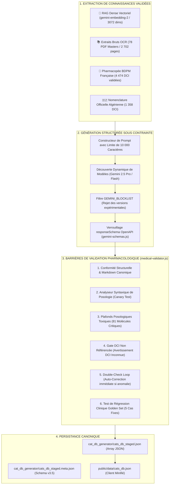

# 🤖 Architecture Approfondie : Moteur de Génération Médicale IA V3.6

> **Quadrant Diátaxis** : *01-Architecture (Explanations & Specifications)*  
> **Statut** : Production (v1.19.0+)  
> **Composants Clés** : `cat_db_generator/generate_cat_db.js`, `cat_db_generator/lib/llm-engine.js`, `cat_db_generator/lib/semantic-rag.js`, `cat_db_generator/lib/medical-validator.js`, `cat_db_generator/lib/gemini-schemas.js`

---

## 🎯 1. Philosophie & Défis Cliniques de la Génération par IA

La génération de Conduites à Tenir (CAT) médicales impose une **tolérance zéro aux hallucinations**. Un modèle de langage généraliste livré à lui-même peut inventer des posologies létales, inverser des contre-indications ou omettre des critères d'hospitalisation vitaux.

Pour résoudre ce défi, le moteur **Dr.CAT LLM Engine V3.6** applique une architecture en entonnoir fermée :



---

## 📐 2. Schémas OpenAPI Stricts (`gemini-schemas.js`)

Le moteur n'autorise aucun texte libre en sortie : Gemini est contraint via `responseSchema` à renvoyer un JSON validé conforme au standard OpenAPI 3.0.

### Structure d'une Fiche Master CAT :
```json
{
  "id": "asthme_aigu_grave",
  "title": "Crise d'Asthme Aiguë & Asthme Aigu Grave (AAG)",
  "category": "Pneumologie / Urgences",
  "specialty": "Pneumologie",
  "summary": "# 1. Triage & Diagnostic Positif\n...",
  "decision_tree": {
    "nodes": [
      { "id": "triage", "label": "DEP < 50% ou Signes de Lutte ?", "yes": "hospit_rea", "no": "traitement_amb" }
    ]
  },
  "ordonnance": [
    {
      "dci": "Salbutamol",
      "dosage": "5 mg",
      "form": "Solution pour nébulisation",
      "posology": "1 nébulisation de 5 mg toutes les 20 minutes pendant 1 heure",
      "duration": "1 heure renouvelable",
      "instructions": "Sous débit d'O2 de 6 à 8 L/min"
    },
    {
      "dci": "Bromure d'Ipratropium",
      "dosage": "0.5 mg",
      "form": "Solution pour nébulisation",
      "posology": "0.5 mg associé au Salbutamol toutes les 8 heures",
      "duration": "24 à 48 heures",
      "instructions": "En cas de crise sévère ou réfractaire"
    }
  ],
  "red_flags": [
    "Silence auscultatoire (poumon silencieux)",
    "Troubles de conscience, somnolence, épuisement respiratoire",
    "Cyanose, SpO2 < 90% sous O2 fort débit",
    "Pouls paradoxal, collapsus hémodynamique"
  ],
  "sub_cats": ["asthme_femme_enceinte", "asthme_enfant_nourrisson"]
}
```

---

## 🔍 3. Découverte Dynamique des Modèles & `GEMINI_BLOCKLIST`

Le fichier `cat_db_generator/lib/llm-engine.js` interroge l'API Google AI pour sélectionner en temps réel le meilleur modèle disponible :

### Algorithme de Sélection & Tri Sémantique :
1. **Appel `models.list`** : Récupération de tous les modèles autorisés pour la clé API.
2. **Filtrage par Capacités** : Conservation exclusive des modèles supportant `generateContent` et `embeddings`.
3. **Application du Filtre `GEMINI_BLOCKLIST`** :
   ```javascript
   function applyModelBlocklist(models) {
     const blocklist = (process.env.GEMINI_BLOCKLIST || '')
       .split(',')
       .map(s => s.trim().toLowerCase())
       .filter(Boolean);
     
     if (!blocklist.length) return models;
     return models.filter(m => !blocklist.some(blocked => m.name.toLowerCase().includes(blocked)));
   }
   ```
4. **Tri Sémantique par Version** : Classement par ordre décroissant de version (ex: `gemini-2.5-pro` > `gemini-2.5-flash` > `gemini-1.5-pro`).
5. **Chaîne de Fallback** : Si le modèle primaire renvoie une erreur `429 Too Many Requests`, le système bascule automatiquement sur le modèle suivant sans interrompre le batch.

---

## 🛡️ 4. Les 7 Barrières du Validateur Médical (`medical-validator.js`)

Chaque fiche générée passe obligatoirement à travers 7 filtres stricts :

| Barrière | Mécanisme de Contrôle | Action en Cas d'Erreur |
| :--- | :--- | :--- |
| **1. Structure & Sections** | Vérifie la présence des 7 étapes obligatoires dans `summary` et des tableaux d'ordonnance. | Rejet immédiat $\rightarrow$ regénération avec prompt de correction. |
| **2. Test Canary de Posologie** | 15 formulations complexes testées (ex: *"50 mg/kg/j en 3 prises"*). Vérifie que le regex extrait la dose exacte. | Blocage total du processus si un seul canary échoue. |
| **3. Plafonds Posologiques Toxiques** | Contrôle des doses maximales pour 81 molécules critiques (ex: Paracétamol > 4g/j adulte = DANGER). | **Erreur Fatale** : arrêt de la fiche et notification immédiate. |
| **4. Gate DCI Non Référencée** | Scan de chaque mot clé contre les 5 832 DCI de la BDPM et de la nomenclature algérienne. | **Avertissement [DCI Non Référencée]** : fiche marquée pour révision humaine. |
| **5. Détection de Contre-Indications** | Recherche des associations proscrites (ex: AINS sur ulcère évolutif ou insuffisance rénale sévère). | Correction obligatoire via boucle de double-check. |
| **6. Format Markdown Canonique** | Validation des titres d'étapes au format standard `**X. Titre :**` (convertit `#` et `##`). | Normalisation automatique du texte sans perte d'information. |
| **7. Suite Golden Set** | Comparaison de 5 cas fixes contre des attentes cliniques strictes (scores de fidélité $\ge 90\%$). | Alerte en cas de dérive de qualité clinique globale. |

---

## 🧪 5. Table des Canaries Posologiques

Le tableau suivant liste les formulations cliniques testées à chaque lancement de `npm run generate -- --canary` :

| ID | Formulation Posologique Testée | Dose Extraite Attendue | Fréquence / Modalité |
| :-: | :--- | :--- | :--- |
| `C1` | "1 g 3 fois par jour au milieu des repas" | `1 g` | 3x / jour |
| `C2` | "500 mg toutes les 8 heures par voie orale" | `500 mg` | Toutes les 8h (3x/j) |
| `C3` | "50 mg/kg/jour répartis en 3 prises" | `50 mg/kg/j` | 3 prises quotidiennes |
| `C4` | "2 bouffées matin et soir avec chambre d'inhalation" | `2 bouffées` | 2x / jour |
| `C5` | "1 nébulisation de 5 mg toutes les 20 minutes pendant 1 heure" | `5 mg` | Triage d'urgence |
| `C6` | "0.5 mg/kg en dose unique le matin" | `0.5 mg/kg` | Dose unique |
| `C7` | "100 UI/ml SC selon schéma basal-bolus" | `100 UI/ml` | Voie sous-cutanée |
| `C8` | "2 sachets en prise unique au coucher" | `2 sachets` | Prise vespérale |
