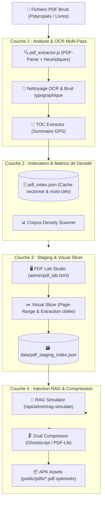

# 📄 Architecture : Pipeline RAG & Découpage Intelligent de PDFs

> **Quadrant Diátaxis** : *01-Architecture (Explanations)*  
> **Statut** : Production (v1.17.0+)  
> **Composants Clés** : `server/pdf_extractor.js`, `index_pdfs.js`, `server/parsers/toc_extractor.js`, `admin/js/pdf_lab.js`

---

## 🎯 1. Vue d'Ensemble & Défis du Traitement PDF Médical

Les documents médicaux de référence (polycopiés universitaires, consensus nationaux, thèses, fiches de conférences) présentent des défis complexes pour l'ingestion par les LLMs :
- Documents volumineux (50 à 400 pages) mélangeant plusieurs spécialités.
- Tableaux de posologies et arbres décisionnels découpés sur plusieurs pages.
- Qualité d'OCR hétérogène (polices non standard, artéfacts de numérisation).
- Contraintes de stockage strictes pour le packaging dans une application mobile Android offline (< 50 Mo).

Le pipeline RAG de Dr. CAT résout ces défis via un système à 4 couches : **Extraction Multi-Pass**, **Sommaire GPS / TOC**, **Découpage Vectoriel (Visual Slicer)** et **Compression Dual-Stream**.

---

## 🔍 2. Pipeline d'Extraction Multi-Pass & Sommaire GPS

### 📑 1. Sommaire GPS & Cartographie de Documents
Pour naviguer instantanément dans des polycopiés de 300 pages sans saturer la fenêtre de contexte du LLM :
- Le module `server/parsers/toc_extractor.js` analyse la structure des titres, la numérotation des chapitres et les repères visuels.
- Il génère un index GPS associant chaque pathologie clinique à une plage de pages exacte (`startPage`, `endPage`).
- Lors de la génération d'une CAT (ex: *Appendicite aiguë*), le moteur RAG charge uniquement les pages ciblées plutôt que le document entier.

### 🧹 2. Nettoyage Typographique & Normalisation Médicale
- Les en-têtes et pieds de page répétitifs (ex: *"Faculté de Médecine d'Alger - Module de Pédiatrie"*) sont automatiquement filtrés.
- Les césures de mots de fin de ligne sont recolées.
- Les caractères spéciaux mal encodés par l'OCR (ex: `fi`, `fl`, `œ`, puces non standard) sont normalisés en UTF-8 propre.

---

## ✂️ 3. Le Visual Slicer & Staging Curation

Le **PDF Lab Studio** (`admin/pdf_lab.html` et `admin/js/pdf_lab.js`) offre un environnement visuel complet pour l'administrateur médical :

1. **Inspection Visuelle Page par Page** : Rendu PDF ultra-rapide via `pdf.min.js`.
2. **Découpage Célérité (Visual Slicer)** :
   - Sélection d'une plage de pages (ex: pages 42 à 45 du document *Gastro-entérologie.pdf*).
   - Découpage physique du flux PDF via `pdf-lib` pour produire une fiche unitaire indépendante (ex: `Ulcère_Gastroduodénal.pdf`).
3. **Curation Staging & Correction OCR** :
   - Sauvegarde dans `data/pdf_staging_index.json`.
   - Éditeur de texte intégré permettant de corriger les erreurs de numérisation avant soumission au générateur LLM.

---

## 🗜️ 4. Compression Dual-Stream (Ghostscript / PDF-Lib)

Pour maintenir l'APK sous la barre des 50 Mo tout en conservant une lisibilité vectorielle parfaite des radiographies et ECGs :

1. **Passe 1 : Ghostscript DPI Optimization** :
   - Réduction des images bitmap à 150 DPI (qualité optimale sur écran rétina mobile).
   - Conversion des espaces colorimétriques en sRGB compact.
2. **Passe 2 : PDF-Lib Stream Deflation** :
   - Compression sans perte (`deflate`) de l'arbre des objets et polices vectorielles.
   - Suppression des métadonnées superflues et des flux d'annotation invisibles.
3. **Gain Moyen Constaté** : Réduction de **60% à 85%** du poids des fichiers sans dégradation perceptible à la lecture.

---

## 🤖 5. Moteur RAG Sémantique Vectoriel (`gemini-embedding-2`)

Dr. CAT V3.6 intègre une recherche vectorielle sémantique de haute précision :
- **Modèle d'Embedding Google `gemini-embedding-2`** : Calcul de vecteurs denses en 3 072 dimensions pour capturer les nuances cliniques (ex: relier *"douleur thoracique transfixiante"* à *"Dissection Aortique"*).
- **Cache Disque Permanent (`data/pdf_embeddings_cache.json`)** : Les passages vectorisés sont stockés localement. Les recherches ultérieures sont instantanées (0 ms) et n'effectuent aucun appel réseau.
- **Calcul de Similarité Cosinus Pure JavaScript** : Évite toute dépendance C++ lourde incompatible avec l'environnement Termux/Android.
- **Bonus de Priorité Staging & Slices (+50 points)** : Les fiches découpées ou éditées manuellement par le médecin reçoivent automatiquement un bonus de 50 points de pertinence dans `pdf-extractor.js`.
- **Filet de Sécurité Lexical** : Repli transparent instantané sur la recherche textuelle en cas de travail hors-ligne.

---

## 🧹 6. Nettoyeur & Synchroniseur de Masse (`scripts/sync_pdf_index.js`)

Le script `scripts/sync_pdf_index.js` est intégré au cycle `npm run build` :
- Nettoie en profondeur les 78 manuels de médecine (2 702 pages indexées).
- Répare les coupures de mots en fin de ligne (`traite-\nment` $\rightarrow$ `traitement`).
- Élimine les caractères de contrôle non imprimables et supprime les artéfacts OCR sur plus de 1 027 pages.
- Garantit la parité stricte entre `pdf_index.json` (racine) et `public/data/pdf_index.json`.

---

## 🔗 Liens & Documents Associés
- 🤖 [Moteur de Génération LLM V3.6](file:///data/data/com.termux/files/home/med/docs/01-architecture/llm-generation-engine.md)
- ✂️ [Guide Pratique du Slicing PDF](file:///data/data/com.termux/files/home/med/docs/02-guides/slicing-master-pdfs.md)
- 📐 [Schéma de la Base de Données CATs](file:///data/data/com.termux/files/home/med/docs/03-reference/schema-cats-db.md)
