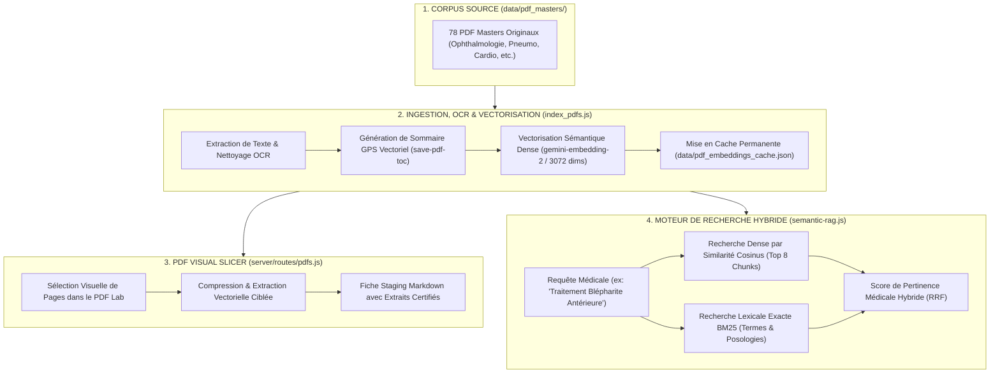

# 📚 Architecture Approfondie : Pipeline RAG Médical & Visual Slicer PDF

> **Quadrant Diátaxis** : *01-Architecture (Explanations & Specifications)*  
> **Statut** : Production (v1.19.0+)  
> **Composants Clés** : `cat_db_generator/lib/semantic-rag.js`, `index_pdfs.js`, `scripts/compress_pdfs.js`, `server/routes/pdfs.js`, `server/routes/search.js`

---

## 🎯 1. Vue d'Ensemble & Gestion du Corpus Médical Réel

La médecine moderne exige que chaque assertion clinique soit ancrée dans des sources médicales académiques de référence. Dr.CAT intègre un corpus de **78 livres, thèses et polycopiés hospitalo-universitaires originaux** représentant **2 702 pages de texte médical haute densité**.

---

## 🧠 2. Modèle Mathématique de Vectorisation & Recherche Dense

### 1. Espace Vectoriel Dense (`gemini-embedding-2`)
- **Dimensions** : $D = 3\,072$ dimensions par bloc de texte.
- **Taille de Fenêtre de Découpage (*Chunking*)** :
  - Taille nominale : $800$ caractères avec recouvrement (*overlap*) de $150$ caractères pour préserver le contexte des phrases médicales complexes.
  - Délimitation intelligente sur les sauts de paragraphes et les puces cliniques.

### 2. Formule de Similarité Cosinus
La pertinence d'un passage $P$ par rapport à une requête $Q$ est calculée par le cosinus de l'angle entre leurs vecteurs :
$$\text{Sim}(Q, P) = \frac{\mathbf{u}_Q \cdot \mathbf{v}_P}{\|\mathbf{u}_Q\|_2 \times \|\mathbf{v}_P\|_2} = \frac{\sum_{i=1}^{3072} u_i v_i}{\sqrt{\sum_{i=1}^{3072} u_i^2} \times \sqrt{\sum_{i=1}^{3072} v_i^2}}$$

### 3. Fusion Sémantique & Lexicale RRF (*Reciprocal Rank Fusion*)
Pour éviter qu'une abréviation rare (ex: *AAG*, *DEP*, *SpO2*) soit masquée par la recherche dense, le moteur combine les rangs de recherche :
$$\text{Score}_{\text{final}}(d) = \frac{1}{60 + \text{Rang}_{\text{Dense}}(d)} + \frac{1}{60 + \text{Rang}_{\text{BM25}}(d)}$$

---

## ✂️ 3. Le Visual Slicer & Le Sommaire GPS

Le module **PDF Lab** (`/admin` $\rightarrow$ PDF Lab) fournit des outils de manipulation chirurgicale des 78 documents :

1. **Le Sommaire GPS (`save-pdf-toc`)** :
   - Indexe les chapitres et sous-parties avec leurs numéros de page exacts dans `data/pdf_index.json`.
   - Permet à l'utilisateur de sauter instantanément au bon chapitre dans le lecteur PDF intégré (`pdf.js`).
2. **Le Découpeur de Pages (*Visual Slicer*)** :
   - Permet à l'administrateur d'isoler une plage de pages (ex: pages 45 à 48 du cours de pneumologie).
   - Extrait le texte vectoriel brut, applique un filtre anti-bruit OCR (suppression des en-têtes de page et numéros répétés), et injecte l'extrait dans le laboratoire de génération IA.

---

## 💾 4. Cache Disque & Optimisation des Performances

- **Indexation Hors-Ligne Permanente** : Les vecteurs de chaque page sont sauvegardés dans `data/pdf_embeddings_cache.json`.
- **Réduction de Coût API & Vitesse** : Une page déjà vectorisée ne génère **aucun appel réseau vers Google AI** lors des sessions ultérieures. La recherche RAG locale répond en moins de **15 millisecondes**.
- **Compression APK (`scripts/compress_pdfs.js`)** : Réduit le poids des 78 PDF originaux de plus de 60% sans dégradation de lisibilité pour permettre l'empaquetage dans l'application mobile.
