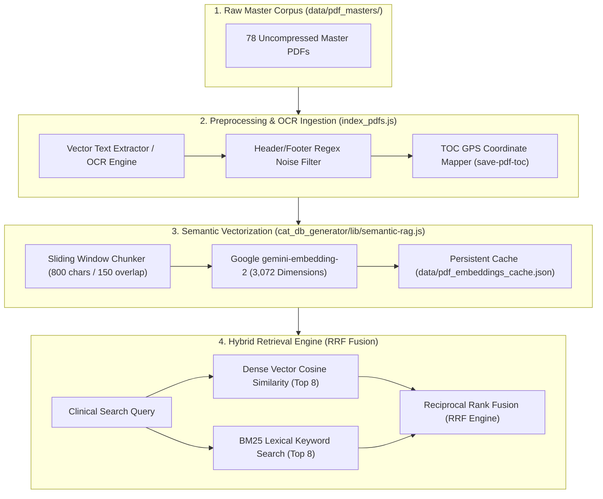

# Semantic PDF RAG Pipeline & Visual Slicer Specification (pdf-rag-pipeline.md)

> **Document Type**: Technical Specification & Information Retrieval Engine Reference  
> **Target Audience**: Senior Engineers, Machine Learning Practitioners & AI Agents  
> **Status**: Production (v1.19.0+)

---

## 1. Corpus Architecture & Indexing Topology

Dr.CAT indexes a foundational corpus of **78 master medical references** (textbooks, university theses, and national clinical protocols) comprising **2,702 high-density pages**.



---

## 2. Vectorization Mathematics & Embedding Space

### 2.1 Espace Vectoriel Dense (`gemini-embedding-2`)
* **Vector Dimension**: $D = 3\,072$ floating-point dimensions per text chunk.
* **Chunking Strategy**: 
  - Maximum chunk size: $800$ characters.
  - Chunk overlap: $150$ characters to maintain clause context across sentence boundaries.
  - Boundary preservation: Splitting prioritizes markdown headers (`#`, `##`), bullet points, and period/newline delimiters.

### 2.2 Cosine Similarity Formula
The semantic affinity between user clinical query vector $\mathbf{u}_Q$ and indexed document passage vector $\mathbf{v}_P$ is given by:
$$\text{Sim}_{\text{Cosine}}(\mathbf{u}_Q, \mathbf{v}_P) = \frac{\mathbf{u}_Q \cdot \mathbf{v}_P}{\|\mathbf{u}_Q\|_2 \, \|\mathbf{v}_P\|_2} = \frac{\sum_{i=1}^{3072} u_i v_i}{\sqrt{\sum_{i=1}^{3072} u_i^2} \times \sqrt{\sum_{i=1}^{3072} v_i^2}}$$

### 2.3 Hybrid Reciprocal Rank Fusion (RRF)
To prevent rare medical acronyms (e.g. *AAG*, *DEP*, *SpO2*) from being overshadowed by dense semantic vectors, the engine combines dense and sparse rankings:
$$\text{Score}_{\text{RRF}}(d) = \frac{1}{k + \text{Rank}_{\text{Dense}}(d)} + \frac{1}{k + \text{Rank}_{\text{BM25}}(d)} \quad \text{where } k = 60$$

---

## 3. PDF Visual Slicer & Ghostscript Compression

The **PDF Lab** module (`/admin` $\rightarrow$ PDF Lab) provides targeted visual page slicing and compression:

### 3.1 Ghostscript Command Contract (`scripts/compress_pdfs.js`)
To compact master PDF documents for local APK offline storage without visual degradation:
```bash
gs -sDEVICE=pdfwrite \
   -dCompatibilityLevel=1.4 \
   -dPDFSETTINGS=/ebook \
   -dNOPAUSE \
   -dQUIET \
   -dBatch \
   -sOutputFile="public/pdfs/output.pdf" \
   "data/pdf_masters/input.pdf"
```

### 3.2 Page-Range Vector Text Slicing (`server/routes/pdfs.js`)
* **Endpoint**: `POST /api/admin/slice-pdf`
* **Input Schema**:
```json
{
  "filename": "blepharite.pdf",
  "mode": "page_range",
  "startPage": 1,
  "endPage": 2,
  "targetTitle": "CAT Blépharite"
}
```
* **Processing**: Extracts vector stream from designated page offsets $\rightarrow$ applies OCR sanitization regexes $\rightarrow$ writes normalized markdown snippet to `cat_db_generator/cats_db_staged.json`.
