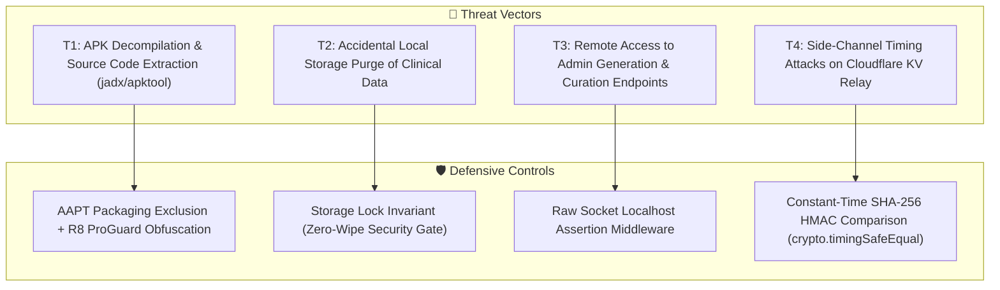

# Security Isolation & Anti-Decompilation Specification (security-isolation.md)

> **Document Type**: Security Architecture & Binary Hardening Specification  
> **Target Audience**: Senior Security Engineers, Android Architects & AI Agents  
> **Status**: Production (v1.19.0+)

---

## 1. Threat Model & Security Controls

Dr.CAT protects proprietary medical decision graphs, pharmaceutical validation routines, and sensitive user annotations through a multi-tier defense-in-depth model.



---

## 2. Production APK Hardening & Anti-Decompilation

### 2.1 Capacitor Asset Purge Pipeline (`scripts/clean_android_assets.js`)
Standard Capacitor builds clone raw development files into the APK asset directory. Dr.CAT intercepts the build via `"cap:sync"`:
```javascript
// scripts/clean_android_assets.js
import fs from 'fs';
import path from 'path';

const targetDir = path.resolve('android/app/src/main/assets/public/js');
const devFolders = ['components', 'lib', 'workspace', 'dashboard'];
const devFiles = ['main.js', 'api.js', 'config.js', 'utils.js', 'state.js', 'install-id.js', 'debug-console.js'];

devFolders.forEach(folder => fs.rmSync(path.join(targetDir, folder), { recursive: true, force: true }));
devFiles.forEach(file => fs.rmSync(path.join(targetDir, file), { force: true }));
```

### 2.2 Gradle AAPT Packaging Filter (`android/app/build.gradle`)
AAPT filters out any matching development patterns during binary packaging:
```groovy
android {
    aaptOptions {
        ignoreAssetsPattern '!.svn:!.git:!.ds_store:!*.scc:.*:!CVS:!thumbs.db:!picasa.ini:!*~:components:lib:workspace:dashboard:main.js:api.js:config.js:utils.js:state.js:install-id.js:debug-console.js'
    }
}
```

### 2.3 R8 ProGuard Obfuscation Rules
```groovy
buildTypes {
    release {
        minifyEnabled true
        shrinkResources true
        proguardFiles getDefaultProguardFile('proguard-android-optimize.txt'), 'proguard-rules.pro'
    }
}
```
* **Binary Audit Verification**: Decompiling the release `.apk` yields only `public/dist/app-[HASH].js` (minified bundle) and runtime engine files (`version-checker.js`, `pdf.min.js`).

---

## 3. Storage Safety & User Notes Sanctuarisation

### 3.1 Lock Screen Invariant
> **The Security Lock Gate (`public/js/version-checker.js`) MUST NEVER invoke `localStorage.clear()`, `sessionStorage.clear()`, or `indexedDB.deleteDatabase()`.**

### 3.2 Impact Analysis
* User-authored annotations (`dr_cat_notes_<id>`) and Leitner spaced repetition flashcards represent irreplaceable clinical study assets.
* When a mandatory update or kill-switch is triggered, the lock screen purges **only** the volatile HTTP cache key `dr_cat_synced_db`.
* UI interactivity is visually blocked by `#app-update-lock-overlay`. Upon client binary upgrade, `window.location.reload()` restores active UI with 100% of user data intact.

---

## 4. Backend Route Isolation & Authentication

### 4.1 Raw Socket Localhost Verification (`server/services/auth.js`)
Administrative routes enforce strict localhost origin checking directly against the TCP socket, bypassing spoofable proxy headers:
```javascript
export function isLocalhostConnection(req) {
  const remoteIp = req.socket?.remoteAddress || req.connection?.remoteAddress || '';
  return remoteIp === '127.0.0.1' || remoteIp === '::1' || remoteIp === '::ffff:127.0.0.1';
}

export function requireAdminAuth(req, res, next) {
  if (!isLocalhostConnection(req)) {
    return res.status(403).json({ error: 'Access denied: Administration endpoints restricted to localhost' });
  }
  const token = req.headers.authorization?.replace('Bearer ', '');
  if (!isValidAdminToken(token)) {
    return res.status(401).json({ error: 'Invalid or expired administrative session token' });
  }
  next();
}
```

---

## 5. Constant-Time Cloudflare KV Sync Security

To eliminate timing side-channel attacks on the Worker suggestion relay:
```javascript
// worker/routes/suggestions.js & server/services/sync-suggestions.js
import crypto from 'crypto';

export function timingSafeEqualSecret(provided, expected) {
  if (!provided || !expected) return false;
  const bufA = Buffer.from(provided);
  const bufB = Buffer.from(expected);
  if (bufA.length !== bufB.length) return false;
  return crypto.timingSafeEqual(bufA, bufB);
}
```
