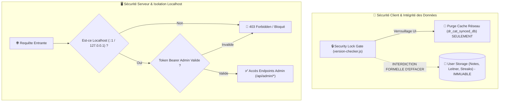

# 🛡️ Architecture : Sécurité, Isolation & Kill Switch Non-Destructif

> **Quadrant Diátaxis** : *01-Architecture (Explanations)*  
> **Statut** : Production (v1.17.0+)  
> **Composants Clés** : `server/services/auth-service.js`, `public/js/version-checker.js`, `scripts/clean_android_assets.js`, `android/app/build.gradle`

---

## 🎯 1. Philosophie de Sécurité en Environnement Embarqué / Mobile

Dr. CAT combine deux caractéristiques uniques nécessitant une posture de sécurité rigoureuse :
1. **Serveur Backend sur Tablette Termux** : Le serveur d'administration s'exécute sur Android dans un espace utilisateur sans root. Il doit empêcher tout accès non autorisé depuis les réseaux locaux (WiFi hospitalier) ou l'Internet public.
2. **Données Médicales Personnelles Locales** : Les utilisateurs stockent sur leur appareil leurs notes cliniques privées (`dr_cat_notes_*`), leur historique de révision Leitner (`dr_cat_leitner`) et leurs séries d'études (`dr_cat_streak`). Toute mise à jour forcée ou verrouillage de sécurité doit impérativement **sanctuariser ces données**.



---

## 🔐 2. Isolation des Endpoints d'Administration

### 🛡️ Règle Anti-Usurpation Localhost
Dans `server/services/auth-service.js` et les middlewares d'Express :
- Les routes destructives ou sensibles (`/api/admin/*`, `/api/cats` en méthode POST/PUT/DELETE, `/api/reindex`, `/api/slice-pdf`) ne peuvent **JAMAIS** être appelées depuis une IP externe, même si un mot de passe ou un token est fourni.
- Le middleware `requireLocalhostOrToken` inspecte `req.ip` et `req.connection.remoteAddress`. Si l'IP ne provient pas de `127.0.0.1`, `::1` ou `::ffff:127.0.0.1`, la requête est rejetée avec un code HTTP `403 Forbidden`.

### 🔑 Cycle de Vie du Token Admin
- Le mot de passe administrateur est haché via `crypto.scrypt` avec un sel unique généré par installation.
- La connexion `/api/login` délivre un token de session chiffré à durée limitée (24h).
- Ce token doit être transmis dans l'en-tête standard : `Authorization: Bearer <TOKEN>`.

---

## 🛑 3. Kill Switch & Protocole de Protection du Stockage Utilisateur

### ⚠️ Règle de Verrouillage Non-Destructif
Le composant `public/js/version-checker.js` interroge périodiquement `/api/version` pour vérifier l'état du déploiement.

Si `forceUpdateActive: true` est signalé ou si la version du client est inférieure à `minVersion` :
1. **Blocage de l'UI** : L'écran de verrouillage permanent (`security-lock-root`) est injecté au sommet du DOM pour empêcher toute interaction médicale obsolète.
2. **Conservation Absolue du Stockage** : Le code a l'interdiction formelle d'exécuter `localStorage.clear()`, `sessionStorage.clear()` ou `indexedDB.deleteDatabase()`.
3. **Purge Réseau Restreinte** : Seule la clé temporaire du cache HTTP `dr_cat_synced_db` est purgée.
4. **Restauration Transparente** : Dès que l'utilisateur met à jour l'application ou que le verrou est levé par l'administrateur, un simple rechargement (`window.location.reload()`) restaure l'interface avec **100% des notes et historiques intacts**.

---

## 📦 4. Durcissement des APK Android (Anti-Décompilation)

Pour empêcher l'extraction de code source sensible lors de la décompilation de l'APK Android :

1. **AAPT Asset Filtering (`android/app/build.gradle`)** :
   ```groovy
   aaptOptions {
       ignoreAssetsPattern 'components:lib:workspace:dashboard:main.js:api.js:config.js:utils.js:state.js:install-id.js:debug-console.js'
   }
   ```
2. **Capacitor Sync Hardener (`scripts/clean_android_assets.js`)** :
   - Exécuté automatiquement après chaque `npx cap sync`.
   - Supprime physiquement les fichiers JavaScript de développement non bundlés du dossier `android/app/src/main/assets/public/js/`.
3. **Minification & Obfuscation R8 (Release)** :
   - `minifyEnabled true` et `shrinkResources true` activés dans `buildTypes.release`.
   - Seuls le bundle unifié minifié `public/dist/app-*.js` et les runtimes de base (`pdf.min.js`, `version-checker.js`) restent présents dans le binaire compilé.

---

## 🛡️ 5. En-Têtes HTTP & Protection Contre les Abus

- **Helmet & Content Security Policy (CSP)** : Injection d'en-têtes HTTP stricts interdisant le chargement de scripts distants non approuvés.
- **Rate Limiting (`express-rate-limit`)** :
  - Endpoint de soumission `/api/suggestions` : limité à 10 requêtes par tranche de 15 minutes par IP.
  - Endpoint de télémétrie `/api/telemetry` : limité à 60 requêtes par minute avec déduplication côté serveur.
- **Sanitisation HTML** : Utilisation de **DOMPurify** avant tout rendu de contenu dynamique généré par l'IA ou injecté dans les fiches médicales.

---

## 🔗 Liens & Documents Associés
- 🌐 [Modèle Réseau Dual-Rail](file:///data/data/com.termux/files/home/med/docs/01-architecture/dual-rail-network.md)
- 📱 [Guide de Compilation APK Android](file:///data/data/com.termux/files/home/med/docs/02-guides/compiling-android-apk.md)
- 📜 [ADR-003 : Protection du Stockage lors du Verrouillage](file:///data/data/com.termux/files/home/med/docs/04-decisions-adr/adr-003-storage-safe-kill-switch.md)
