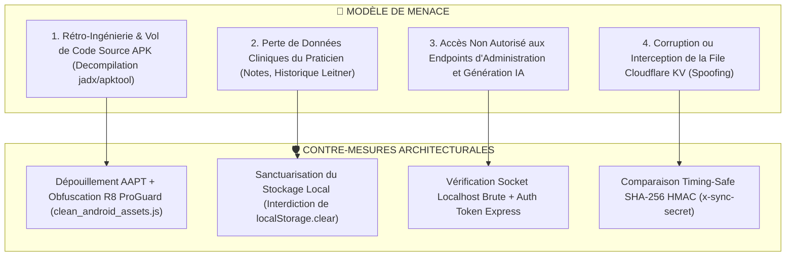

# 🔒 Architecture Approfondie : Sécurité, Isolation & Durcissement Anti-Piratage

> **Quadrant Diátaxis** : *01-Architecture (Explanations & Specifications)*  
> **Statut** : Production (v1.19.0+)  
> **Composants Clés** : `android/app/build.gradle`, `scripts/clean_android_assets.js`, `public/js/version-checker.js`, `server/services/sync-suggestions.js`, `worker/cors.js`

---

## 🎯 1. Modèle de Menace & Piliers de Sécurité Dr.CAT

En tant qu'application médicale professionnelle intégrant une propriété intellectuelle clinique majeure (algorithmes de décision, protocoles posologiques certifiés, thèses indexées), Dr.CAT fait face à 4 menaces fondamentales :



---

## 🛡️ 2. Durcissement Anti-Décompilation de l'APK Android

Par défaut, les frameworks hybrides (Capacitor / Cordova) empaquettent tous les fichiers sources JavaScript non compilés dans l'archive `.apk`. Tout utilisateur curieux peut décompresser l'APK avec `unzip` et lire l'intégralité du code source en clair.

### Le Dispositif en 3 Verrous de Dr.CAT :

#### 1. Verrou 1 : Le Script de Purge Capacitor (`clean_android_assets.js`)
Exécuté automatiquement à chaque commande `npm run cap:sync` :
```javascript
// scripts/clean_android_assets.js
// Supprime impitoyablement les sources JS de dev brutes dans android/app/src/main/assets/public/js/
const devDirsToRemove = ['components', 'lib', 'workspace', 'dashboard'];
const devFilesToRemove = ['main.js', 'api.js', 'config.js', 'utils.js', 'state.js', 'install-id.js', 'debug-console.js'];
```

#### 2. Verrou 2 : L'Exclusion Native AAPT (`android/app/build.gradle`)
Même si un fichier brut subsiste, Gradle ordonne au compilateur d'assets Android (AAPT) de l'ignorer totalement lors de l'assemblage binaire :
```groovy
// android/app/build.gradle
aaptOptions {
    ignoreAssetsPattern '!.svn:!.git:!.ds_store:!*.scc:.*:!CVS:!thumbs.db:!picasa.ini:!*~:components:lib:workspace:dashboard:main.js:api.js:config.js:utils.js:state.js:install-id.js:debug-console.js'
}
```

#### 3. Verrou 3 : L'Obfuscation & Shrinking R8 / ProGuard
```groovy
buildTypes {
    release {
        minifyEnabled true
        shrinkResources true
        proguardFiles getDefaultProguardFile('proguard-android-optimize.txt'), 'proguard-rules.pro'
    }
}
```

### Résultat de l'Audit Binaire :
Une inspection de l'APK final compilé révèle **uniquement** :
- `public/dist/app-[HASH].js` (Bundle de production minifié et obfusqué).
- `public/js/version-checker.js` (Moteur de sécurité de démarrage).
- `public/data/cats_db.json` (Données cliniques publiques).

---

## 💾 3. Sanctuarisation du Stockage Utilisateur

### Règle Fondamentale :
> **Le fichier [`public/js/version-checker.js`](../../public/js/version-checker.js) ou tout écran de verrouillage / kill-switch NE DOIT JAMAIS appeler `localStorage.clear()`, `sessionStorage.clear()`, ou `indexedDB.deleteDatabase()`.**

### Rationale Médicale :
Un médecin généraliste utilise Dr.CAT pendant des mois pour y stocker ses observations cliniques personnelles, ses mémos sur des patients complexes et ses statistiques de révision Leitner. Un appel accidentel à `localStorage.clear()` lors d'un forçage de mise à jour effacerait définitivement :
- `dr_cat_notes_*` : Toutes les notes personnelles prises sur les fiches.
- `dr_cat_user_progress` : L'historique de lecture.
- `dr_cat_leitner` : Les boîtes de mémorisation espacée.
- `dr_cat_streak` : Les séries de travail continu.

### Mécanisme Autorisé :
Sur activation du Lock Screen, l'application bloque l'accès aux boutons de l'interface et purge **uniquement** le cache HTTP volatile (`dr_cat_synced_db`). Dès que l'application est mise à jour ou le verrou levé, `window.location.reload()` réactive l'interface avec **100% des notes intactes**.

---

## 🔑 4. Authentification Timing-Safe & Isolation du Relay

Pour protéger la file d'attente Cloudflare KV des attaques par injection ou timing-attacks :

### Comparaison en Temps Constant :
```javascript
// server/services/sync-suggestions.js & worker/routes/suggestions.js
import crypto from 'crypto';

function timingSafeEqualSecret(provided, expected) {
  if (!provided || !expected || provided.length !== expected.length) {
    return false;
  }
  return crypto.timingSafeEqual(Buffer.from(provided), Buffer.from(expected));
}
```
- Empêche un attaquant de déduire la clé secrète en mesurant les nanosecondes de réponse de l'API.
- Bloque immédiatement avec un code `HTTP 403 Forbidden` toute tentative non autorisée.
