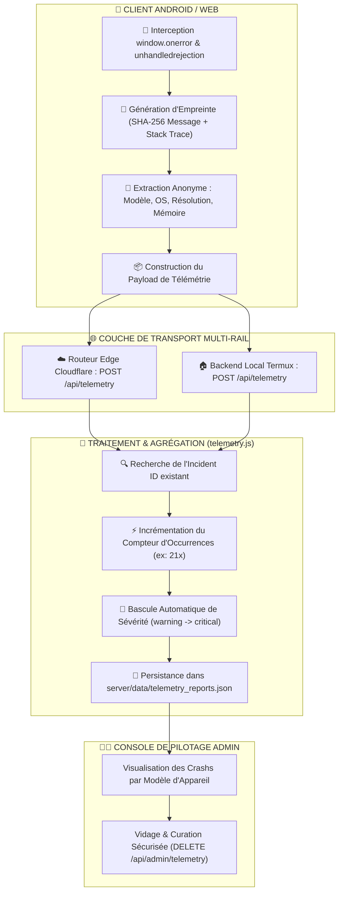

# 🚨 Architecture Approfondie : Télémétrie Mobile & Crash Intelligence Sentry-Grade

> **Quadrant Diátaxis** : *01-Architecture (Explanations & Specifications)*  
> **Statut** : Production (v1.19.0+)  
> **Composants Clés** : `public/js/version-checker.js`, `public/js/debug-console.js`, `server/routes/telemetry.js`, `worker/routes/telemetry.js`, `server/data/telemetry_reports.json`

---

## 🎯 1. Philosophie & Objectifs de la Télémétrie Médicale

Une application médicale ne peut pas dépendre d'un tiers payant (comme Datadog ou Sentry SaaS) qui exposerait potentiellement des métadonnées de santé sensibles ou violerait le secret médical.

Dr.CAT implémente son propre système de **Télémétrie Sentry-Grade Décentralisée** :
- **Anonymisation Totale** : Zéro transmission de données patients ou de notes personnelles.
- **Collecte Universelle** : Capture les erreurs JavaScript, les rejets de promesses non gérés (`unhandledrejection`) et les blocages réseau.
- **Déduplication par Empreinte (*Fingerprinting*)** : 1 000 occurrences d'un même bug sur 100 appareils ne créent **qu'un seul rapport d'incident agrégé avec compteur dynamique**.



---

## 🔑 2. Algorithme de Fingerprinting & Déduplication

Pour éviter de saturer la base de données avec des milliers de logs redondants :

### Formule de Calcul de l'Empreinte :
$$\text{Fingerprint} = \text{SHA-256}\Big(\text{error.message} + \text{normalized}(\text{error.stack}) + \text{file.name} + \text{line.number}\Big)$$

1. Les lignes de stack traces sont nettoyées de leurs variables dynamiques (adresses mémoire, timestamps).
2. L'empreinte génère un identifiant unique stable (ex: `inc_a7b9c4...`).
3. Si un incident avec cette empreinte existe déjà :
   - Le champ `occurrences` est incrémenté ($N + 1$).
   - Le dictionnaire `affected_devices[model]` est mis à jour (ex: `{"Xiaomi 12T Pro": 21, "Samsung Tab S9": 4}`).
   - Le timestamp `last_seen` est rafraîchi à l'heure exacte.

---

## 🔴 3. Escalade Automatique de Sévérité

Le système classe automatiquement la criticité d'un incident selon son impact réel sur les utilisateurs :

| Sévérité | Seuil de Déclenchement | Comportement & Alerte Admin |
| :--- | :--- | :--- |
| 🟡 **Warning** | $1 \le \text{Occurrences} < 5$ sur un seul modèle d'appareil. | Incident consigné pour inspection de routine. |
| 🟠 **Elevated** | $5 \le \text{Occurrences} < 15$ ou présent sur 2 modèles distincts. | Badge orange dans le panneau d'administration. |
| 🔴 **Critical** | $\text{Occurrences} \ge 15$ ou touchant plus de 3 modèles différents. | **Alerte Rouge Panne Globale** : priorité de correction absolue. |

---

## 🔒 4. Endpoints de l'API de Télémétrie

### 1. Ingestion Publique : `POST /api/telemetry`
- **Authentification** : Publique (ouvert à tous les clients de l'application).
- **Format du Payload** :
```json
{
  "type": "uncaught_error",
  "message": "TypeError: Cannot read properties of undefined (reading 'title')",
  "stack": "TypeError: Cannot read properties of undefined...\n at renderWorkspace (app-E4JTYG42.js:45:12)",
  "url": "https://drcat.is-an-app.workers.dev/index.html",
  "device": {
    "platform": "Android",
    "model": "Lenovo Tab P12 Pro",
    "screen": "2560x1600",
    "userAgent": "Mozilla/5.0 (Linux; Android 14; ...)",
    "appVersion": "1.19.0"
  }
}
```
- **Réponse** : `HTTP 200 { success: true, reportId: "inc_a7b9c4...", occurrences: 1 }`.

### 2. Consultation Admin : `GET /api/admin/telemetry`
- **Authentification** : `Bearer <ADMIN_TOKEN>` + Vérification Localhost.
- **Réponse** : Liste complète des incidents triés par sévérité et date décroissante.

### 3. Vidage Sécurisé : `DELETE /api/admin/telemetry/all`
- **Authentification** : `Bearer <ADMIN_TOKEN>`.
- **Action** : Purge intégrale des rapports résolus après déploiement d'un correctif.
