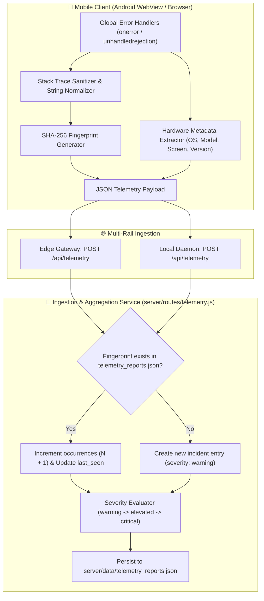
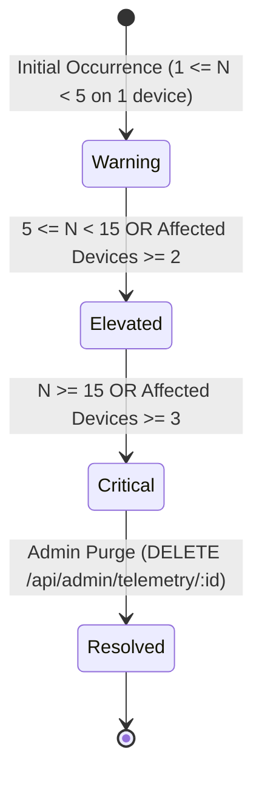

# Sentry-Grade Crash Intelligence & Telemetry Specification (telemetry-crash-intelligence.md)

> **Document Type**: Technical Specification & Error Monitoring Protocol  
> **Target Audience**: Senior Frontend Engineers, DevOps & Autonomous AI Agents  
> **Status**: Production (v1.19.0+)

---

## 1. System Overview & Data Privacy Guarantees

Dr.CAT implements a self-hosted, Sentry-grade telemetry engine designed specifically for medical offline-first environments.



### Privacy & Confidentiality Guarantee:
* **Zero Patient Data Collection**: Error handlers scrub query strings and payloads.
* **Zero Third-Party Data Sharing**: All telemetry data resides strictly within the user's infrastructure (Cloudflare Worker & Termux).

---

## 2. Fingerprinting & Stack Trace Normalization Algorithm

To prevent crash log explosion (e.g. 10,000 duplicate events flooding the database), error events are condensed into stable SHA-256 fingerprints.

### 2.1 Stack Normalization Regex Rules
1. Strip transient memory addresses (`0x[0-9a-fA-F]+`).
2. Normalize bundle hash identifiers (`app-[A-Z0-9]+\.js` $\rightarrow$ `app-bundle.js`).
3. Strip dynamic URL query parameters (`\?.*$`).

### 2.2 Mathematical Fingerprint Formula
$$\text{IncidentFingerprint} = \text{SHA-256}\Big(\text{normalize}(\text{error.name}) \parallel \text{normalize}(\text{error.message}) \parallel \text{normalize}(\text{error.stack}[0..2])\Big)$$

---

## 3. Incident Severity State Machine

The telemetry aggregation daemon dynamically calculates incident severity based on real-world blast radius:



---

## 4. Telemetry REST API Contracts

### 4.1 Client Ingestion: `POST /api/telemetry`
* **Access Level**: Public (No auth required)
* **Request Payload**:
```json
{
  "type": "uncaught_error",
  "message": "TypeError: Cannot read properties of undefined (reading 'title')",
  "stack": "TypeError: Cannot read properties of undefined...\n at renderWorkspace (app-bundle.js:45:12)",
  "url": "https://drcat.is-an-app.workers.dev/index.html",
  "device": {
    "platform": "Android",
    "model": "Lenovo Tab P12 Pro",
    "screen": "2560x1600",
    "userAgent": "Mozilla/5.0 (Linux; Android 14; ...)",
    "appVersion": "1.19.0"
  }
}
```
* **Response**: `HTTP 200 {"success": true, "reportId": "inc_9f8a2b...", "occurrences": 1}`.

### 4.2 Administrative Retrieval: `GET /api/admin/telemetry`
* **Access Level**: Protected (`Bearer <ADMIN_TOKEN>` + Localhost Socket Verified)
* **Response Schema**:
```json
[
  {
    "id": "inc_9f8a2b1c4e7d",
    "severity": "critical",
    "occurrences": 21,
    "first_seen": 1788300000000,
    "last_seen": 1788309687851,
    "error_name": "TypeError",
    "message": "Cannot read properties of undefined (reading 'title')",
    "normalized_stack": "at renderWorkspace (app-bundle.js:45:12)",
    "affected_devices": {
      "Xiaomi 12T Pro": 17,
      "Samsung Galaxy Tab S9": 4
    }
  }
]
```
