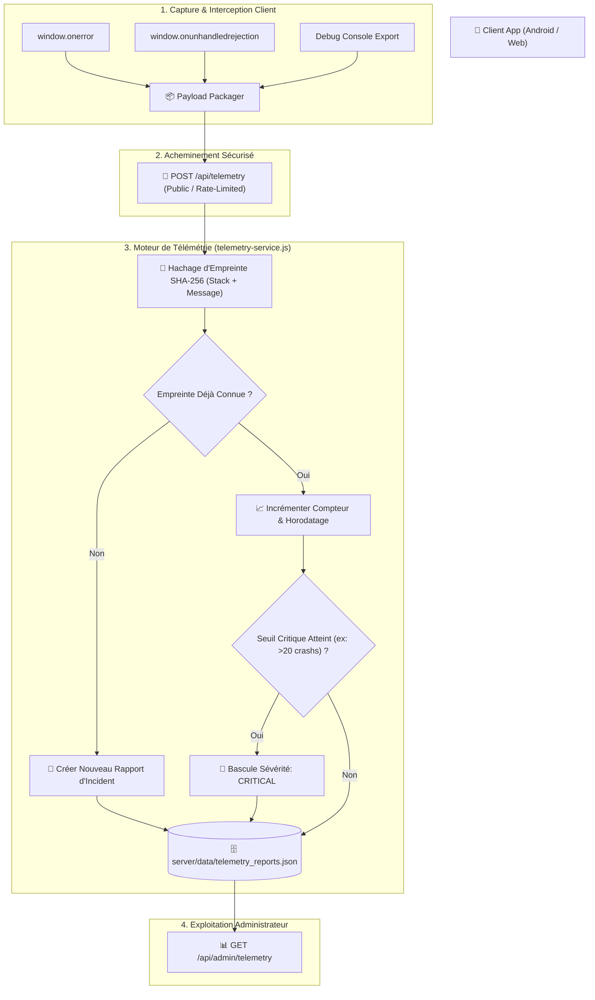

# 🚨 Architecture : Télémétrie & Crash Intelligence (Sentry-Grade)

> **Quadrant Diátaxis** : *01-Architecture (Explanations)*  
> **Statut** : Production (v1.17.0+)  
> **Composants Clés** : `server/services/telemetry-service.js`, `server/routes/telemetry.js`, `public/js/debug-console.js`, `public/js/main.js`

---

## 🎯 1. Vue d'Ensemble & Objectifs

Pour une application médicale critique utilisée en contexte d'urgence ou de consultation ambulatoire, les plantages silencieux, les blocages d'interface ou les erreurs de rendu peuvent avoir des conséquences graves.

Dr. CAT intègre un système complet de **Crash Intelligence & Télémétrie Auto-Hébergé** conçu selon les principes de plateformes professionnelles comme Sentry :
- **Capture Automatique & Silencieuse** : Interception des erreurs de démarrage, rejets de promesses non gérés (`unhandledrejection`), et erreurs globales (`window.onerror`).
- **Agrégation Intelligente par Empreinte SHA-256** : Évite le spamming en fusionnant des centaines de crashs identiques en un incident unique avec compteur d'occurrences.
- **Escalade Automatique de Sévérité** : Bascule dynamique en statut critique (🔴 *Panne Globale*) lorsqu'un seuil de fréquence ou d'appareils impactés est franchi.
- **Respect Absolu de la Vie Privée (Zéro Donnée de Santé)** : Anonymisation stricte des identifiants et neutralisation des contenus médicaux ou notes personnelles.



---

## 🔑 2. Calcul d'Empreinte (Fingerprinting) & Déduplication

Pour empêcher la saturation des disques et faciliter le diagnostic :

1. **Extraction des Éléments Discriminants** :
   - Type d'erreur (ex: `TypeError`, `NetworkError`, `ReferenceError`).
   - Préfixe du message d'erreur (normalisé sans les identifiants dynamiques).
   - Les 3 premières lignes de la pile d'exécution (*Stack Trace* normalisée).
2. **Hachage SHA-256** :
   ```javascript
   const fingerprint = crypto
     .createHash('sha256')
     .update(`${errorType}|${cleanMessage}|${topStackFrames}`)
     .digest('hex')
     .substring(0, 16);
   ```
3. **Agrégation** :
   - Si un millier d'utilisateurs subissent la même erreur, la base ne crée pas 1000 lignes : elle incrémente le compteur `occurrences: 1000` et met à jour `lastSeen` ainsi que la liste des appareils touchés (`deviceBreakdown`).

---

## 📈 3. Escalade Automatique de Sévérité

Le moteur réévalue la criticité de chaque incident à chaque nouvelle occurrence :

| Niveau | Critères de Déclenchement | Impact UI / Diagnostic |
| :--- | :--- | :--- |
| 🟡 **Warning** | 1 à 4 occurrences sur un seul type d'appareil | Incident isolé ou glitch réseau |
| 🟠 **Error** | 5 à 19 occurrences ou plusieurs appareils distincts | Dysfonctionnement à investiguer |
| 🔴 **Critical** | ≥ 20 occurrences OU impactant > 5 appareils distincts | Alerte rouge, anomalie bloquante |

---

## 🔒 4. Protection de la Confidentialité & Conformité Médicale

Le rapport de télémétrie ne contient **JAMAIS** de données médicales nominatives ou de santé :
- Les URLs sont nettoyées de tout paramètre de recherche clinique sensible.
- Les adresses IP sont anonymisées côté serveur (seul un identifiant d'installation opaque `installId` anonyme est consigné).
- Les textes de notes utilisateur ou de prescriptions personnalisées sont exclus du payload de crash.

---

## 🛠️ 5. Endpoints d'Exploitation & Administration

- `POST /api/telemetry` : Endpoint public protégé par rate limiting (60 req/min).
- `GET /api/admin/telemetry` : Consultation de la liste agrégée des incidents (Protégé par Token Admin + Localhost).
- `DELETE /api/admin/telemetry/:id` : Acquittement et suppression d'un incident résolu.
- `DELETE /api/admin/telemetry/all` : Vidage complet de l'historique des incidents.

---

## 🔗 Liens & Documents Associés
- 🛡️ [Sécurité & Isolation](file:///data/data/com.termux/files/home/med/docs/01-architecture/security-isolation.md)
- 🛠️ [Guide de Dépannage & Runbook](file:///data/data/com.termux/files/home/med/docs/02-guides/troubleshooting-runbook.md)
- 📜 [ADR-004 : Choix de la Télémétrie Auto-Hébergée](file:///data/data/com.termux/files/home/med/docs/04-decisions-adr/adr-004-sentry-grade-telemetry.md)
