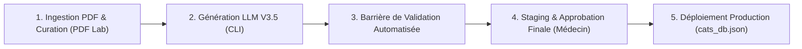

# 🛠️ Guide : Génération, Validation & Staging des Fiches Médicales (CATs)

> **Quadrant Diátaxis** : *02-Guides (How-To Guides)*  
> **Statut** : Production (v1.17.0+)  
> **Composants Clés** : `cat_db_generator/generate_cat_db.js`, `cat_db_generator/cats_db_staged.json`, `admin/pdf_lab.html`

---

## 🎯 1. Vue d'Ensemble du Flux de Curation

La création et l'intégration d'une nouvelle Conduite à Tenir (CAT) dans Dr. CAT suit un cycle de vie strict en 4 étapes pour garantir une sécurité clinique totale :



---

## 💻 2. Commandes CLI du Générateur (`npm run generate`)

Le point d'entrée principal est le script `cat_db_generator/generate_cat_db.js`.

### 🐤 1. Auto-Test des Parsers de Posologie (Canary Test)
Exécutez toujours un test canari pour vous assurer que les expressions régulières de dosage sont opérationnelles :
```bash
npm run generate -- --canary
```

### 🏆 2. Test de Régression Clinique (Golden Set)
Évaluez les 5 cas cliniques de référence pour vérifier l'absence de dérive qualitative du modèle :
```bash
npm run generate -- --golden
```

### 🚀 3. Génération d'une Fiche Spécifique ou d'une Catégorie
```bash
# Générer une pathologie spécifique
npm run generate -- --topic "Pneumonie Aiguë Communautaire"

# Générer toutes les fiches d'une spécialité
npm run generate -- --category "Cardiologie"

# Régénération complète de la base (avec canaries automatiques)
npm run generate -- --rebuild-all
```

---

## 🛡️ 3. Interprétation des Résultats de Validation

Lors de la génération, le script affiche le rapport d'audit clinique :

| Message de Sortie | Signification Clinique | Action Requise |
| :--- | :--- | :--- |
| `✅ [PASS] Validation Schéma & Posologie` | Fiche 100% conforme aux règles BDPM et plafonds | Prête pour staging |
| `⚠️ [WARNING] [DCI Non Référencée] MoleculeX` | Molécule non répertoriée dans le dictionnaire BDPM | Vérifier l'orthographe dans le Staging Lab |
| `❌ [ERROR] Dépassement Plafond Posologique` | Posologie prescrite supérieure à la dose journalière max | La fiche est rejetée automatiquement |
| `❌ [ERROR] Drapeaux Rouges Manquants` | Section de signes de gravité absente | La fiche est rejetée automatiquement |

---

## 🖥️ 4. Validation & Approbation dans le Staging Lab

Toutes les fiches générées avec succès sont d'abord enregistrées dans l'espace de staging (`cat_db_generator/cats_db_staged.json`) :

1. Connectez-vous à l'interface d'administration : `http://localhost:3000/admin/pdf_lab.html`.
2. Ouvrez l'onglet **Staging Curation**.
3. Relisez la fiche, ajustez manuellement la formulation si nécessaire.
4. Cliquez sur **Approuver & Promouvoir vers Production**.

---

## 📦 5. Promotion & Synchronisation de la Base Production

Pour synchroniser la base validée avec les applications clientes et l'APK :
```bash
# Migration et nettoyage du schéma de base de données
node scripts/upgrade_db_schema.js --clean

# Re-génération des index de recherche et listes de distribution
node index_pdfs.js
```

---

## 🔗 Liens & Documents Associés
- 🤖 [Architecture du Moteur LLM V3.5](file:///data/data/com.termux/files/home/med/docs/01-architecture/llm-generation-engine.md)
- 📐 [Schéma Complet de la Base de Données](file:///data/data/com.termux/files/home/med/docs/03-reference/schema-cats-db.md)
- 📜 [Règles de Nomenclature Médicale & BDPM](file:///data/data/com.termux/files/home/med/docs/03-reference/drug-nomenclature-algeria.md)
