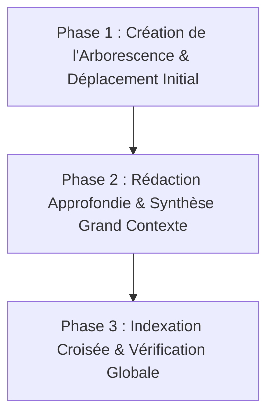

# 🗺️ Master Plan : Restructuration Documentaire Diátaxis & ADRs (Dr. CAT)

> **Document de Référence & Feuille de Route d'Exécution**  
> Modernisation et refonte de l'ensemble de la documentation technique de **Dr. CAT** selon les standards internationaux de l'ingénierie logicielle (**Framework Diátaxis** + **Architecture Decision Records**).

---

## 🎯 1. Vision & Objectifs

Face à l'envergure grandissante du projet Dr. CAT (moteur RAG hybride, générateur LLM, découpeur PDF, agrégateur de télémétrie Sentry-grade, sécurité Termux/Android, PWA & Cloudflare Workers), la documentation doit évoluer d'un ensemble de fichiers monolithiques vers une **architecture modulaire standardisée**.

### Principes Clés :
1. **Adoption du Framework Diátaxis** : Séparation stricte des 4 quadrants cognitifs (*Explanations*, *How-To Guides*, *Reference*, *Tutorials*).
2. **Historique des Décisions (ADRs)** : Formalisation des choix architecturaux majeurs pour garder la mémoire du projet.
3. **Docs-as-Code & Navigation Fluide** : Diagrammes Mermaid natifs, liens markdown relatifs vérifiés et index centralisé.

---

## 🗂️ 2. Structure Cible de l'Arborescence `docs/`

```text
docs/
├── README.md                              # 🗺️ Table des matières interactive & Guide de navigation
│
├── 01-architecture/                       # 🧠 EXPLANATIONS (Comprendre les choix et concepts)
│   ├── dual-rail-network.md               # Rail Cloudflare Edge (90%) vs Rail Termux Admin (10%)
│   ├── security-isolation.md              # Anti-usurpation localhost, tokens, Kill Switch & Lock Gate
│   ├── pdf-rag-pipeline.md                # Pipeline d'extraction vectorielle & RAG multi-sources
│   ├── llm-generation-engine.md           # Moteur V3.5, 5 flux de connaissances, Canaries & Golden Set
│   └── telemetry-crash-intelligence.md    # Auto-diagnostic silencieux, hachage d'empreinte & agrégation
│
├── 02-guides/                             # 🛠️ HOW-TO GUIDES (Tutoriels opérationnels pas-à-pas)
│   ├── developer-onboarding.md            # Installation et démarrage local sous Termux / Node.js
│   ├── generating-validating-cats.md      # Création, validation et staging d'une nouvelle CAT
│   ├── slicing-master-pdfs.md             # Utilisation du PDF Lab, Sommaire GPS et Visual Slicer
│   ├── compiling-android-apk.md           # Capacitor Sync, AAPT assets stripping & obfuscation R8
│   ├── cloudflare-wrangler-deploy.md      # Déploiement Worker, secrets KV et shim Termux
│   └── troubleshooting-runbook.md         # Guide de dépannage des pannes et anomalies courantes
│
├── 03-reference/                          # 📐 REFERENCE (Spécifications formelles et fiches techniques)
│   ├── schema-cats-db.md                  # Schéma JSON complet des fiches cliniques V3.5
│   ├── api-endpoints-matrix.md            # Spécification détaillée de toutes les routes HTTP/REST
│   ├── environment-secrets.md             # Inventaire complet des variables .env et secrets Cloudflare
│   ├── test-suites-ledger.md              # Matrice des 11 suites de tests automatisées
│   └── drug-nomenclature-algeria.md       # Règles de validation BDPM et nomenclature locale
│
└── 04-decisions-adr/                      # 📜 ARCHITECTURE DECISION RECORDS (Registre des décisions)
    ├── adr-001-dual-rail-hybrid-model.md  # Choix du modèle Cloudflare Worker + Termux Backend
    ├── adr-002-fixed-database-filenames.md# Abandon du versionnage par nom de fichier (cats_db.json)
    ├── adr-003-storage-safe-kill-switch.md# Protection des données utilisateur lors du verrouillage
    ├── adr-004-sentry-grade-telemetry.md  # Choix de l'auto-hébergement et de l'agrégation par empreinte
    └── adr-005-diataxis-documentation.md  # Standardisation de l'arborescence documentaire
```

---

## 🗺️ 3. Matrice de Migration des Fichiers Existants

| Fichier Actuel | Nouvelle Destination Cible | Statut / Action |
| :--- | :--- | :--- |
| `docs/technical_architecture.md` | `01-architecture/dual-rail-network.md` + `security-isolation.md` | Découper et approfondir |
| `docs/TELEMETRY_CRASH_INTELLIGENCE.md` | `01-architecture/telemetry-crash-intelligence.md` | Déplacer et lier |
| `docs/llmengineupdate.md` & `addendum` | `01-architecture/llm-generation-engine.md` | Fusionner et enrichir |
| `docs/GUIDE_PDF_RAG_STANDARDIZATION.md` | `01-architecture/pdf-rag-pipeline.md` | Convertir |
| `docs/developer_guide.md` | `02-guides/developer-onboarding.md` | Mettre à jour |
| `docs/security-hardening-v1.12.0.md` | `04-decisions-adr/adr-003-storage-safe-kill-switch.md` | Synthétiser en ADR |
| `docs/REBUILD_CORPUS_MASTER_PLAN.md` | `02-guides/generating-validating-cats.md` | Intégrer |
| `docs/original_listcat.md` | `03-reference/original-cats-archive.md` | Conserver comme archive |

---

## 🚀 4. Protocole d'Exécution en 3 Phases



1. **Phase 1 : Arborescence & Déplacement (Fondations)** :
   - Création des répertoires `01-architecture/`, `02-guides/`, `03-reference/`, `04-decisions-adr/`.
   - Migration ordonnée des fichiers existants.
2. **Phase 2 : Rédaction Approfondie (Grand Contexte IA)** :
   - Exploitation de la fenêtre de contexte maximale pour documenter chaque composant du code source de façon détaillée.
3. **Phase 3 : Vérification & Indexation** :
   - Génération du `docs/README.md` avec navigation interactive.
   - Validation de l'intégrité de tous les liens GitHub markdown.
