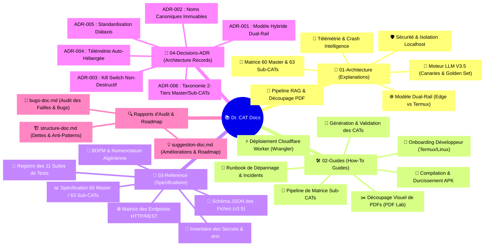

# 📚 Documentation Technique Dr. CAT (Framework Diátaxis & ADRs)

> **Application Médicale de Conduites à Tenir (CAT) & Outils Cliniques**  
> **Auteur & Concepteur** : Dr. Kibeche Ali Dia Eddine  
> **Version Actuelle** : `v1.17.0`  
> **Architecture** : Standard Diátaxis (4 Quadrants Cognitifs) + Architecture Decision Records (ADRs)

---

## 🗺️ Carte Interactive de la Documentation

---

## 🧠 1. Architecture & Concepts Fondamentaux (`01-architecture/`)

Comprendre le fonctionnement global, les flux de données et les choix de conception du système :

| Document | Sujet & Périmètre Clé |
| :--- | :--- |
| 🌐 [**Modèle Réseau Hybride Dual-Rail**](file:///data/data/com.termux/files/home/med/docs/01-architecture/dual-rail-network.md) | Rail 1 Edge Cloudflare (90% trafic) vs Rail 2/3 Termux Admin (10%). |
| 🛡️ [**Sécurité, Isolation & Kill Switch**](file:///data/data/com.termux/files/home/med/docs/01-architecture/security-isolation.md) | Protection anti-usurpation localhost, tokens admin et sanctuarisation du stockage. |
| 📄 [**Pipeline RAG & Découpage PDF**](file:///data/data/com.termux/files/home/med/docs/01-architecture/pdf-rag-pipeline.md) | Extraction OCR multi-pass, sommaires GPS, Visual Slicer et compression dual-stream. |
| 🤖 [**Moteur de Génération Médicale LLM V3.5**](file:///data/data/com.termux/files/home/med/docs/01-architecture/llm-generation-engine.md) | Découverte dynamique Gemini, GEMINI_BLOCKLIST, 5 flux RAG, Canaries & Golden Set. |
| 🌳 [**Matrice Hiérarchique Master & Sub-CATs**](file:///data/data/com.termux/files/home/med/docs/01-architecture/hierarchical-subcats-engine.md) | Architecture taxonomique 2-tiers, deep-linking `#cat-12-sub_1` et recherche profonde. |
| 🚨 [**Télémétrie & Crash Intelligence**](file:///data/data/com.termux/files/home/med/docs/01-architecture/telemetry-crash-intelligence.md) | Capture silencieuse, hachage SHA-256 déterministe, déduplication et escalade. |

---

## 🛠️ 2. Guides Opérationnels Pas-à-Pas (`02-guides/`)

Guides pratiques pour exécuter des tâches concrètes et administrer la plateforme :

| Guide | Objectif Opérationnel |
| :--- | :--- |
| 🚀 [**Onboarding Développeur (Termux / Linux)**](file:///data/data/com.termux/files/home/med/docs/02-guides/developer-onboarding.md) | Configuration de l'environnement, Node.js 24, variables .env et PM2. |
| 💊 [**Génération, Validation & Staging des CATs**](file:///data/data/com.termux/files/home/med/docs/02-guides/generating-validating-cats.md) | Utilisation de `npm run generate`, options CLI, relecture et promotion. |
| ✂️ [**Découpage Visuel de PDFs (PDF Lab)**](file:///data/data/com.termux/files/home/med/docs/02-guides/slicing-master-pdfs.md) | Manipulation du PDF Lab Studio, extraction par plage de pages et sommaire GPS. |
| 📱 [**Compilation & Packaging de l'APK Android**](file:///data/data/com.termux/files/home/med/docs/02-guides/compiling-android-apk.md) | Capacitor Sync, AAPT asset stripping, obfuscation R8 et vérification de binaire. |
| ⚡ [**Déploiement Cloudflare Worker (Wrangler)**](file:///data/data/com.termux/files/home/med/docs/02-guides/cloudflare-wrangler-deploy.md) | Déploiement distant, Termux workerd shim et parité des secrets SYNC_SECRET. |
| 🌳 [**Pipeline de Matrice Sub-CATs**](file:///data/data/com.termux/files/home/med/docs/02-guides/subcats-matrix-pipeline.md) | Scanners de densité, compilation de la matrice officielle et échantillonnage. |
| 🚒 [**Runbook de Résolution d'Incidents**](file:///data/data/com.termux/files/home/med/docs/02-guides/troubleshooting-runbook.md) | Fiches de dépannage des 6 pannes courantes (403, workerd, ports, lock screens). |

---

## 📐 3. Références Techniques & Spécifications (`03-reference/`)

Fiches techniques exhaustives, contrats d'interface et dictionnaires de données :

| Référence | Contenu Détaillé |
| :--- | :--- |
| 📄 [**Schéma de Données des Fiches (v3.5)**](file:///data/data/com.termux/files/home/med/docs/03-reference/schema-cats-db.md) | Spécification JSON Schema formelle, champs requis, sous-fiches et historique. |
| 📊 [**Spécification Matrice 60-Master / 63-Sub-CAT**](file:///data/data/com.termux/files/home/med/docs/03-reference/master-subcats-matrix-spec.md) | Répartition par spécialité, identifiants normalisés et couverture médicale. |
| 🌐 [**Matrice des Endpoints HTTP / REST**](file:///data/data/com.termux/files/home/med/docs/03-reference/api-endpoints-matrix.md) | Tableau exhaustif de toutes les routes, méthodes, charges utiles et statuts HTTP. |
| 🔑 [**Inventaire des Variables & Secrets**](file:///data/data/com.termux/files/home/med/docs/03-reference/environment-secrets.md) | Variables `.env`, secrets Wrangler et constantes client avec niveau de criticité. |
| 🧪 [**Registre des 11 Suites de Tests**](file:///data/data/com.termux/files/home/med/docs/03-reference/test-suites-ledger.md) | Inventaire complet des tests automatisés (`npm run test:suite`). |
| 💊 [**Règles Pharmacologiques & Nomenclature**](file:///data/data/com.termux/files/home/med/docs/03-reference/drug-nomenclature-algeria.md) | Dictionnaires BDPM, équivalences algériennes, plafonds de sécurité et règle des 3 lignes. |
| 📋 [**Roadmaps & Rapports Historiques de Staging**](file:///data/data/com.termux/files/home/med/docs/03-reference/official-master-subcats-roadmap.md) | Feuilles de route d'expansion clinique et matrices candidates. |

---

## 📜 4. Registre des Décisions d'Architecture (`04-decisions-adr/`)

La mémoire vivante des choix techniques majeurs :

- 📜 [**ADR-001** : Modèle Réseau Hybride Dual-Rail (Edge Worker vs Termux Backend)](file:///data/data/com.termux/files/home/med/docs/04-decisions-adr/adr-001-dual-rail-hybrid-model.md)
- 📜 [**ADR-002** : Abandon du Versionnage par Nom de Fichier & Noms Canoniques Immuables](file:///data/data/com.termux/files/home/med/docs/04-decisions-adr/adr-002-fixed-database-filenames.md)
- 📜 [**ADR-003** : Protection Absolue du Stockage Utilisateur lors du Verrouillage de Sécurité](file:///data/data/com.termux/files/home/med/docs/04-decisions-adr/adr-003-storage-safe-kill-switch.md)
- 📜 [**ADR-004** : Adoption de la Télémétrie Auto-Hébergée & Agrégation SHA-256](file:///data/data/com.termux/files/home/med/docs/04-decisions-adr/adr-004-sentry-grade-telemetry.md)
- 📜 [**ADR-005** : Standardisation de la Documentation Technique sur le Framework Diátaxis](file:///data/data/com.termux/files/home/med/docs/04-decisions-adr/adr-005-diataxis-documentation.md)
- 📜 [**ADR-006** : Modèle Taxonomique 2-Tiers (60 Master CATs & 63 Sub-CATs)](file:///data/data/com.termux/files/home/med/docs/04-decisions-adr/adr-006-hierarchical-subcats.md)

---

## 🔍 5. Rapports d'Audit & Améliorations Futures

Rapports d'analyse approfondie du code source réalisés lors de la restructuration documentaire :

- 🐛 [**Audit des Bugs, Vulnérabilités & Cas Limites (`bugs-doc.md`)**](file:///data/data/com.termux/files/home/med/docs/bugs-doc.md) : 15 anomalies répertoriées avec localisation exacte et correctifs recommandés.
- 🏗️ [**Audit Structurel, Dettes Techniques & Anti-Patterns (`structure-doc.md`)**](file:///data/data/com.termux/files/home/med/docs/structure-doc.md) : Analyse des code smells, couplages forts et cibles de refactoring.
- 💡 [**Propositions d'Améliorations & Roadmap d'Évolution (`suggestion-doc.md`)**](file:///data/data/com.termux/files/home/med/docs/suggestion-doc.md) : Calculateurs interactifs, RAG vectoriel, amélioration Leitner SM-2 et thème de garde.

---

## 📦 6. Archives Documentaires (`archive/`)

Tous les anciens documents et notes de conception historiques ont été archivés sans aucune suppression dans le dossier dédié :
- 📁 [**Consulter les Archives Documentaires (`docs/archive/`)**](file:///data/data/com.termux/files/home/med/docs/archive/)
