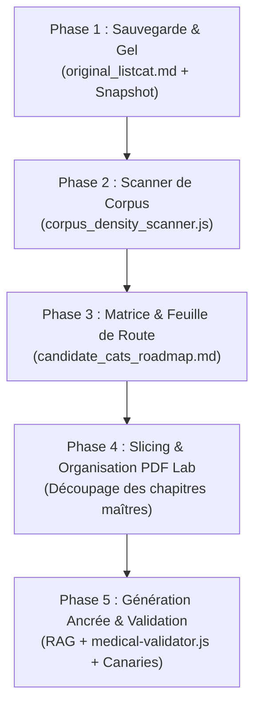

# 🗺️ Master Plan : Refonte Clinique Complète & Exploitation du Corpus Médical Offline

> **Document de référence & protocole d'exécution** pour la reconstruction haute-fidélité de la base de données clinique Dr. CAT à partir du corpus des 85+ manuels médicaux, référentiels nationaux et guides de pratique officiels.

---

## 🎯 1. Vision & Objectifs Stratégiques

1. **Zéro Hallucination & Ancrage Documentaire Réel (RAG)** :
   - Abandonner la génération purement synthétique en vase clos.
   - Chaque fiche CAT sera désormais ancrée et extraite directement depuis les chapitres sources découpés de la bibliothèque médicale offline (Pilly, Collèges d'enseignants, SFMU, HAS, Vidal, Guides d'urgences).
2. **Préservation du Socle Historique** :
   - Les **62 CATs originelles** sont archivées et gelées dans [`docs/original_listcat.md`](./original_listcat.md) et dans le snapshot de secours `backups/cats_db_pre_rebuild_v1.15.2.json`.
3. **Système de Notation de Densité & Matrice de Préparation Clinique** :
   - Notation automatique de chaque pathologie candidate trouvée dans le corpus selon un barème d'exhaustivité médicale (définition, signes d'alerte, posologies, formes pédiatriques, molécules algériennes).
   - Classification en 3 grades (**Grade A**, **Grade B**, **Grade C**).
4. **Utilisation Optimale du PDF Lab & du Generator Lab** :
   - Découpage vectoriel propre des chapitres maîtres (`data/pdf_masters/` ➔ `cat_db_generator/staging/`).
   - Validation automatisée par `medical-validator.js` et validation par le médecin via l'interface Admin.

---

## 📐 2. Système de Notation de Densité Médicale (Clinical Readiness Score)

Chaque pathologie scannée dans le corpus offline est évaluée sur **100 points** selon 5 axes cliniques vitaux :

| Critère | Poids | Éléments analysés |
| :--- | :---: | :--- |
| **1. Définition & Présentation Clinique** | **20 pts** | Clarté nosologique, facteurs de risque, critères diagnostiques positifs/différentiels. |
| **2. Drapeaux Rouges & Critères de Gravité** | **25 pts** | Signes de choc, critères d'hospitalisation/réanimation, scores de gravité (qSOFA, Fine, etc.). |
| **3. Densité Thérapeutique & Ordonnances** | **25 pts** | Molécules de 1ère et 2ème intention, posologies chiffrées (`mg`, `g`, `UI`, `mg/kg/j`), durée, voie d'administration. |
| **4. Profils Spécifiques (Pédiatrie / Terrains)** | **15 pts** | Adaptations posologiques enfant/nourrisson, femme enceinte, insuffisant rénal/hépatique. |
| **5. Conformité Nomenclature Locale / BDPM** | **15 pts** | Disponibilité des molécules dans la nomenclature algérienne & BDPM, absence de contre-indications majeures. |

### 🏆 Classification en 3 Niveaux :

* 🟢 **Grade A (Gold Standard - Score ≥ 85/100)** :
  * **Statut** : Données complètes, aucun manque thérapeutique.
  * **Action** : Prêt pour génération et validation directe en 1 clic via le Generator Lab.
* 🟡 **Grade B (Thérapeutique Partielle - Score 60 à 84/100)** :
  * **Statut** : Diagnostic et clinique parfaits, mais manque de posologies pédiatriques précises ou d'alternatives en cas d'allergie.
  * **Action** : Nécessite un enrichissement ciblé (Pilly / Vidal / Nomenclature locale).
* 🔴 **Grade C (Faible Densité - Score < 60/100)** :
  * **Statut** : Simple mention ou résumé succinct dans le manuel source (1-2 paragraphes).
  * **Action** : Nécessite l'intégration ou le découpage d'un PDF de consensus dédié avant génération.

---

## 🗺️ 3. Protocole d'Exécution en 5 Phases



### 📍 Phase 1 : Sauvegarde & Archivage
- [x] Snapshot immutable : `backups/cats_db_pre_rebuild_v1.15.2.json`
- [x] Liste d'origine : `docs/original_listcat.md` (62 fiches classées par spécialité)

### 🔍 Phase 2 : Scanner de Densité de Corpus (`scripts/corpus_density_scanner.js`)
- Créer un script Node.js qui parcourt `pdf_index.json` et `data/pdf_cache/`.
- Extraire la liste exhaustive des pathologies mentionnées avec :
  - Nombre d'occurrences et pages sources associées.
  - Détection automatique des marqueurs posologiques (`mg`, `g`, `x/j`, etc.).
  - Détection des mots-clés d'urgence et critères diagnostiques.
- Calculer le score de densité sur 100.

### 📊 Phase 3 : Feuille de Route Interactive (`docs/candidate_cats_roadmap.md`)
- Générer un tableau Markdown interactif classé par spécialité et par Grade (A / B / C) avec cases à cocher `[ ]` pour le suivi d'avancement clinique.

### ✂️ Phase 4 : Découpage et Curation PDF Lab
- Pour chaque fiche Grade A / Grade B, découper le chapitre maître correspondant via le Visual Slicer (`POST /api/admin/slice-pdf`).
- Sauvegarder les extraits textuels propres dans `cat_db_generator/staging/`.

### 🧪 Phase 5 : Génération Ancrée & Promotion en Production
- Lancer la génération ciblée :
  ```bash
  node cat_db_generator/generate_cat_db.js --single "Titre Pathologie" --specialty "Spécialité"
  ```
- Passer par les tests de canaris et benchmarks :
  ```bash
  npm run generate -- --canary
  npm run generate -- --golden
  ```
- Validation dans l'interface Admin Doctor Lab ➔ Compilation `npm run build` ➔ Déploiement `npx wrangler deploy`.

---

## 🛠️ 4. Commandes Utiles pour la Tablette

```bash
# 1. Récupérer les dernières mises à jour et le plan sur la tablette :
git pull origin ui-ux-01

# 2. Lancer le scanner de densité (dès création du script) :
node scripts/corpus_density_scanner.js

# 3. Lancer le serveur local et ouvrir l'Admin PDF Lab :
npm start
# Naviguer sur http://localhost:3000

# 4. Lancer les tests complets de validation :
npm run test:suite
```
