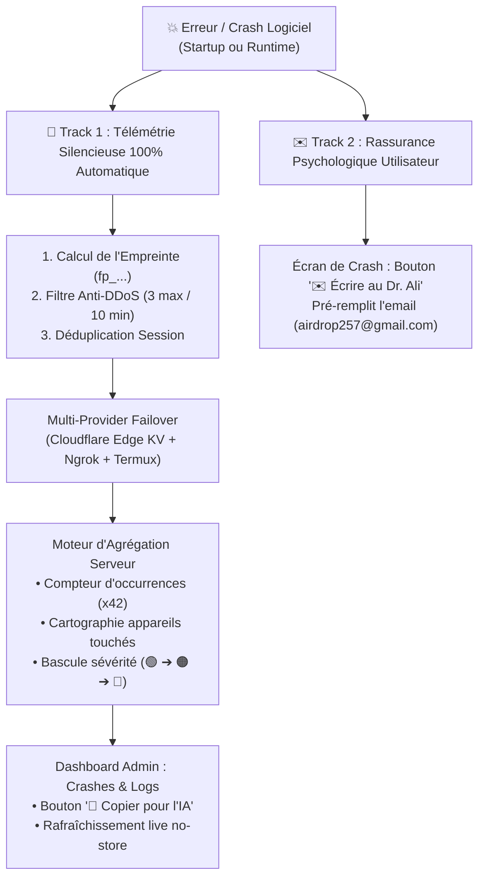

# 📡 Télémétrie, Auto-Diagnostic & Intelligence des Incidents (v1.16.x)

> **Document de Référence Technique & Guide Opérationnel**  
> Architecture du système d'auto-diagnostic temps réel, d'agrégation d'incidents de niveau Sentry, de déduplication anti-DDoS et d'assistance au débogage par IA de **Dr. CAT**.

---

## 🎯 1. Vue d'Ensemble & Philosophie de Conception

Le système de télémétrie de Dr. CAT repose sur une **architecture duale (Dual-Track)** séparant strictement l'expérience utilisateur de l'ingénierie logicielle :



### Principes Directeurs :
1. **Zéro Action Requise** : Les bugs sont capturés et transmis immédiatement à l'apparition, sans demander à l'utilisateur de comprendre ou manipuler des logs.
2. **Immunité Anti-Bloqueurs (AdGuard / uBlock)** : Architecture 100% auto-hébergée (aucun script SaaS tiers lourd type Sentry ou LogRocket), garantissant 100% de délivrabilité.
3. **Zéro Fuite Médicale (RGPD & Loi 18-07)** : Seules les métriques techniques matérielles et logicielles sont transmises. Aucune donnée patient ou note clinique n'est collectée.
4. **Prêt pour l'IA (Prompt-Ready)** : Chaque incident génère un prompt d'analyse complet en 1 clic pour résolution instantanée par LLM.

---

## 📱 2. Sous-Système Client (Capture & Rate-Limiting)

### 2.1 Empreinte d'Erreur Déterministe (`generateErrorFingerprint`)
Pour regrouper les erreurs identiques sans dépendre de variations mineures (numéros de ligne transitoires, adresses IP d'hébergement), le client génère un hachage d'empreinte :

$$\text{Raw} = \text{cleanErrorName} + \text{"::"} + \text{cleanCallsite}$$

```javascript
// public/js/lib/telemetry.js
export function generateErrorFingerprint(error = '', stack = '') {
  const cleanError = String(error).trim().split('\n')[0].replace(/:\d+:\d+/g, '');
  const firstStackLine = String(stack).split('\n').find(l => l.includes('.js') || l.includes('at ')) || '';
  const cleanStack = firstStackLine.replace(/https?:\/\/[^\/]+\//g, '').replace(/:\d+:\d+/g, '').trim();
  const raw = `${cleanError}::${cleanStack}`.toLowerCase();
  
  let hash = 0;
  for (let i = 0; i < raw.length; i++) {
    hash = ((hash << 5) - hash) + raw.charCodeAt(i);
    hash |= 0;
  }
  return 'fp_' + Math.abs(hash).toString(36);
}
```

### 2.2 Régulation Anti-DDoS & Déduplication Locale
Pour éviter qu'une boucle `setInterval` défaillante n'inonde le serveur ou le quota Cloudflare KV :
* **Déduplication par Session** : Une même empreinte (`fp_...`) n'est envoyée qu'une seule fois par session de navigation.
* **Fenêtre Glissante (Token Bucket)** : Plafond strict de **3 rapports maximum par client par tranche de 10 minutes**.
* **Filtre Anti-Bruit** : Les refus d'accès d'authentification normaux (`403 Forbidden`, `Unauthorized`) sont automatiquement ignorés de la télémétrie.

---

## 🗂️ 3. Moteur d'Agrégation Serveur & Edge (Sentry-Grade)

### 3.1 Modèle de Données d'un Groupe d'Incidents
Au lieu d'enregistrer 500 entrées séparées pour un même bug, le backend (`server/routes/telemetry.js` et `worker.js`) regroupe les occurrences sous une seule fiche :

```json
{
  "id": "tel_1787849442123_qhlpl66",
  "fingerprint": "fp_dxixfl",
  "firstSeen": 1787841468000,
  "lastSeen": 1787850335351,
  "occurrences": 21,
  "severity": "critical",
  "type": "runtime_error",
  "error": "ReferenceError: setupMutationObserver is not defined",
  "stack": "ReferenceError: setupMutationObserver is not defined\n at version-checker.js:355:3",
  "affectedDevices": {
    "Xiaomi 12T Pro": 12,
    "Poco F6": 6,
    "Samsung Galaxy Tab S9": 3
  },
  "appVersion": "1.16.2",
  "logs": [
    { "timestamp": "18:05:35", "level": "INFO", "message": "🚀 Debug Console initialized." },
    { "timestamp": "18:05:35", "level": "ERROR", "message": "Uncaught ReferenceError" }
  ]
}
```

### 3.2 Classification Automatique de la Sévérité
Le serveur recalcule dynamiquement le niveau de criticité de chaque incident selon la fréquence d'apparition :

| Sévérité | Seuil d'Occurrences | Badge Visuel Dashboard | Signification Clinique |
| :--- | :---: | :--- | :--- |
| 🟢 **MINEUR** | `1 à 4` | `🟢 MINEUR` | Bug isolé, glitch spécifique à un seul appareil ou navigateur. |
| 🟠 **FRÉQUENT** | `5 à 19` | `🟠 FRÉQUENT` | Anomalie récurrente touchant plusieurs utilisateurs. |
| 🔴 **CRITIQUE** | `≥ 20` | `🔴 PANNE GLOBALE` *(Pulsant)* | **Panne générale bloquante** consécutive à une mise à jour récente. |

### 3.3 Politique de Rétention & Buffer Circulaire FIFO (Zero Storage Bloat)
* **Plafond Fixe** : Maximum **50 groupes d'incidents** conservés dans Cloudflare KV (`telemetry_reports`) et `server/data/telemetry_reports.json`.
* **Éviction Automatique (FIFO)** : À l'arrivée du 51ème incident unique, le groupe le plus ancien ou inactif est automatiquement purgé.
* **Taille des Payloads** : Stack trace tronquée à 1500 caractères, logs console limités aux 20 dernières lignes.
* **Empreinte Globale** : **< 60 KB au total** (soit **0.006%** du quota gratuit de 1 GB Cloudflare KV).

---

## 🖥️ 4. Tableau de Bord Administrateur ("Crashes & Logs")

Situé dans le Centre de Contrôle Admin (`#admin-pane-telemetry`), il offre :

1. **Rendu Paresseux (Lazy-Loaded)** : Ne sollicite aucun appel réseau tant que l'administrateur n'a pas ouvert l'onglet.
2. **Bouton `🔄 Actualiser` Temps Réel** : Forcé en `Cache-Control: no-store` et `_t=${Date.now()}` pour contourner tout cache navigateur.
3. **Bouton `🤖 📋 Copier pour l'IA`** : Formate instantanément un rapport complet prêt à coller :

```text
🚨 [Dr. CAT Diagnostic Incident Report]
• Incident ID: #fp_dxixfl
• Type: runtime_error
• Sévérité: CRITICAL
• Occurrences: 21
• App Version: v1.16.2
• Appareils touchés: Xiaomi 12T Pro (12), Poco F6 (6), Samsung Galaxy Tab S9 (3)
• Dernier signalement: 27/08/2026 18:05:36

--- ERREUR & STACK TRACE ---
ReferenceError: setupMutationObserver is not defined
    at version-checker.js:355:3

--- TRACES CONSOLE JOINTES ---
[18:05:35] [INFO] 🚀 Debug Console initialized.
[18:05:35] [ERROR] Uncaught ReferenceError: setupMutationObserver is not defined

👉 Instruction pour l'IA :
Analyse cette trace d'erreur et ces logs de Dr. CAT, diagnostique la cause exacte du problème et fournis les modifications de code précises pour le corriger.
```

---

## 🔒 5. Spécification des Endpoints API

| Méthode | Endpoint | Accès / Sécurité | Description |
| :--- | :--- | :--- | :--- |
| `POST` | `/api/telemetry` | Public (`x-app-key`) | Ingestion et agrégation d'un rapport de crash / diagnostic. |
| `GET` | `/api/admin/telemetry` | Admin Only (Localhost / Token / `SYNC_SECRET`) | Récupération de la liste des incidents agrégés avec synchronisation Cloudflare KV. |
| `DELETE` | `/api/admin/telemetry/:id` | Admin Only | Suppression d'un incident spécifique ou vidage complet (`:id = all`). |

---

## ⚖️ 6. Conformité Légale & Protection des Données (RGPD & Loi 18-07)

La collecte technique est déclarée de manière transparente à l'**Article 3 des Mentions Légales & CGU (`#legal-modal`)** de l'application :

> **Article 3 — Télémétrie Technique & Auto-Diagnostic Anonymisé** :  
> *"Afin d'assurer la stabilité logicielle et de corriger rapidement les anomalies sur les différents modèles d'appareils Android, Dr. CAT intègre un dispositif de télémétrie technique strictement anonymisé. En cas de crash ou de signalement manuel, seules des données matérielles et logicielles génériques sont transmises : modèle d'appareil, version logicielle et pile d'erreur JavaScript. Aucune donnée à caractère médical, aucun dossier patient et aucune note personnelle n'est collectée ou transmise."*

---

## 🧪 7. Suite de Tests Automatisés

Le système est couvert de bout en bout par la suite de tests dédiée :

```bash
# Exécution du test unitaire de télémétrie
node tests/test_telemetry.js

# Exécution de la Master Suite (11 suites intégrées)
npm run test:suite
```

*Scénarios validés : Ingestion publique, déduplication, hachage d'empreinte, bascule de sévérité à 20 occurrences, protection 403 des routes admin, synchronisation KV et vidage complet.*
