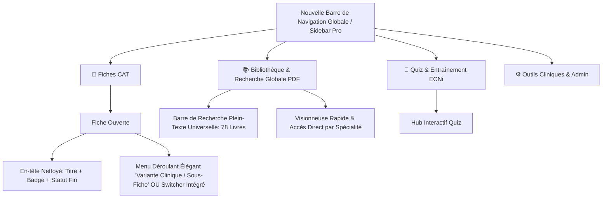

# 🩺 Dr.CAT UI/UX Master Redesign & Ergonomics Blueprint

> **Auteur :** Antigravity (UI/UX Clinical Lead)  
> **Statut :** Proposition & Blueprint d'Architecture Visuelle  
> **Application cible :** Web Desktop, Tablette Médicale & Application Android (Capacitor)

---

## 🎯 1. Diagnostic des Problèmes Majeurs Identifiés

| Composant | Problème Actuel | Impact Utilisateur (Médecin) |
| :--- | :--- | :--- |
| **Sous-CATs (Sub-CATs)** | Les pilules (`.subcat-pill`) s'accumulent directement sous le titre principal, surchargeant visuellement l'en-tête de la fiche. | Sensation de saturation cognitive. On a l'impression d'avoir deux barres d'onglets superposées avant même d'arriver au texte clinique. |
| **Tableau de Bord (Dashboard)** | Occupe 100% de l'écran d'accueil avec des cartes de statistiques de révision peu utiles en pratique clinique immédiate. Sert surtout de passerelle vers l'Admin. | Espace d'accueil gaspillé. Le médecin qui ouvre l'app veut soit chercher une CAT, soit un médicament, soit un protocole d'urgence dans les PDFs. |
| **Recherche & Lecture PDF** | La recherche plein-texte des 78 livres PDF et la liste des PDFs sont enfouies dans des 4ème et 5ème onglets d'une fiche spécifique. | Fonctionnalité majeure ("Killer Feature") quasi-invisible. Pour chercher une molécule dans un PDF, il faut obligatoirement ouvrir une CAT d'abord ! |
| **Menu Latéral (Sidebar)** | Mixte filtres spécialités + statuts + bouton Quiz + barre de progression + liste de fiches. | Pas assez d'espace accordé à la recherche rapide et aux accès directs transversaux (Fiches / Bibliothèque PDF / Quiz). |

---

## 💡 2. Solutions Ergonomiques & Architecture Proposée



---

## 📐 3. Détail des 4 Chantiers de Refonte

### 🔲 A. Remplacement des Pilules "Sous-CATs" Encombrantes
Au lieu de dérouler 5 à 6 boutons colorés sous le titre :
- **Option Recommandée : Dropdown Segmenté Compact / Floating Chip** :
  - Intégrer un sélecteur moderne à côté de la spécialité : `[ Gastro-entérologie ] ▾ [ Profil : Adulte standard (défaut) ▾ ]`.
  - En un clic, un menu déroulant soigné avec icônes affiche les déclinaisons :
    - 👶 *Pédiatrie (< 15 kg)*
    - 🤰 *Femme Enceinte (CRAT)*
    - 🚨 *Forme Grave / Urgence*
    - 🧓 *Sujet Âgé / Insuffisance Rénale*
  - **Résultat :** L'en-tête de la fiche redevient aéré et conserve une hauteur fixe minimale !

---

### 📊 B. Transformation du Tableau de Bord en "Centre de Commande Médical"
Remplacer les compteurs statiques d'étude par un **Véritable Dashboard Pratique** :
1. **Omni-Search Central (Barre Google Médicale)** :
   - Une grande barre de recherche instantanée qui cherche **en même temps** dans les 62 Fiches CAT **ET** dans les 78 Livres PDF avec filtre DCI/Médicaments.
2. **Accès Rapides "Protocoles d'Urgence" (Quick Actions)** :
   - Boutons 1-clic : *Arrêt Cardio-Respiratoire (ACR)*, *Choc Anaphylactique*, *Crise d'Asthme Aiguë*, *Colique Néphrétique*.
3. **Livres & Guides Récemment Consultés** :
   - Miniatures des derniers PDFs ouverts pour reprendre une lecture en 1 tap.
4. **Section Admin / Sync Discète** :
   - Réservée aux administrateurs ou regroupée dans un bouton discret en bas.

---

### 🔍 C. Libération de la Recherche PDF (Transformer en "Moteur Clinique Dédié")
Actuellement, pour chercher dans les 78 livres, il faut ouvrir une fiche, aller au 5ème onglet, puis chercher.
- **Nouvelle disposition :**
  - Ajout d'un onglet / bouton principal dans le menu : **`🔍 Recherche PDF Globale`** ou **`📚 Bibliothèque`**.
  - Permet d'ouvrir n'importe quel livre PDF directement avec table des matières (Sommaire GPS) et recherche de posologie instantanée sans passer par une CAT.

---

### 📑 D. Optimisation de la Sidebar (Navigation Hybride 3 Onglets)
- **Haut de la sidebar :** 3 mini-onglets de navigation rapide :
  - `[ 📋 Fiches (62) ]` | `[ 📚 PDFs (78) ]` | `[ 🧠 Quiz ]`
- **Milieu :** Recherche ultra-rapide avec suggestions en direct.
- **Bas :** Statut d'apprentissage compact et bouton sombre/clair.

---

## 🎨 4. Maquette Visuelle Conceptuelle (ASCII Mockup)

```
┌──────────────────────────────┬─────────────────────────────────────────────────────────────────┐
│ 🩺 Dr.CAT  [📋 CAT] [📚 PDF] │  Gastro-entérologie  ▾ [ Profil: Forme Pédiatrique (SRO) ▾ ]    │
├──────────────────────────────┼─────────────────────────────────────────────────────────────────┤
│ 🔍 Recherche rapide...       │  CAT devant Diarrhée Aiguë Infectieuse                          │
├──────────────────────────────┤  Statut : [ À faire | En cours | ● Maîtrisé ]                   │
│ • Gastro-entérologie (12)    ├─────────────────────────────────────────────────────────────────┤
│   - Diarrhée Aiguë           │  ⚠️ RED FLAGS : Déshydratation >8%, choc, rectorragies fébriles  │
│   - RGO & Gastrite           ├─────────────────────────────────────────────────────────────────┤
│   - Hémorragie Digestive     │  [ 📄 Fiche Synthèse ] [ 💊 Ordonnance ] [ 📝 Notes ] [ 📚 PDFs ]│
│ • Cardiologie (8)            │ ─────────────────────────────────────────────────────────────── │
│   - HTA Urgence              │  1. RÉHYDRATATION IMMÉDIATE (1ère Intention)                    │
│   - Insuffisance Cardiaque   │  - SRO (Soluté de Réhydratation Orale) : 1 sachet / 200ml eau   │
│                              │  - Posologie : 10 ml/kg après chaque selle liquide              │
└──────────────────────────────┴─────────────────────────────────────────────────────────────────┘
```
