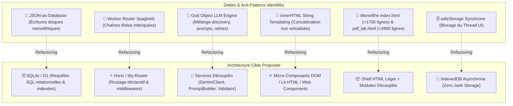

# 🏗️ Grand Audit Structurel, Dettes Techniques & Anti-Patterns (`structure-doc.md`)

> **Date de l'Audit** : 2026-09-01  
> **Projet** : Dr. CAT (v1.17.0+)  
> **Périmètre** : Architecture Logicielle, Modularité, Couplage Frontend/Backend, Spaghetti Code & Dette Technique

---

## 🎯 1. Vue d'Ensemble & Diagnostic Global

L'architecture actuelle de Dr. CAT est hautement fonctionnelle et stable en production. Néanmoins, l'évolution rapide du projet a laissé plusieurs zones de **couplage fort**, d'**anti-patterns de persistance** et de **code spaghetti** qui ralentiront la maintenabilité à long terme si elles ne sont pas progressivement refactorisées.



---

## 🔍 2. Analyse Approfondie des 6 Anti-Patterns Majeurs

---

### 1. L'Anti-Pattern "JSON-as-Database" (Backend & Termux)
- **Localisation** : `server/routes/cats.js`, `server/routes/cat-generator.js`, `server/services/data-store.js`.
- **Mécanisme** :
  Toute modification d'une seule fiche clinique charge en mémoire l'intégralité du tableau `cats_db.json` (plusieurs mégaoctets), le modifie en RAM, puis réécrit la totalité du fichier sur le disque.
- **Risques & Inconvénients** :
  - **Latence I/O linéaire** : Plus la base grossit (60 Master + 63 Sub-CATs), plus le temps de sérialisation et d'écriture disque augmente.
  - **Absence de requêtage indexé** : Les recherches par catégorie ou par mot-clé parcourent systématiquement un tableau en mémoire via `.filter()` et `.find()`.
  - **Concurrence fragile** : Risque d'écrasement mutuel si deux requêtes écrivent en même temps sans verrouillage strict.
- **Cible de Refactoring** :
  Migrer vers **SQLite** (via `better-sqlite3`) pour le serveur Termux :
  ```sql
  CREATE TABLE cats (
      id INTEGER PRIMARY KEY,
      category TEXT NOT NULL,
      title TEXT NOT NULL,
      summary TEXT NOT NULL,
      red_flags TEXT NOT NULL,
      ordonnance TEXT NOT NULL,
      updated_at INTEGER NOT NULL
  );
  CREATE TABLE subcats (
      id TEXT PRIMARY KEY,
      master_id INTEGER REFERENCES cats(id),
      label TEXT NOT NULL,
      summary TEXT NOT NULL,
      ordonnance TEXT NOT NULL,
      red_flags TEXT NOT NULL
  );
  ```

---

### 2. Le Router Spaghetti du Cloudflare Worker (`worker.js`)
- **Localisation** : `worker.js`, Lignes 33 à 418.
- **Mécanisme** :
  Le point d'entrée `fetch` contient plus de 250 lignes d'instructions conditionnelles imbriquées (`if (url.pathname === '/api/cats') ... else if (url.pathname === '/api/version') ...`).
- **Risques & Inconvénients** :
  - **Lisibilité et testabilité compromises** : Tout le cycle de vie de la requête (CORS, auth secret, parsing JSON, réponse KV) est fusionné dans un seul bloc de code.
  - **Duplication de code** : Les en-têtes CORS et le traitement des erreurs 500 sont répétés à chaque branche conditionnelle.
- **Cible de Refactoring** :
  Adopter le framework moderne et ultra-léger **Hono** (conçu spécifiquement pour Cloudflare Workers) :
  ```javascript
  import { Hono } from 'hono';
  import { cors } from 'hono/cors';

  const app = new Hono();
  app.use('*', cors());

  app.get('/api/cats', async (c) => fetchStaticAsset('/data/cats_db.json'));
  app.get('/api/version', (c) => c.json({ version: '1.17.0', minVersion: '1.0.0' }));
  app.post('/api/telemetry', async (c) => handleTelemetry(c));

  export default app;
  ```

---

### 3. "God Object" & Couplage Fort dans le Moteur LLM (`llm-engine.js`)
- **Localisation** : `cat_db_generator/lib/llm-engine.js` (938 lignes).
- **Mécanisme** :
  Un fichier unique gère simultanément :
  1. La découverte dynamique des modèles via l'API Google AI Studio.
  2. Le filtrage de la liste noire `GEMINI_BLOCKLIST`.
  3. L'assemblage du prompt système et des 5 flux de connaissances RAG.
  4. L'appel HTTP avec retry et gestion des quotas (HTTP 429).
  5. Le parsing de repli par regex (`safeParseLLMJson`).
- **Cible de Refactoring** :
  Découper en 4 services découplés et testables unitairement :
  - `lib/gemini-client.js` : Gestion des requêtes réseau, rate-limiting, retry et auth.
  - `lib/model-registry.js` : Découverte dynamique, tri de version et filtrage `GEMINI_BLOCKLIST`.
  - `lib/prompt-composer.js` : Assemblage du contexte clinique, charte des sous-fiches et formats de sortie.
  - `lib/json-sanitizer.js` : Nettoyage markdown et parsing des réponses d'IA.

---

### 4. Concaténation de Chaînes HTML & Injection `innerHTML` (Frontend)
- **Localisation** : `public/js/components/dashboard.js`, `public/js/components/workspace.js`, `public/js/components/sidebar.js`.
- **Mécanisme** :
  Les composants construisent des gabarits HTML géants en concaténant des chaînes de caractères (`let html = '<div class="...">' + ...; container.innerHTML = html;`).
- **Risques & Inconvénients** :
  - **Risque XSS omniprésent** : Chaque interpolation de variable est une opportunité d'injection si `escapeHTML()` est oublié (cf. BUG-01).
  - **Destruction brutale du DOM** : `innerHTML` détruit et reconstruit tous les éléments enfants, réinitialisant les positions de défilement et supprimant les écouteurs d'événements existants.
- **Cible de Refactoring** :
  - Utiliser la création programmatique avec `document.createElement()` et `DocumentFragment` (comme dans `quiz/ui.js`).
  - Ou adopter une bibliothèque de templates légers et sécurisés par défaut comme **Lit-HTML** ou **Preact**.

---

### 5. Monolithes HTML HTML-First (`index.html` >1700 Lignes & `pdf_lab.html` >2800 Lignes)
- **Localisation** : `public/index.html` et `admin/pdf_lab.html`.
- **Mécanisme** :
  Les fichiers HTML contiennent à la fois le markup de base, des centaines de lignes de CSS inliné, des dizaines de structures modales pré-générées, et des milliers de lignes de scripts JavaScript inline.
- **Cible de Refactoring** :
  - Déporter les modales dans des balises `<template id="modal-tpl">` chargées dynamiquement lors de leur première ouverture.
  - Extraire le JavaScript de `pdf_lab.html` vers des modules ESM modulaires (`admin/js/slicer.js`, `admin/js/toc.js`, `admin/js/rag-sim.js`).

---

### 6. Stockage Synchrone Bloquant (`safeStorage.js` vs IndexedDB)
- **Localisation** : `public/js/lib/safeStorage.js`.
- **Mécanisme** :
  Toutes les écritures (historique de lecture, révision espacée Leitner, notes médicales, état de synchronisation) s'exécutent de façon synchrone sur `window.localStorage`.
- **Risques & Inconvénients** :
  - Bloque le thread principal du navigateur pendant les sérialisations JSON lourdes.
  - Limite de stockage stricte (environ 5 Mo selon les navigateurs WebView Android).
- **Cible de Refactoring** :
  Basculer vers **IndexedDB** asynchrone (via la librairie légère `idb` de Jake Archibald) pour tout stockage volumineux, en conservant `localStorage` exclusivement pour les préférences utilisateur simples (thème, taille de police).

---

## 📈 Matrice de Suivi des Chantiers de Refactoring Structurel

| Priorité | Chantier de Refactoring | Complexité | Gain Architectural & Performance | Statut |
| :---: | :--- | :---: | :--- | :---: |
| **P1** | **Sécurisation XSS & Échappement Systématique** | 🟢 Faible | 🔴 Critique (Sécurité des utilisateurs) | ✅ **Complété (v1.17.1)** |
| **P2** | **Modularisation du Routeur Cloudflare Worker (`worker/`)** | 🟡 Moyenne | 🟠 Élevé (Maintenabilité & Découplage) | ✅ **Complété (v1.17.1)** |
| **P3** | **Découpage Modulaire de `llm-engine.js` (4 Sous-services)** | 🟡 Moyenne | 🟠 Élevé (Testabilité unitaire) | ✅ **Complété (v1.17.1)** |
| **P4** | **Extraction du JavaScript de `admin/pdf_lab.html` (`admin/js/`)** | 🟡 Moyenne | 🟠 Élevé (Propreté du code) | ✅ **Complété (v1.17.1)** |
| **P5** | **Optimisation Stockage Client (`safeGetJSON`/`safeSetJSON`)** | 🟡 Moyenne | 🟢 Modéré (Fluidité UI 60 FPS) | ✅ **Complété (v1.17.1)** |
| **P6** | **Migration Base Backend vers SQLite (`better-sqlite3`)** | 🔴 Élevée | 🟢 Modéré (Scalabilité long terme) | ⏳ *Prévu Roadmap v2* |
