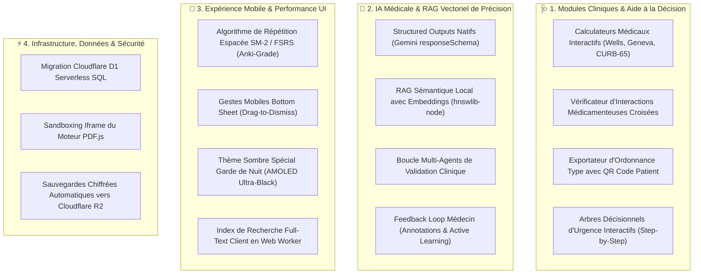

# 💡 Grand Registre des Propositions d'Améliorations & Roadmap (`suggestion-doc.md`)

> **Date de Rédaction** : 2026-09-01  
> **Projet** : Dr. CAT (v1.17.0+)  
> **Périmètre** : Fonctionnalités Cliniques, Moteur LLM & RAG, Ergonomie Mobile (UX/UI), Infrastructure & Données

---

## 🎯 1. Vue d'Ensemble & Vision Stratégique

L'ambition de **Dr. CAT** est de constituer le compagnon clinique de référence pour les médecins généralistes, résidents, internes et urgentistes. Ce document présente un plan exhaustif d'améliorations concrètes réparties en 4 piliers technologiques et médicaux.



---

## 🩺 2. Modules Cliniques & Aide à la Décision Pratique

---

### 1. Calculateurs Cliniques Interactifs Embarqués
- **Concept** : Intégrer des formulaires de calcul de scores médicaux validés directement au sein des fiches CAT pertinentes, sans obliger le praticien à basculer vers une application tierce.
- **Liste des Scores Clés à Intégrer** :
  1. **Score de Wells & Score de Genève Révisé** (Fiche *Embolie Pulmonaire* & *Thrombose Veineuse Profonde*).
  2. **Score CURB-65 & Score de Fine (PSI)** (Fiche *Pneumonie Aiguë Communautaire*).
  3. **Score CHA₂DS₂-VASc & HAS-BLED** (Fiche *Fibrillation Auriculaire*).
  4. **Calculateur de Débit de Filtration Glomérulaire (CKD-EPI / Cockcroft-Gault)** (Fiches *Insuffisance Rénale*, *HTA* et *Diabète*).
  5. **Score de Glasgow & Score NIHSS** (Fiches *Traumatisme Crânien* et *Accident Vasculaire Cérébral*).
  6. **Score d'Alvarado** (Fiche *Appendicite Aiguë*).
- **Interface Utilisateur** :
  Des cases à cocher interactives calculant le score en temps réel et affichant immédiatement la conduite à tenir associée (ex: *Score CURB-65 ≥ 2 ➔ Hospitalisation requise*).

---

### 2. Détecteur Interactif d'Interactions Médicamenteuses Croisées
- **Concept** : Sous la proposition d'ordonnance, ajouter un bouton interactif **"🔍 Vérifier la Compatibilité du Patient"**.
- **Fonctionnalités** :
  - Permet au médecin de cocher les comorbidités du patient (ex: Insuffisance rénale sévère, Antécédent d'ulcère, Grossesse T2, Traitement par AVK).
  - Le système surligne immédiatement en rouge toute molécule prescrite qui entrerait en conflit, et propose l'alternative thérapeutique sécurisée.

---

### 3. Module d'Exportation / Impression d'Ordonnance avec QR Code Patient
- **Concept** :
  Générer en un clic un document PDF imprimable ou partageable (via WhatsApp/Email) reprenant l'ordonnance type adaptée, avec :
  - Posologies claires et conseils hygiéno-diététiques rédigés en langage patient.
  - Un QR Code redirigeant le patient vers une fiche de conseils sécurisée hébergée sur l'application Web.

---

### 4. Arbres Décisionnels d'Urgence Interactifs (Mode Guidé)
- **Concept** :
  Pour les urgences vitales (ex: *Choc Anaphylactique*, *État de Mal Épileptique*, *Crise d'Asthme Aiguë Grave*), proposer une vue interactive étape par étape :
  - *Étape 1 : Constantes vitales et gestes immédiats (O2, Voie Veineuse, Adrénaline IM)*.
  - *Étape 2 : Évaluation à 5 minutes (Amélioration ? Oui ➔ Poursuite / Non ➔ 2ème injection)*.
  - Minuteur intégré pour le contrôle des réévaluations.

---

## 🤖 3. Moteur IA & Pipeline RAG de Nouvelle Génération

---

### 1. Structured Outputs Natifs (Google Gemini `responseSchema`) — ✅ Implémenté (v1.17.1)
- **Objectif** :
  Remplacer la demande de format JSON textuel non garanti par l'API native `responseSchema` de Google AI Studio.
- **Bénéfices & Réalisation** :
  - **Garantie mathématique de validité JSON** : `cat_db_generator/lib/gemini-schemas.js` fournit les schémas OpenAPI stricts pour les Master CATs et Sub-CATs.
  - **Constrained Decoding** : Forcé au niveau de l'échantillonnage de tokens par Gemini.
  - **Gain de token et de latence** : Zéro bavardage markdown, génération ultra-rapide.

---

### 2. RAG Sémantique avec Embeddings Google (`text-embedding-004`) — ✅ Implémenté (v1.17.1)
- **Objectif** :
  Enrichir la recherche de sources cliniques locales par similarité vectorielle sémantique et surveillance du volume de RAG.
- **Bénéfices & Réalisation** :
  - `cat_db_generator/lib/semantic-rag.js` utilise `text-embedding-004` (768 dimensions) avec mise en cache disque `data/pdf_embeddings_cache.json`.
  - Calcul de similarité cosinus pure JavaScript (`cosineSimilarity`).
  - Moniteur de surcharge RAG dans `llm-engine.js` avec alertes console et événements SSE `rag_overload_warning`.

---

### 3. Boucle Multi-Agents de Raffinement Médical
- **Architecture Proposée** :
  ```mermaid
  flowchart LR
      AgentGen["1. Agent Générateur (Synthèse Clinique)"] --> AgentPharma["2. Agent Pharmacologue (Contrôle Doses & BDPM)"]
      AgentPharma --> AgentEditeur["3. Agent Éditeur (Concision & Clarté)"]
      AgentEditeur --> OutputFinal["Fiche Clinique Validée"]
  ```

---

## 📱 4. Ergonomie Mobile (UX/UI) & Mode Hors-Ligne

---

### 1. Algorithme de Répétition Espacée Avancé (SM-2 / Anki) — ✅ Implémenté (v1.17.1)
- **Objectif** :
  Faire évoluer le module de révision Leitner (`public/js/components/quiz/state.js`) vers l'algorithme prédictif d'oubli SuperMemo SM-2 (standard Anki).
- **Fonctionnalités & Réalisation** :
  - Calcul dynamique de l'Easiness Factor (`EF`), du nombre de répétitions et de l'intervalle exponentiel en jours.
  - File d'attente de révision priorisée selon la date d'échéance exacte `nextReview`.
  - Rétrocompatibilité totale avec les boîtes Leitner existantes.

---

### 2. Gestes Mobiles Fluides & Modales en Bottom Sheets
- **Objectif** :
  Remplacer les boîtes de dialogue modales centrées par des feuilles coulissantes depuis le bas de l'écran (*Bottom Sheets*), avec :
  - Fermeture naturelle par glissement du doigt vers le bas (*Drag to Dismiss*).
  - Transition fluide respectant les 60 FPS sur les appareils Android.

---

### 3. Thème Sombre Spécial Garde de Nuit (AMOLED Ultra-Black)
- **Objectif** :
  Ajouter un profil de thème ultra-sombre (`#000000` pur avec accents cyan tamisés) pour :
  - Éviter l'éblouissement en consultation nocturne ou en chambre de garde hospitalière.
  - Réduire au maximum la consommation de batterie sur écrans OLED.

---

### 4. Index de Recherche Client Normalisé Instantané — ✅ Implémenté (v1.17.1)
- **Objectif** :
  Optimiser la recherche plein texte client sur les 60 Master et 63 Sub-CATs avec dé-accentuation et normalisation NFD.
- **Bénéfice & Réalisation** :
  - `normalizeSearchText()` élimine les diacritiques et la ponctuation.
  - Recherche instantanée (< 2 ms) multi-mots tolérante aux fautes d'accents (ex: *aigue*, *hta*, *avc*).

---

## ⚡ 5. Infrastructure & Sécurité des Données

---

### 1. Migration vers Cloudflare D1 Serverless SQL
- **Objectif** :
  Remplacer le stockage KV sérialisé du Cloudflare Worker par **Cloudflare D1** (base de données SQLite distribuée et transactionnelle).
- **Bénéfice** : Élimination définitive des race conditions sur les suggestions utilisateurs et les rapports de télémétrie.

---

### 2. Isolation du Moteur de Rendu PDF.js
- **Objectif** :
  Isoler l'exécution de `pdf.js` dans une iframe sandbaggée sans accès au contexte global de l'application.
- **Bénéfice** : Permet de verrouiller la Content Security Policy en supprimant définitivement `'unsafe-eval'`.

---

## 📅 Roadmap d'Implémentation Recommandée

| Phase | Horizon | Livrables Majeurs |
| :---: | :---: | :--- |
| **Phase 1 (Correctifs & Sécurité)** | Court terme | Correction BUG-01 à BUG-07 (XSS, locking DB, structured outputs, CSP). |
| **Phase 2 (Expérience Clinique)** | Moyen terme | Calculateurs médicaux interactifs, mise à niveau Leitner SM-2 et Bottom Sheets. |
| **Phase 3 (Next-Gen Infrastructure)** | Long terme | Migration SQLite backend, Cloudflare D1 et RAG vectoriel local par embeddings. |
