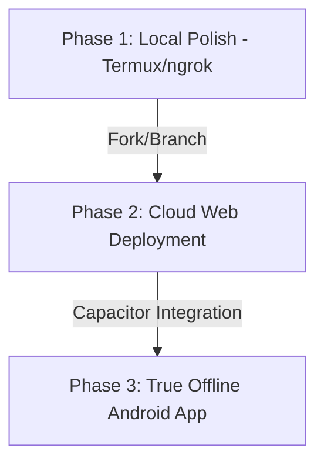

# Dr.CAT — Multi-Stage Roadmap & Progress

This document tracks our long-term objectives across three distinct phases, transitioning from local development to cloud deployment, and finally to a native offline-first Android app.

> [!IMPORTANT]
> **Priority Strategy**: Core features and operational functionality (navigation stack preservation, file sharing, and print warnings) take absolute precedence. Once all elements are functionally 100% verified, we will initiate Phase 4: Performance optimization and UI/animation polish.

---

## 🗺️ Architectural Phases

---

## 📍 Progress Tracker

### Phase 1: Local Polish (Current)
*Goal: Perfect the user interface, responsiveness, and study features locally on Termux.*

- `[x]` **Layout Adjustments**: Strict 50/50 dashboard split, tablet spacing, and mobile scroll heights.
- `[x]` **Branding Update**: Logo generated, name updated to *Dr.CAT — Rappel Clinique*.
- `[x]` **Quiz Flow Fix**: Navigation link to reference sheet with a "Retour au Quiz" return button.
- `[x]` **Replace CSS `zoom: 0.9` hack**: Switch to standard CSS media queries for high-density tablets.
- `[x]` **Favicon Integration**: Set up the stethoscope logo as the browser favicon.
- `[x]` **Light/Dark Mode Toggle**: Allow switching styles; default to dark.
- `[x]` **Export/Backup Progress**: Allow downloading progress as JSON locally.
- `[x]` **PWA support & Persistence Warnings**: Linked manifest, service worker files, and context-aware storage warnings.

---

### Phase 2: Cloud Web Deployment (Fork)
*Goal: Host Dr.CAT publicly on a production cloud server to act as the central sync hub.*

- `[ ]` **Fork repository** for public web deployment.
- `[ ]` **Database Migration**: Migrate data storage from `cats_db.json` and `suggestions.json` to an online database (e.g., MongoDB, PostgreSQL, or Supabase).
- `[ ]` **Asset Cloud Storage**: Move the PDF folder to cloud bucket storage (S3/Supabase Storage) instead of bundling it in the Node.js repository.
- `[ ]` **Admin Security hardening**: Set up cloud environment variables for passwords and secrets.

---

### Phase 3: True Offline Android App (App Fork)
*Goal: Wrap the frontend into an offline-first Android app package (.apk) that caches files locally and syncs with the Cloud Hub when connected.*

- `[x]` **Capacitor integration** to wrap the HTML/CSS/JS frontend.
- `[x]` **Offline Database**: Configure local data storage on the phone (LocalStorage fallback overrides & custom creations) so the app works with zero network connection.
- `[x]` **Local PDF Bundler**: Embed reference PDFs directly into the app assets during build compilation (`build.js`).
- `[x]` **Sync Engine**: Built client suggestion syncing using `REMOTE_SERVER_URL` and `isOnlineAtStartup` checking.
- `[x]` **CI/CD Build Action**: Automate compile packaging to `.apk` on every GitHub push.

---

### Phase 4: Diagnostics, Performance & Polish (Upcoming)
*Goal: Provide logging tools, diagnose network/sync status on native devices, and improve animation smoothness.*

- `[ ]` **Diagnostics Panel**: Add a settings panel in the app to configure `REMOTE_SERVER_URL` at runtime, test backend ping connectivity, see logs, and verify indexed PDF file counts.
- `[ ]` **UI Transitions Smoothness**: Implement hardware-accelerated layouts, prune DOM elements, and add micro-animations.
