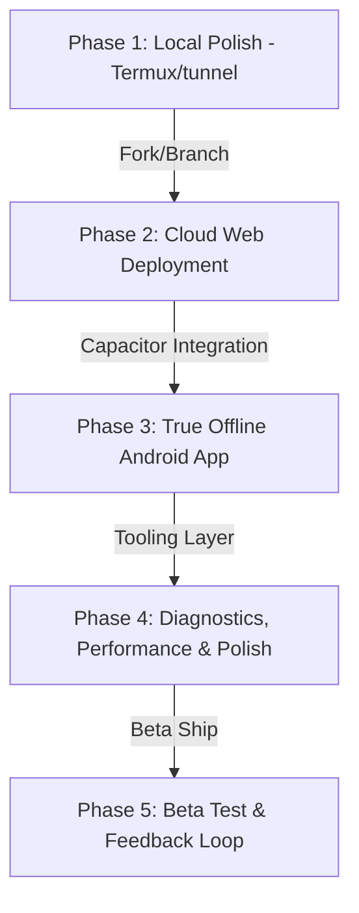

# Dr.CAT — Multi-Stage Roadmap & Progress

This document tracks our long-term objectives across four distinct phases, transitioning from local development to cloud deployment, and finally to a native offline-first Android app with full developer tooling.

---

## 🗺️ Architectural Phases

---

## 📍 Progress Tracker

### Phase 1: Local Polish ✅ COMPLETE
*Goal: Perfect the user interface, responsiveness, and study features locally on Termux.*

- `[x]` **Layout Adjustments**: Strict 50/50 dashboard split, tablet spacing, and mobile scroll heights.
- `[x]` **Branding Update**: Logo generated, name updated to *Dr.CAT — Rappel Clinique*.
- `[x]` **Quiz Flow Fix**: Navigation link to reference sheet with a "Retour au Quiz" return button.
- `[x]` **Replace CSS `zoom: 0.9` hack**: Switch to standard CSS media queries for high-density tablets.
- `[x]` **Favicon Integration**: Set up the stethoscope logo as the browser favicon.
- `[x]` **Light/Dark Mode Toggle**: Allow switching styles; default to dark.
- `[x]` **Export/Backup Progress**: Allow downloading progress as JSON locally.
- `[x]` **PWA support & Persistence Warnings**: Linked manifest, service worker files, and context-aware storage warnings.

---

### Phase 2: Cloud Web Deployment (Future)
*Goal: Host Dr.CAT publicly on a production cloud server to act as the central sync hub.*

- `[ ]` **Fork repository** for public web deployment.
- `[ ]` **Database Migration**: Migrate data storage from `cats_db.json` and `suggestions.json` to an online database (e.g., MongoDB, PostgreSQL, or Supabase).
- `[ ]` **Asset Cloud Storage**: Move the PDF folder to cloud bucket storage (S3/Supabase Storage) instead of bundling it in the Node.js repository.
- `[ ]` **Admin Security hardening**: Set up cloud environment variables for passwords and secrets.

---

### Phase 3: True Offline Android App ✅ COMPLETE
*Goal: Wrap the frontend into an offline-first Android app package (.apk) that caches files locally and syncs with the server when connected.*

- `[x]` **Capacitor integration** to wrap the HTML/CSS/JS frontend.
- `[x]` **Offline Database**: Configure local data storage on the phone (LocalStorage fallback overrides & custom creations) so the app works with zero network connection.
- `[x]` **Local PDF Bundler**: Embed reference PDFs directly into the app assets during build compilation (`build.js`).
- `[x]` **Provider-Agnostic Sync Engine**: Built client sync using `server-providers.js` + `remote_server_config.json` for dynamic provider switching (Ngrok, Cloudflare, custom domains).
- `[x]` **Dynamic App Mode System**: `api.setAppMode()` + `drcat-app-mode-changed` event lets UI react live to connectivity changes.
- `[x]` **CI/CD Build Action**: Automate compile packaging to `.apk` on every push to `light-android` branch via GitHub Actions.
- `[x]` **CORS Fix for Capacitor WebViews**: Added `http://localhost` and `capacitor://localhost` to the server's allowed origins.

---

### Phase 4: Diagnostics, Performance & Developer Tooling ✅ COMPLETE
*Goal: Provide logging tools, diagnose network/sync status on native devices, and give developers full visibility into app health.*

- `[x]` **Diagnostics Panel**: Live server health panel showing endpoint latency, sync status, PDF index coverage, and active provider URL. Supports full JSON export.
- `[x]` **Performance / Telemetry Panel**: Real-time metric cards for component render times and user interaction latency. Telemetry engine (`performance.js`) profiles all clicks and boot milestones.
- `[x]` **Telemetry Journal Console**: In-app scrollable log console inside the Performance panel — with **Copy** and **Clear** buttons — keeping the main debug console clean.
- `[x]` **Mobile Debug Console**: Floating 🐛 button console with network request interceptor, console routing, and full Copy/Clear controls for Android-native debugging.
- `[x]` **Startup Freeze Fix**: Resolved all Android startup race conditions — fast-fail offline mode, no more frozen loading screens on APK boot.
- `[x]` **CORS & Provider Sync Bug Fixes**: Fixed `no-cors` false positives in connectivity pings; migrated to provider-aware headers for real connection verification.

---

### Phase 5: Beta Test & Feedback Loop 🚀 ACTIVE
*Goal: Ship the app to real clinical colleagues, collect feedback, iterate on bugs and missing features.*

- `[x]` **Codebase Audit**: Full senior developer audit completed — security, performance, data integrity, and architecture verified.
- `[x]` **Documentation Sync**: All docs (README, codemap, developer_guide, technical_architecture, lessons_learned) updated to reflect current architecture.
- `[ ]` **Beta APK Distribution**: Share compiled APK with beta testers.
- `[ ]` **Bug Triage**: Collect and triage reported bugs from testers.
- `[ ]` **Local PDF Index Caching**: Bundle the PDF search index inside the Capacitor APK for offline full-text search without ever connecting to the server.
- `[ ]` **Database Schema Validation**: Validate `cats_db.json` structure on server boot to catch manual editing mistakes before they cause crashes.
